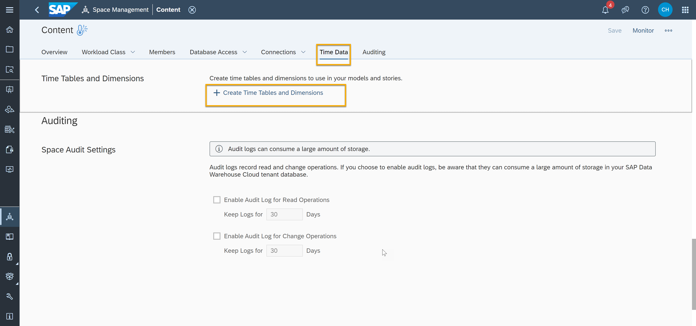
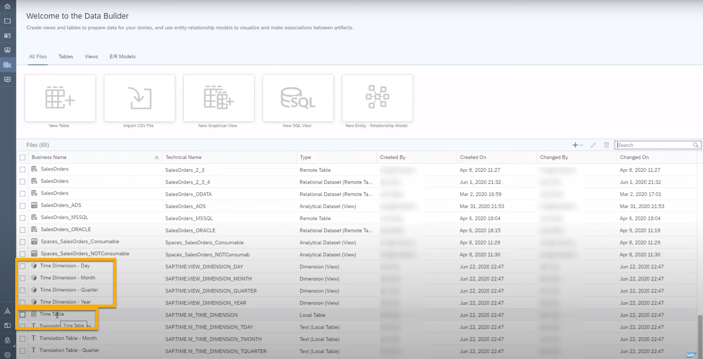
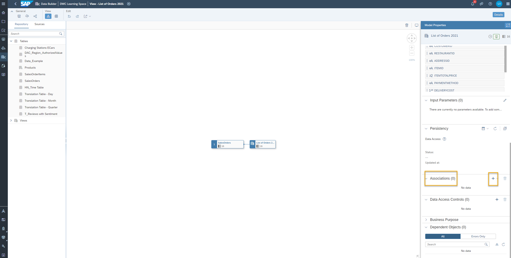

# Generate Time Table and Dimensions
<!-- description --> Create time tables and dimensions in SAP Data Warehouse Cloudת which then allows you to gather insights with year, quarter, month and day granularities.

## Prerequisites
- Have at least one graphical view created and deployed in SAP Data Warehouse Cloud -- see [Model Data with a Graphical View](data-warehouse-cloud-graphical1-model).
- Have a date field in your dataset or views to be analyzed

## You will learn
- How to create time tables and dimensions
- How to associate the time dimensions with your data

## Intro
Let's suppose you have two columns named `Product` and `Createdat` with the values of `'product_x'` and `'20210707'` in your dataset or view.

You can easily associate the `Createdat` field with the time dimensions in SAP Data Warehouse Cloud to get `'20210707'` and year, quarter, month and day columns for the `Product_x` additionally.

You can then for example visualize the sales of `Product_x` throughout the year 2021 to see the months, days, quarter wise analysis.

---

### Access time data

1.	Go to the space management icon in the SAP Data Warehouse Cloud and navigate to the time data area or click on the time data tab.

2.	Click on **Create timetables and dimensions**.

    <!-- border -->

3.	In the next dialog, you can configure your time table. You can give a business name and set the time period for which you want to generate the data for.

4.	In the same dialog, choose among the different granularity available. You can choose between year, quarter, month, and day. You can also edit the dimension name here.
> Currently, the calendar type supported is Gregorian only.

### View and associate your time data

1.	In the welcome page of the Data Builder, you can see the time table raw data and the corresponding time dimension (Year, Quarter, Month and Day) views.

    

2.	You can preview the time table and the dimensions by clicking on them and then selecting the view icon to see the created data set according to the time period set up in step 1.
> You can use any analytical dataset containing a date field to associate the generated time data.

3.	Open the raw dataset to which you want to associate the time data.

4.	In the properties sidebar, under Associations, click on the plus icon to create a new association.

    <!-- border -->

5.	Next, search and select the time data granularity you need for your raw dataset. This is going to be based on the date field you have in your dataset.

6.	Click on **OK** to continue.

7.	Associate your date field in the raw dataset by dragging the field to your chosen granularity.

8.	Re-deploy the dataset by clicking on the deploy icon.

> **Well done!**
>
> You have completed the Basic Data Modeling with Graphical Views tutorial group in SAP Data Warehouse Cloud. Now it is time to continue learning. Please check out the other [SAP Data Warehouse Cloud tutorials available here](https://developers.sap.com/tutorial-navigator.html?tag=products:technology-platform/sap-data-warehouse-cloud), and do not forget to follow the [SAP Data Warehouse Cloud tag](https://blogs.sap.com/tags/73555000100800002141/) in the SAP Community to hear about the most up to date product news.

### Test yourself

---
