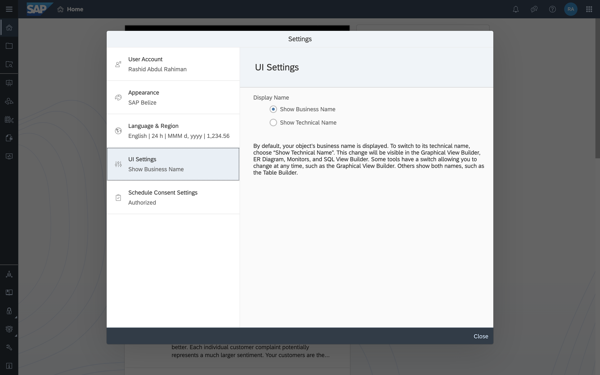

# Manage Profile Settings in SAP Data Warehouse Cloud
<!-- description --> View and change your profile settings.

## Prerequisites
 - You have [signed up for a free SAP Data Warehouse Cloud Trial](data-warehouse-cloud-1-begin-trial) or are an existing SAP Data Warehouse Cloud customer.

## You will learn
- How to view your profile settings
- What each profile setting means

---

### Understand the profile settings

To view and edit your profile in SAP Data Warehouse Cloud, click on your user icon in the top right corner of the screen, and then select **Settings**.

The **Settings** dialog will open, where you can find the following information:

-	**User Account** – Your user data including your full name and e-mail address is shown here.

-	**Appearance** – The SAP standard theme that is used for the visual appearance of SAP Data Warehouse Cloud.

-	**Language & Region** – You can find language settings, formatting settings and the setting for the currency here.

-	**UI Settings** – The UI Settings tab shows the way names are shown in SAP Data Warehouse Cloud, namely the business name or technical name.

-	**Schedule Consent Settings** – Here you can set your decision on authorizing the central scheduling component to run data integration tasks.

### Change the language and region

In this section, you can find settings pertaining to language, date, time and currency.
The following settings can be found here:

-	**Language** - Here, you can choose a language to view SAP Data Warehouse Cloud in.  

-	**Data Access Language** - Here you can find information about the default language SAP Data Warehouse Cloud. Currently, the default language is English.

-	**Date Formatting** - Choose a date format from the list. You can see examples in brackets.

-	**Time Formatting** - Choose a time format from the list. You can choose either 12 h or 24 h.

-	**Number Formatting** - Choose a number format from the list.

-	**Scale Formatting** - Choose how to format the number scale. You can choose the System default, short (`k, m, bn`) or long (Thousand, Million, Billion).

-	**Currency Position** - Here you can find information about scale formatting and where the currency symbol (or ISO code) is displayed.

### Change the interface settings

By default, in every modeling interface of your SAP Data Warehouse Cloud tenant you see your object's business name. To switch to the default of its technical name, go to **UI Settings** under your profile settings, and choose Show Technical Name.

### Schedule consent settings

The job scheduling component of SAP Data Warehouse Cloud needs the consent of the owner of the schedule to run scheduled tasks on the owner's behalf. Here, you can give or revoke your consent to SAP Data Warehouse Cloud to let the scheduling component run tasks with schedules owned by you in the future.

You can schedule data integration tasks such as data replication, persisting views, or executing data flows. Scheduled tasks run asynchronously and recurrently in the background according to the settings defined in the schedule.

**IMPORTANT:** Note that when you don't provide your consent or revoke your consent, tasks for which you own the schedule won't be executed.

Your consent is valid for 12 months. After the consent has expired, a log informs you that the tasks for which you own the schedule won't be executed anymore. Renew your consent to resume task execution according to the schedules.

>**Well done!**

> You have completed the 2nd tutorial of this group. Now you know how to work with your profile settings in SAP Data Warehouse Cloud.

> Learn in the next tutorial [how to add users and manage roles](data-warehouse-cloud-3-add-users) in SAP Data Warehouse Cloud.

### Test yourself

---
