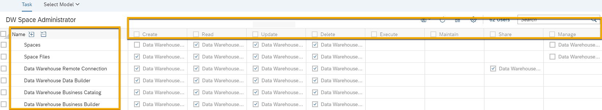
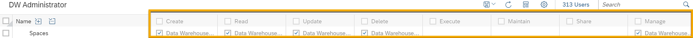
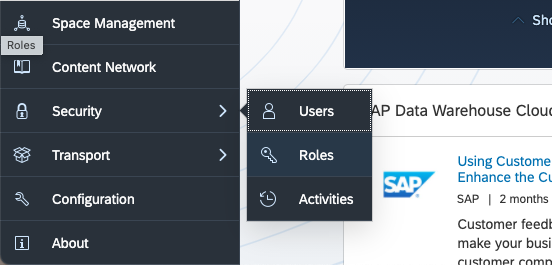
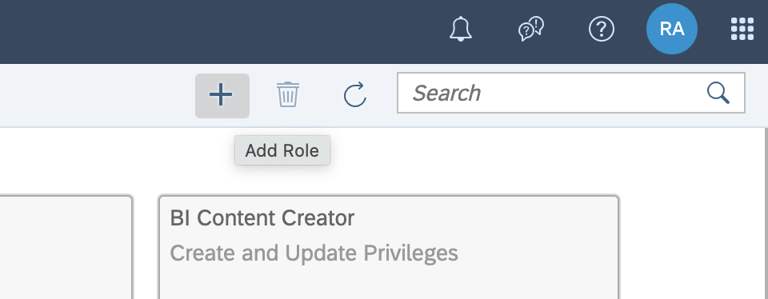

# Create Custom User Roles in SAP Data Warehouse Cloud
<!-- description --> In SAP Data Warehouse Cloud, create custom user roles that fit your organization's needs.

## Prerequisites
 - You have [familiarised yourself with the SAP Data Warehouse Cloud interface.](data-warehouse-cloud-2-interface)
 - You have the DW Administrator role assigned to you in your SAP Data Warehouse Cloud tenant.

## You will learn
  - How to create custom roles
  - Overview of privileges
  - What each permission means
  - How this works in a practical example

---
### Understand privileges and roles

A role represents the main tasks that a user performs in SAP Data Warehouse Cloud. Each role has a set of privilege types and are assigned different permissions like **Create**, **Read**, **Update**, **Delete** or **Manage** and **Share**. The privilege types represent areas of the application like the **Space Management** or the **Business Builder** and the files or objects created in those areas.

Each role has a set of privilege types and are assigned different permissions. These settings are configured in the **Privilege** page.

<!-- border -->

The standard application roles provide a set of privilege types that are appropriate for each particular job role.

For example, the **DW Administrator** role includes the **Create**, **Read**, **Update**, **Delete** and **Manage** permissions for the privilege type **Spaces**, while the **SAP Data Warehouse Cloud Viewer** has no permissions selected on this permission type. Instead the user has the **Read** permission for **Space Files**, meaning this user won't be able to assign users or connections, but they would be able to view the tables and views in the Spaces they have been assigned to.

<!-- border -->

### Understand privileges types

A privilege type represents a task or an area in SAP Data Warehouse Cloud and is assigned to a specific role. The actions that can be performed in the area are determined by the permissions assigned to a privilege type.

The following [link](https://help.sap.com/viewer/9f804b8efa8043539289f42f372c4862/cloud/en-US/862b88eed50244049d41361ba3290456.html?q=Data%20Warehouse%20Cloud%20Privileges%20and%20Permissions) lists the SAP Data Warehouse Cloud privilege types and the available permissions. Please note, that some of the privileges that are not restricted to an SAP Data Warehouse Cloud license (for example, Users and Roles) can be found in the **Other Privileges and Permissions** table. These object types and privileges depend on your license type and might, therefore, not be relevant or available to you.

### Understand permissions

Permissions allow the user to perform certain actions such read, write or delete on privilege types. The type of action depends on the privilege type that permission have been assigned to.

For example, the **Read** permission allows opening and viewing an item and it's content, whereas the **Delete** permission allows deletion of the item. The full list of all the permissions and it's meaning can be found in the [linked table here](https://help.sap.com/viewer/9f804b8efa8043539289f42f372c4862/cloud/en-US/862b88eed50244049d41361ba3290456.html?q=Data%20Warehouse%20Cloud%20Privileges%20and%20Permissions#loio1c4bf1ee5cdf4333807b22568ce0d874).

### Create a custom role

Creating a custom role and assigning them to users in SAP Data Warehouse Cloud is a simple procedure. As an administrator, you can custom define roles that fit your organization's needs. To create a custom user role, simply follow the procedure below.

> In this procedure, we use the **Roles** page to assign roles to users, but you can also assign roles on the **Users** page. Whether you create users first or roles first does not matter.

1. To add roles, click on **Security** and **Roles**.

    

2. Click on **Add Role** on the top right of the screen.

    

3. Enter a unique name for the role and select the license type **SAP Data Warehouse Cloud**.

4. Select **Create**.

5. Select a role template.

    > Role templates are the predefined standard roles associated with the SAP Data Warehouse Cloud license type. If you wish to create a role without extending a predefined standard role, choose the blank template. After you select a template, the Permissions page appears, showing you the individual permissions assigned to privilege types that have been defined for the role template you chose.

6. Define the permissions for your new role for every privilege type. The permission privileges represent an area, application or tool in SAP Data Warehouse Cloud while the permissions (create, read, update, delete, manage and share) represent the actions a user can perform.

7. If you want to change the role template that your new custom role will be based on, select (**Select Template**), and choose a role.  

8. Save your new custom role.

    > You can't delete or save changes to the predefined standard roles.

### Learn from an example

A user with **DW Viewer**, for example, cannot see the **Space Management** area including the Spaces. They can only read the files of the Space that they have been assigned to (Space files) and read the data belonging to their Space in the **Data Builder**. They can only see the connections, but not edit them. They cannot see the member section or the individual members of their Space (user and team). A user with **DW Administrator** on the other hand would have almost all permissions of all areas.

With an even finer granularity, you can select permissions that allows your user to see or edit only certain areas of your Space. A modeler, for example, can be prohibited to see the general settings in particular the storage, priority and data lake settings. The user might, however, be configured to see the members of a Space, but is not allowed to add or delete members.

You can learn in detail about different privileges and permissions in SAP Data Warehouse Cloud by following this [link.](https://help.sap.com/viewer/9f804b8efa8043539289f42f372c4862/cloud/en-US/862b88eed50244049d41361ba3290456.html?q=Data%20Warehouse%20Cloud%20Privileges%20and%20Permissions#loio1c4bf1ee5cdf4333807b22568ce0d874)

>**Well done!**

> You have completed the 4th tutorial of this group. Now you know how to create custom roles in SAP Data Warehouse Cloud.

> Learn in the next tutorial how to [create and monitor Spaces in SAP Data Warehouse Cloud.](data-warehouse-cloud-4-spaces)

### Test yourself

---
