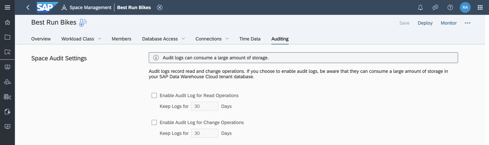
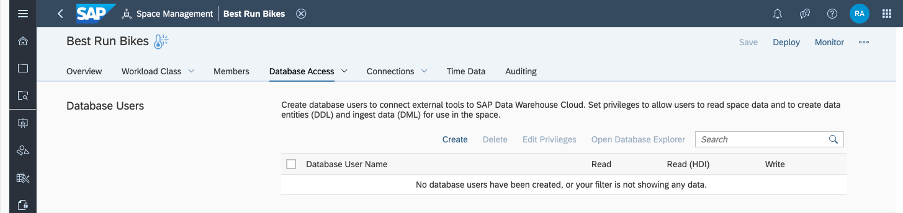
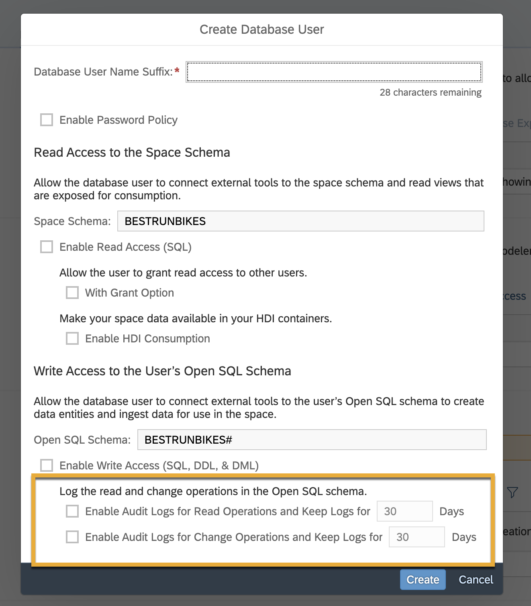
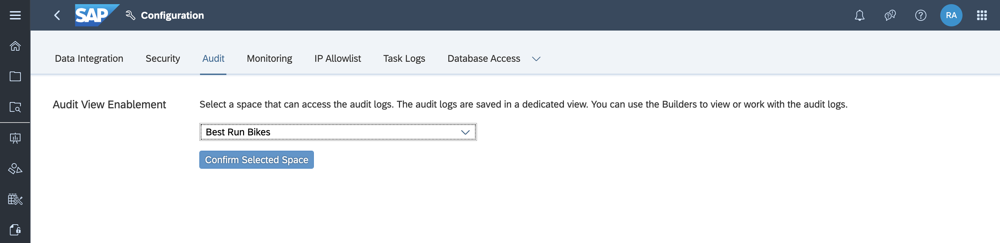

# Set Up and Review Audit Logs in SAP Data Warehouse
<!-- description --> Perform audit logging to monitor and record selected actions performed in SAP Data Warehouse Cloud, providing you with visibility on who did what and when.

## Prerequisites
  - You have [familiarised yourself with the SAP Data Warehouse Cloud interface.](data-warehouse-cloud-2-interface)

## You will learn
  - About audit logging of customer-owned data within Spaces
  - How to view audit logs

---
### Understand audit logs in SAP Data Warehouse Cloud

Audit logs are a simple way to monitor and record selected actions performed in SAP Data Warehouse Cloud.

You can set up the change log and the read access log independently of each other. Both logs are implemented using the same mechanism, so the following steps applies

### Enable audit logging for spaces

> If you choose to enable audit logs, be aware that they can consume a large amount of storage in your SAP Data Warehouse Cloud tenant.

To enable audit logs for specific Spaces in SAP Data Warehouse Cloud:

  1.	Go to **Space Management** by clicking on the icon on the left-side menu.

  2.	Select the Space in which you want to enable the audit logs, and click on the **Auditing** tab.

    

  3. Here, check the **Enable Audit Log for Read or Change Operations** checkboxes and set the retention time for the same. You can set the retention time in days. The default is 30 days, the minimum retention time is 7 days, and the maximum retention time is 10 000 days.

> If auditing has been enabled, entries of all SAP Data Warehouse Cloud related objects are saved in an SAP HANA Cloud, SAP HANA database audit log. These logs don't include the objects of the database access schemas, like open SQL schemas, for example.

### Enable audit logging for individual database schemas

To enable audit logs for individual database schemas in SAP Data Warehouse Cloud:

  1.	Go to Space Management by clicking on the icon on the left-side menu and select the Space in which you want to enable the logs.

  2.	Navigate to the **Data Access** tab, where you can find the database users assigned to your Space.

    

  3. Now, simply select the database user you wish to enable audit logs for.

  4.	Here you can check the **Enable Audit Log for Read or Change Operations** checkboxes and set the retention time for the same.

    

> The retention time can be defined per schema.

> Please note, that the statements issued via the execute-procedure for the data lake are currently not audited in SAP Data Warehouse Cloud. As a result, SAP HANA policies are created for the schemas of the Space.

>The policy names of the SAP Data Warehouse Cloud administered objects are:

>`DWC_DPP_<Space name>_READ`
`DWC_DPP_<Space name>_CHANGE`

### View auditing logs

1. Go to Configuration on the bottom right of your screen, and navigate to the **Audit** tab.

2. Choose the space from the drop-down list that contains the audit logs you wish to see.

    

    > To configure this setting, you need the audit configuration authorization. We recommend creating a dedicated Space for audit logs, as you might not want all users to view sensitive data.

The audit logs are saved as external data, for example, as a view. You can now select these audit logs in the Data Builder. The data is located in the `AUDIT_LOG` view of the `DWC_AUDIT_READER` schema.

The audit logs of the database analysis user are saved separately in the `ANALYSIS_AUDIT_LOG` view.

>**Well done!**

> You have completed the 6th tutorial of this group. Now you know how to set up and view audit logs in SAP Data Warehouse Cloud.

> Learn in the next tutorial how to [change ownership of scheduled remote table replications and data flows.](data-warehouse-cloud-intro7-ownership-schedule)

### Test yourself

---
