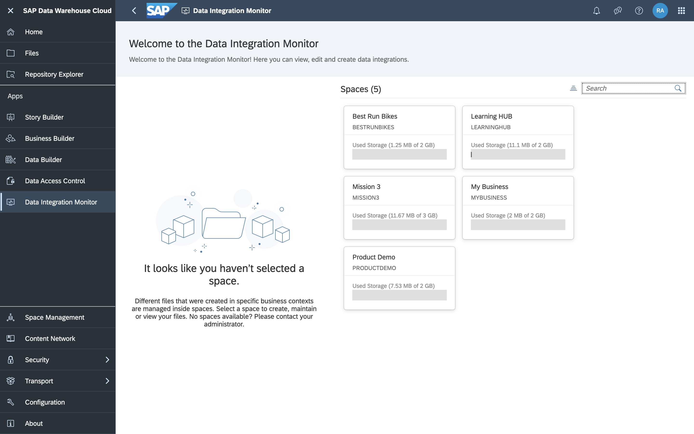

# Change Ownership of Scheduled Remote Table Replications and Data Flows
<!-- description --> Change the ownership of a scheduled remote table replication or data flow in SAP Data Warehouse Cloud.

## Prerequisites
 - You have [familiarised yourself with the SAP Data Warehouse Cloud interface.](data-warehouse-cloud-2-interface)
 - You have [given consent to let the job scheduling component of SAP Data Warehouse Cloud run scheduled tasks on your behalf.](data-warehouse-cloud-intro2-login-profilesettings)
 - You have [understood different roles](data-warehouse-cloud-3-add-users), and are assigned the DW Integrator role.

## You will learn
  - How to take over ownership of another user's schedule

---

### Take over ownership of a schedule

1. Go to the **Data Integration Monitor** and select your Space.

    

2. Open the monitor for the relevant object.

3. If you haven't authorized SAP Data Warehouse Cloud yet to run your scheduled tasks for you, you will see a message at the top of the monitor asking for your consent. Give your consent.

4. For remote tables and views: Select the object for which you want to schedule a task.

5. Depending on the object, perform the following action:

    -	For remote tables, select Schedule Replication and then click on Edit Schedule.

    -	For views, select Schedule and then click on Edit Schedule.

    -	For data flows, select Schedule and then click on Edit Schedule.

6. The **Edit Schedule** window opens.

    > For data flows, you first enter a dialog where you select the relevant data flow before you get to the **Edit Schedule** window.

7. Click on **Assign to Me** and confirm the following message.

8. Click on **OK** to save the schedule.

The **Owner** field now shows your user ID as the new owner of the schedule. The scheduling component from now own will execute the task on your behalf.

> With the DW Integrator role you can change the schedule and let the scheduling component run tasks on your behalf. For data flows, you need the DW Integrator role along with the DW Viewer or the DW Modeler role.

### Change ownership for a deleted user

If a user leaves your organization or has been deleted from SAP Data Warehouse Cloud for any reason, and this user happens to be the owner of a job scheduled in your tenant, then you will need to change the ownership of this job schedule to another user. Job schedules are not assigned to any other user automatically and can't be executed successfully unless they are associated with an existing user.

Hence, it is important to change the ownership of a scheduled remote table replication or data flow if the owner of the same has left or has been deleted from your SAP Data Warehouse Cloud tenant.

>**Well done!**

> You have completed the 7th tutorial of this group. Now you know how to take ownership of scheduled remote table replications and data flows in SAP Data Warehouse Cloud.

> Learn in the next tutorial [how to create a database user in SAP Data Warehouse Cloud.](data-warehouse-cloud-intro8-create-databaseuser)

### Test yourself

---
