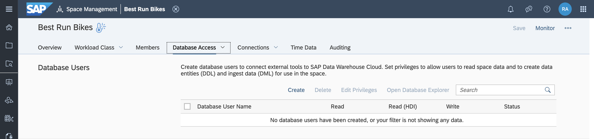
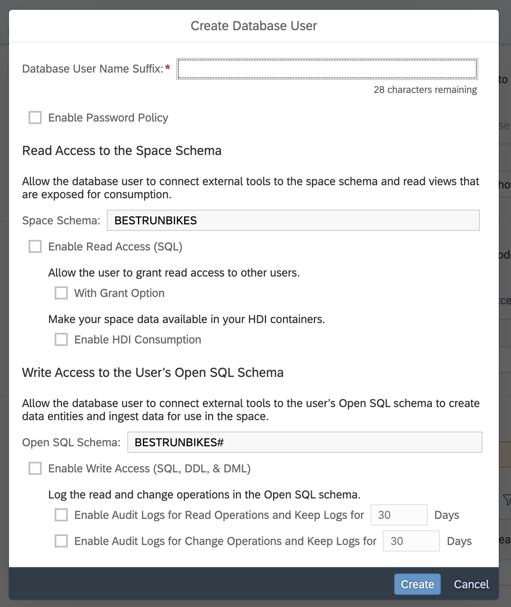
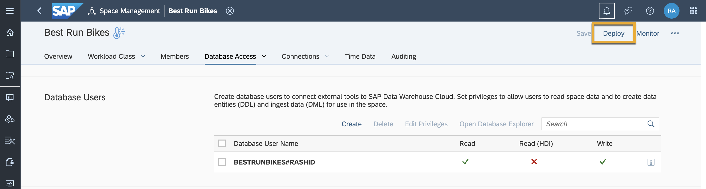
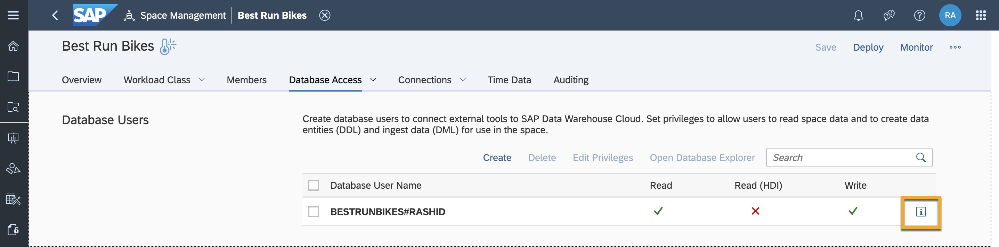
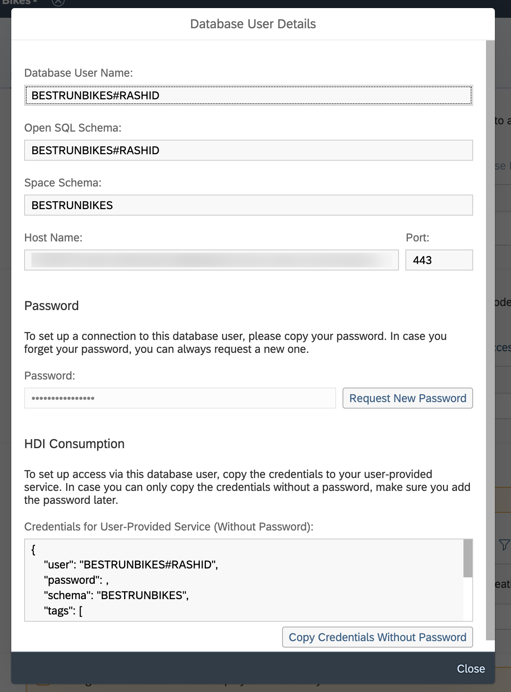

# Create a Database User in SAP Data Warehouse Cloud
<!-- description --> Create a database user, that is, a technical user that can connect the underlying SAP HANA Cloud database to third-party SQL clients and allow data to get in or out via JDBC/ODBC.

## Prerequisites
  - You have [familiarised yourself with the SAP Data Warehouse Cloud interface.](data-warehouse-cloud-2-interface)
  - You have [understood different roles](data-warehouse-cloud-3-add-users), and are assigned the DW Administrator role.

## You will learn
  - Who a database user is
  - How to create a database user

---

### Understand who database users are

Database users are technical users that can connect the underlying SAP HANA Cloud, SAP HANA database to third-party SQL clients and allow data to be received or sent out via JDBC/ODBC. In SAP Data Warehouse Cloud, an open SQL schema is always created when you create a database user. This open SQL schema grants the database user read privileges to the underlying database. Depending on your needs, different privileges can be set for different schemas.

Every user who wants to work with the underlying SAP HANA Cloud, SAP HANA database must have a database user. But be careful, since database users that have more than read access can make significant changes to the data flowing into SAP Data Warehouse

### Create a database user

When you create a database user, you also configure which privileges the user is granted.

> You need the DW Administrator role to create a database user.

In this example, we'll assume that you don't have a database user and want to create one and add the privileges.

Follow the below steps in order to create a database user:

  1. In Space Management go to **Database Access**.

  2. Select **Database Users** and click on **Create**.

    

  3. If you already have a database user and want to adjust it select **Edit Privileges**.

  4. A new dialog opens with several options to select and fill out. Start by adding a **Database User Name Suffix**. This is the name of your database user, and it is added as a suffix to your Space name.

    

  5. Next, you can check to **Enable Password Policy** if you want to apply the password policy. The passwords of database users are subject to certain rules, which are defined in the password policy.

  6. Next, under **Read Access to the Space Schema**, you can choose to **Enable Read Access (SQL)**. This allows the database user to read the data in the Space if the data has been exposed.

  7. Check the **With Grant Option** checkbox if you want your database user to also grant the read access to other users.

  8. You can also **Enable HDI Consumption** to allow your user to connect an HDI container. If this is the initial connection to an HDI container, you need to open an SAP ticket and let us map the HDI container to your Space.

  9. Next, under **Write Access to the User's Open SQL Schema**; you can **Enable Write Access (SQL, DDL, DML)** to allow other SQL clients to write to the Open SQL schema and perform DDL (Data Definition Language) and DML (Data Manipulation Language) operations.

  10. You can also choose to **Enable Audit Logs for Read Operations and Keep Logs for XX Days** or **Enable Audit Logs for Change Operations and Keep Logs for XX Days**. This allows you to log read and change operations performed by this database user. The logs are saved in the `ANALYSIS_AUDIT_LOG` view and can be accessed in the Data Builder.

  11. Click on Create to now create the database user.

  12. Once done, deploy your changes by clicking on the **Deploy** button on the top right of your screen.

    

  13. You can now access the Database User Details by clicking on the **i** icon next to your newly created database user.

    

    This provides you with the required credentials to connect to your SQL client.

    

    The following information can be found here:

      -	**Database User Name** – The name of your SAP Data Warehouse Cloud database user.

      -	**Open SQL Schema** - The schema name that is used to connect your SQL clients. SQL clients are granted write access to this schema allowing you to ingest their data.

      -	**Space Schema** - The schema name where deployed data is stored. Exposed data can be accessed (read) by third-party SQL clients, for example.

      -	**Host Name** – The host name that is needed to connect your SQL client.

      -	**Port** – The port number that is needed to connect your SQL client.

      -	**Password** – Your password for access. If you forget this password, you can always reset it by selecting i (Info)on the right and selecting Request New Password.

      -	**HDI Consumption** – These credentials can be used to connect your HDI container to your Space.

      Once connected, database users can either read the space schema data, or perform DDL, DLM, SQL on the open SQL schema, or both.

> **Well done!**

> You have completed this tutorial. Now you know how to create a database user in SAP Data Warehouse Cloud.

### Test yourself

---
