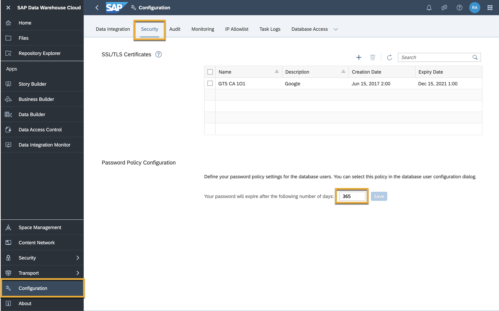
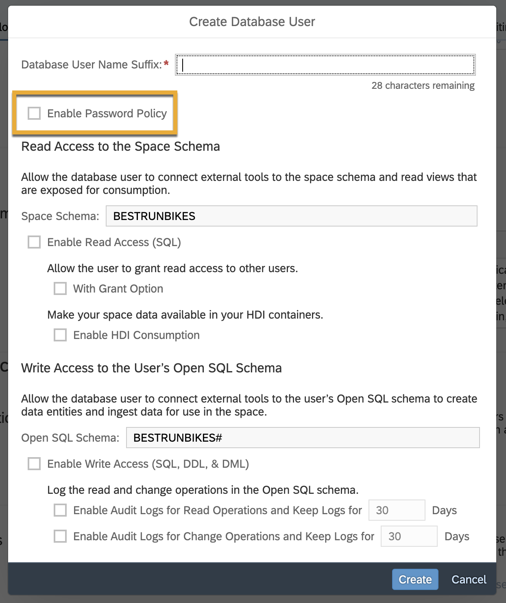

# Define the Password Lifetime for a Database User
<!-- description --> Define a password lifetime for database users to help better meet your security needs for SAP Data Warehouse Cloud.

## Prerequisites
 - You have [understood different roles](data-warehouse-cloud-3-add-users), and are assigned the DW Administrator role.
 - You have [created a database user in your Space.](data-warehouse-cloud-intro8-create-databaseuser)

## You will learn
  - How to define a password lifetime policy in your tenant
  - How to apply password lifetime policy for your database users

---

### Define a global password policy

SAP Data Warehouse Cloud allows you to connect to 3rd-party ETL and BI tools by using database users. Each user has its own set of credentials, including passwords. To help you better meet your security needs, we have introduced an option to manage password lifetime for database users. This feature allows you to:

  - Define a global tenant-wide password lifetime policy.

  - Remain flexible – for each database user, decide whether the lifetime policy applies.

  - Improve compliance with corporate password policies.

> You need the DW Administrator role to configure the password policy.

To define the password policy, go to **Configuration** > **Security**

  

Here, you can enter the number of days for which the initial password or any password set by a user administrator for a user is valid.

If a user has not logged on using the initial password within the given period of time, the user will be deactivated until their password is reset.

### Apply password policy to database user

You can apply the policy  when creating a new database user by selecting **Enable Password Policy** as shown below.

  

For an existing user, simply select the database user and mark the checkbox. You have now successfully applied your password policy for your database user.

>**Well done!**

> You have completed the 9th tutorial of this group. Now you know how to define the password lifetime for a database user in SAP Data Warehouse Cloud.

> Learn in the next tutorial [how to connect your Space to an SAP HANA Cloud, data lake in SAP Data Warehouse Cloud.](data-warehouse-cloud-intro10-connectspace-datalake)

### Test yourself

---
