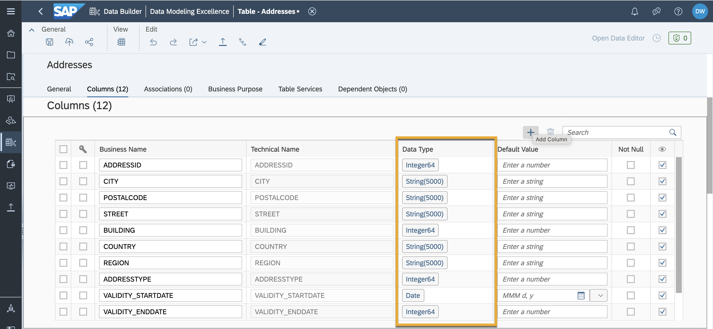
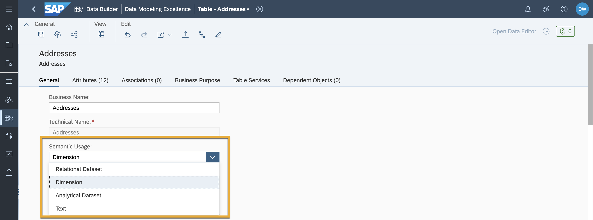
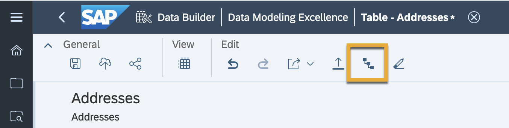
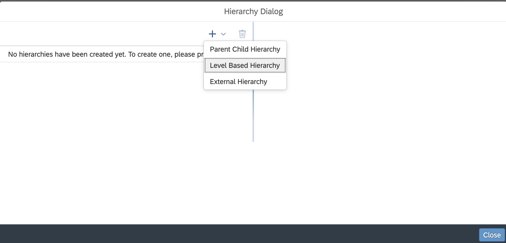
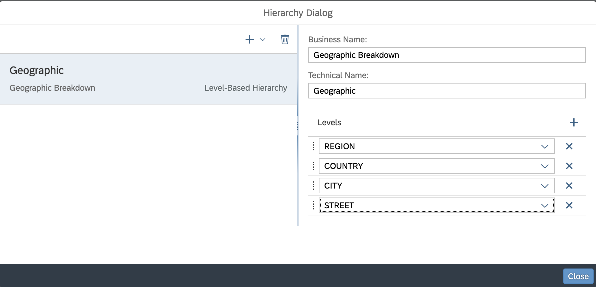
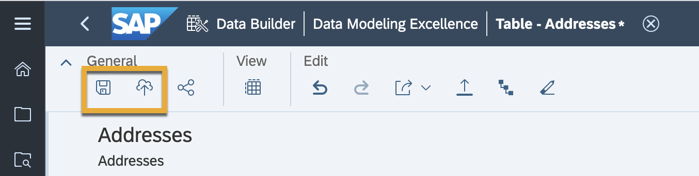

# Create Level-Based Hierarchies in SAP Data Warehouse Cloud
<!-- description --> Create a level-based hierarchy, a hierarchy in a standard dimension that contains one or more levels of aggregation.

## Prerequisites
 - You have [familiarised yourself with the SAP Data Warehouse Cloud overview and architecture](data-warehouse-cloud-2-interface).
 - You have imported your dataset into the data builder.

## You will learn
  - How to create a level-based hierarchy in SAP Data Warehouse Cloud

---

### What is a level-based hierarchy

A level-based hierarchy is a hierarchy in a standard dimension that contains one or more levels of aggregation. They are rigid in nature, implying that the root and the child nodes can only be accessed in the defined order. The members of the hierarchy roll up into the next higher level in a many-to-one relationship, and members at this higher level roll up into the next higher level, and so on to the top level.

In other words, the different levels of the hierarchy are kept in separate tables. Each level is fixed. These levels are linked to each other in a way that describes a special relationship: a level-based relationship. It is only used for level-based measures.

For instance, a time dimension might have a hierarchy that represents data at the day, week, month and year levels. Each level above the base (or most detailed) level contains aggregate values for the levels below it.

### Create a level-based hierarchy

1. In order to create a hierarchy within your dataset, you need to ensure that your uploaded CSV files have their datasets defined properly. Go into the **Data Builder**, and select your uploaded CSV file. Ensure that the data types of your target columns are of the right type.

    

2. The next step is defining your table as a dimension. A dimension is where you identify a set of master data attributes and keys for use in fact and consumption models. Hence, your table must be defined as such. On the same screen click on the **Semantic Usage** drop down, and select **Dimension**.

    

3. A hierarchy icon shaped like a staircase now becomes selectable on the top bar. Click on this icon to open the hierarchy settings.

    

4. Click on the + icon and select **Level-based** hierarchy.

    <!-- border -->

5. You can now define the business name, technical name as well as the different levels in your level-based hierarchy. In this example, the levels are defined as **Region**, **Country**, **City** and **Street**. Click on **Close** once done.

    <!-- border -->

6. As always, first save and then deploy your dataset. Your dataset is now ready to be combined with analytical datasets to produce a clear and concise visualisation with well defined hierarchies.

    

>**Well done!**

> You have completed the create hierarchies with SAP Data Warehouse Cloud tutorial group. Now it is time to continue learning. Please check out the other SAP Data Warehouse Cloud tutorials available here, and don't forget to follow the SAP Data Warehouse Cloud tag in the [SAP Community](http://community.sap.com) to hear about the most up to date product news.

### Test yourself

---
