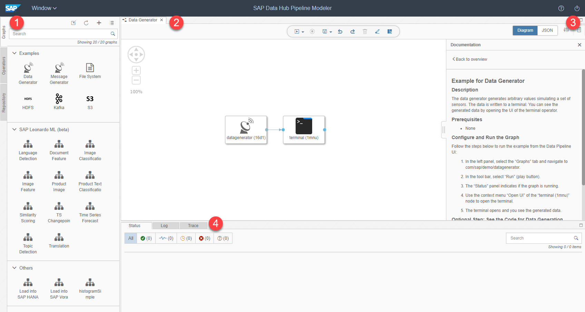

## Prerequisites  
 - **Proficiency:** Beginner
 - You have completed [Navigate around SAP Data Hub, developer edition](https://developers.sap.com/tutorials/datahub-docker-navigation.html)

## Details
**This tutorial is obsolete and will be removed shortly (end of-November 2018).**
### You will learn  
During this tutorial, you will learn how to run the examples pipelines delivered with SAP Data Hub, developer edition.

### Time to Complete
**30 Min**

---

[ACCORDION-BEGIN [Step 1: ](Familiarize yourself with the modelling UI)]
Open the modelling environment for building pipelines via `http://localhost:8090` (SAP Data Hub Pipeline Modeler).

  

The modelling environment consists of four main parts:
 - **Navigation (1)**: You use this part of the modelling environment to access pipelines (also known as graphs), operators and the repository.
 - **Pipeline editor (2)**: You create and edit pipelines here.
 - **Configuration / documentation (3)**: You use this part of the modelling environment to configure pipelines as well as operators inside pipelines and to access the documentation. The two buttons on the right help you to switch between configuration and documentation.
 - **Status messages, logs, traces (4)**: You use this part of the modelling environment to monitor the execution of pipelines.

[ACCORDION-END]

[ACCORDION-BEGIN [Step 2: ](Execute an example pipeline)]
Click on the **Data Generator** (or any other) example pipeline (inside the **Navigation**). The pipeline opens in the editor.

Open the documentation of the pipeline (use the context menu of the pipeline inside the **Navigation** area). Follow the steps described in the documentation to execute the pipeline.

Very often the example pipelines run "out of the box". Sometimes you have to configure the examples first (as described in the documentation).

[ACCORDION-END]

---
