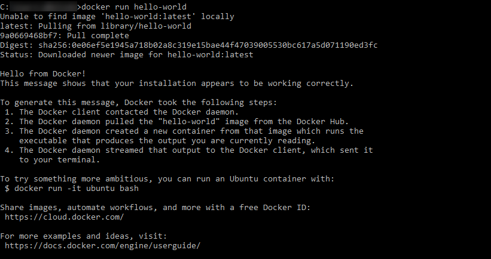
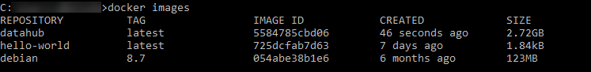
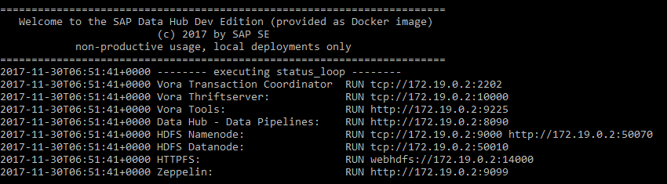

## Prerequisites  
 - **Proficiency:** Beginner

## Next Steps

## Details
### You will learn  
During this tutorial, you will learn how to download SAP Data Hub, developer edition, from SAP Store and run it on your local computer as a Docker container.

### Time to Complete
**45 Min**

---

[ACCORDION-BEGIN [Step 1: ](Check the prerequisites)]
Running SAP Data Hub, developer edition on your local computer requires:

* at least **2 CPU cores** (recommended 4 CPU cores) with X86_64 instruction set

* at least **8 GB of RAM**

* at least **10 GB disk space** for a running Docker container

* Internet connectivity (temporarily while building the Docker image)

* Docker installed and running (http://www.docker.com)

Verify that Docker is properly installed and running by opening a terminal window and entering the following.

```sh
docker run hello-world
```

You see an output similar to the following.
  

[ACCORDION-END]

[ACCORDION-BEGIN [Step 2: ](Download SAP Data Hub, developer edition)]
Download SAP Data Hub, developer edition from SAP Store and unpack the archive to your disk. You find it via the following link.

```sh
https://store.sap.com/sap/cp/ui/resources/store/html/SolutionDetails.html?pid=0000014517
```

Carefully read the `README.html` as well as the license agreement prior to continuing with the tutorial.

[ACCORDION-END]


[ACCORDION-BEGIN [Step 3: ](Build the Docker image)]
Open and review the `Dockerfile` with any text editor. For now you do **not** have to understand the file in detail. You **do** have to ensure that the proxy settings for Internet access are maintained correctly though.

```sh
ENV http_proxy=http://myproxy:8080

ENV https_proxy=http://myproxy:8080
```

Open a terminal window and navigate to the directory where you have unpacked the archive (that is the directory which includes the `Dockerfile`). Build the docker image for SAP Data Hub, developer edition. Replace the build-time variables `VORA_USERNAME` and `VORA_PASSWORD` with meaningful values **prior to executing the following command**.

```sh
docker build --build-arg VORA_USERNAME=vora --build-arg VORA_PASSWORD=SomeNicePassword19920706 --tag datahub .
```

After 30-60 minutes (depending on the speed of your internet connection) the build completes. Verify that your local Docker registry now includes a new image (called `datahub`) for SAP Data Hub, developer edition by entering the following.

```sh
docker images
```
You see an output similar to the following.
  

[ACCORDION-END]

[ACCORDION-BEGIN [Step 4: ](Run a Docker container (based on the image))]
Create a Docker network by opening a terminal window (or using the already open one). This will later help you to easily connect the container running SAP Data Hub, developer edition (which you will soon start) with other containers. Enter the following command.

```sh
docker network create dev-net
```

Run a Docker container based on image `datahub`. By publishing the ports `8090`, `9099`, `9225` and `50070` you ensure that you later can access the different user interfaces running inside the Docker container via `localhost`.

```sh
docker run -ti --publish 127.0.0.1:8090:8090 --publish 127.0.0.1:9099:9099 --publish 127.0.0.1:9225:9225 --publish 127.0.0.1:50070:50070 --name datahub --hostname datahub --network dev-net datahub run --agree-to-sap-license --hdfs --zeppelin
```

After a few minutes (during which you can follow what happens inside the container), you see an output ("status loop") similar to the following. The output refreshes every minute and indicates that all services related to SAP Data Hub, developer edition are running.

  

**Attention:** If you press `Ctrl-C` during the "status loop", this will stop the running container (see also step 6).

[ACCORDION-END]

[ACCORDION-BEGIN [Step 5: ](Perform a smoke test)]
Open a web browser and test the following URLs (where necessary enter **Username** and **Password** which you have set while building the Docker image):

* http://localhost:8090 (SAP Data Hub - Data Pipelines)
* http://localhost:9099 (Apache Zeppelin)
* http://localhost:9225 (SAP Vora Tools)
* http://localhost:50070 (Apache Hadoop User Interface)

If all URLs are working, you can assume that you have successfully set up SAP Data Hub, developer edition on your local computer.

[ACCORDION-END]

[ACCORDION-BEGIN [Step 6: ](Stop and restart the Docker container)]
You can stop SAP Data Hub, developer edition without loosing data by using the `stop` command. After you used the above `run` command, you need to open a new terminal window to enter the `stop` command (alternatively you can use `Ctrl-C`).

```sh
docker stop datahub
```

You can also restart SAP Data Hub, developer edition (without creating a completely new container) by using the `start` command (this will not open a "status loop").

```sh
docker start datahub
```

If you like to see what is going on (after you have issued a `start` command) you can take a look at the logs.

```sh
docker logs datahub
```

[ACCORDION-END]

---
