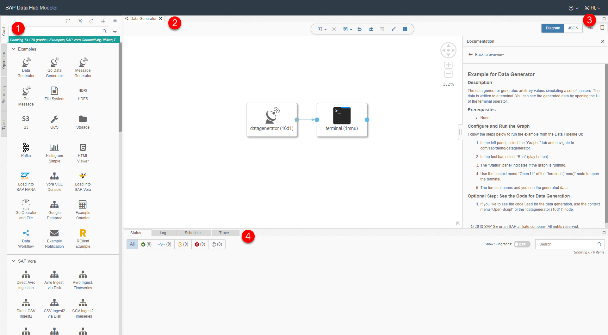
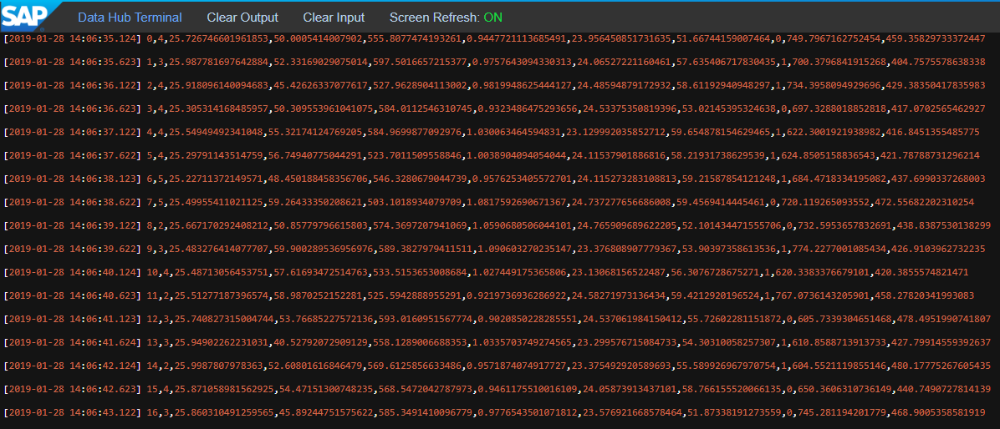

## Prerequisites

## Details
### You will learn  
During this tutorial, you will learn how to run the examples pipelines delivered with SAP Data Hub, developer edition.

### Time to Complete
**30 Min**

---

[ACCORDION-BEGIN [Step 1: ](Familiarize yourself with the modelling UI)]
Open the modelling environment for building pipelines via `http://localhost:8090` (SAP Data Hub Modeler).

  

The modelling environment consists of four main parts:

  1. **Navigation**: You use this part of the modelling environment to access pipelines (also known as graphs), operators and the repository.
  2. **Pipeline editor**: You create and edit pipelines here.
  3. **Configuration / documentation**: You use this part of the modelling environment to configure pipelines as well as operators inside pipelines and to access the documentation. The two buttons on the right help you to switch between configuration and documentation.
  4. **Status messages, logs, traces**: You use this part of the modelling environment to monitor the execution of pipelines.

[DONE]

[ACCORDION-END]

[ACCORDION-BEGIN [Step 2: ](Execute an example pipeline)]
Click on the **Data Generator** (or any other) example pipeline (inside the **Navigation**). The pipeline opens in the editor.

Click **Run** to execute the pipeline

When the **Status** tab indicates that the pipeline is running, use the context menu **Open UI** of the **Terminal** operator to see the generated sensor data.

Copy any row of the terminal output and paste it in the text area below and click on **Submit Answer** button to complete Step 2.

[VALIDATE_1]

Stop the pipeline by clicking **Stop**.
[ACCORDION-END]

---
