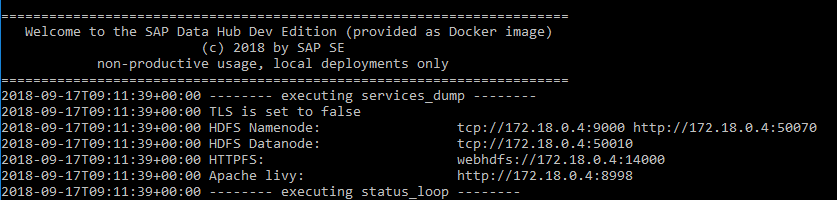

## Prerequisites  

## Details
### You will learn  
During this tutorial, you will learn how to download SAP Data Hub, developer edition, and run it on your local computer as a Docker container.

### Time to Complete
**45 Min**

---

[ACCORDION-BEGIN [Step 1: ](Check the prerequisites)]
Running SAP Data Hub, developer edition on your local computer requires:

* at least **2 CPU cores** (recommended 4 CPU cores) with `X86_64` instruction set

* at least **8 GB of RAM**

* at least **10 GB disk space** for a running Docker container

* Internet connectivity (temporarily while building the Docker image)

* Docker installed and running (http://www.docker.com)
  **Attention:** If you use Docker for Windows, make sure that you run Linux and **not** Windows containers. You can check this via the Docker for Windows context menu. If necessary, switch to Linux containers via the context menu.
  **Attention:** If you use Docker Toolbox, pay special attention to the sizing of the Linux VM. For details take a look at our [FAQ](http://blogs.sap.com/2017/12/06/faqs-for-sap-data-hub-developer-edition).

Verify that Docker is properly installed and running by opening a terminal window and entering the following.

```sh
docker run hello-world
```

You see an output similar to the following:


[VALIDATE_1]

[ACCORDION-END]

[ACCORDION-BEGIN [Step 2: ](Download SAP Data Hub, developer edition)]
Download SAP Data Hub, developer edition and unpack the archive to your disk. You find it via the following link.

```sh
https://www.sap.com/registration/trial.f47300f6-63b8-4f22-b189-dbadd3c903d6.html?id=0050000001302052018&external-site=aHR0cHM6Ly9kZXZlbG9wZXJzLnNhcC5jb20vdHJpYWxzLWRvd25sb2Fkcy5odG1s
```

Carefully read the `README.html` as well as the license agreement prior to continuing with the tutorial.

[DONE]

[ACCORDION-END]


[ACCORDION-BEGIN [Step 3: ](Build the Docker image)]
Open and review the `Dockerfile` with any text editor. For now you do **not** have to understand the file in detail. If you run behind a proxy, you **do** have to ensure that the proxy settings for Internet access are maintained correctly.

```sh
ENV http_proxy=http://myproxy:8080

ENV https_proxy=http://myproxy:8080
```

Open a terminal window and navigate to the directory where you have unpacked the archive (that is the directory which includes the `Dockerfile`). Build the docker image for SAP Data Hub, developer edition.

```sh
docker build --tag datahub .
```

After some time (depending on the speed of your internet connection) the build completes. Verify that your local Docker registry now includes a new image (called `datahub`) for SAP Data Hub, developer edition by entering the following.

```sh
docker images
```
You see an output similar to the following:

  

[DONE]

[ACCORDION-END]

[ACCORDION-BEGIN [Step 4: ](Run a Docker container (based on the image))]
Create a Docker network by opening a terminal window (or using the already open one). This will later help you to easily connect the container running SAP Data Hub, developer edition (which you will soon start) with other containers. Enter the following command.

```sh
docker network create dev-net
```

Run a Docker container based on image `datahub`. By publishing the ports `8090`, `9225` and `30115` you ensure that you later can access the different user interfaces running inside the Docker container via `localhost`.


```sh
docker run -ti --env VORA_USERNAME=vora --env VORA_PASSWORD=SomeNicePassword19920706 --publish 8090:8090 --publish 9225:9225 --publish 30115:30115 --name datahub --hostname datahub --network dev-net datahub run --agree-to-sap-license
```

After a few minutes (during which you can follow what happens inside the container), you see an output ("status loop") similar to the following. The output refreshes every minute and indicates that all services related to SAP Data Hub, developer edition are running.

  

**Attention:** If you press `Ctrl-C` during the "status loop", this will stop the running container (see also step 6).

Now that we have our `datahub` container up and running, we would start a separate container for `HDFS`.

Open a new command prompt and run the following command :

```sh
docker run -ti --publish 50070:50070 --name hdfs --hostname hdfs --net dev-net datahub run-hdfs
```

After the installations are completed, the container would be started. You would be able to see the following output in the command prompt :



[DONE]

[ACCORDION-END]

[ACCORDION-BEGIN [Step 5: ](Perform a smoke test)]
Open a web browser and test the following URLs (replace `localhost` with the IP address returned by `docker-machine ip` command, if running in Docker Toolbox).

* `http://localhost:8090` (SAP Data Hub Modeler)
* `http://localhost:9225` (SAP Vora Tools)
* `http://localhost:50070` (Apache Hadoop User Interface)

 Where necessary enter **Username** and **Password** which you have set while starting the Container using the Docker built image (`VORA_USERNAME` and `VORA_PASSWORD` environment variables)

If all URLs are working, you can assume that you have successfully set up SAP Data Hub, developer edition on your local computer.

[DONE]

[ACCORDION-END]

[ACCORDION-BEGIN [Step 6: ](Stop and restart the Docker container)]
You can stop SAP Data Hub, developer edition by using the `stop` command. After you used the above `run` command, you need to open a new terminal window to enter the `stop` command (alternatively you can use `Ctrl-C`).

```sh
docker stop datahub
```

You can also restart SAP Data Hub, developer edition (without creating a completely new container) by using the `start` command (this will not open a "status loop"). The `-i` option ensures that you see the "status loop".

```sh
docker start -i datahub
```

**Attention**: When stopping and restarting the Docker container, currently the tables which you have created in SAP Vora get lost. You need to recreate them.


If you like to see what is going on (after you have issued a `start` command) you can take a look at the logs.

```sh
docker logs datahub
```

[DONE]

[ACCORDION-END]

---
