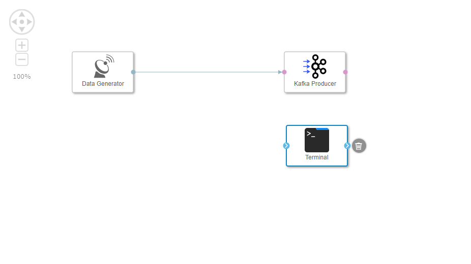
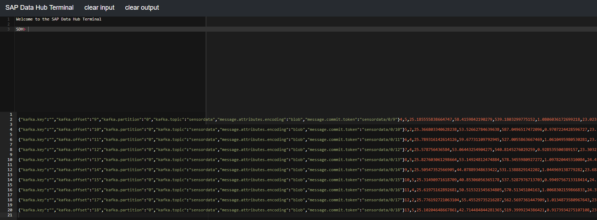

## Prerequisites  
 - **Proficiency:** Beginner
 - You have completed [Generate sensor data](https://www.sap.com/developer/tutorials/datahub-pipelines-sensordata.html)

## Next Steps
 - [Store sensor data in HDFS](https://www.sap.com/developer/tutorials/datahub-pipelines-storeinhdfs.html)

## Details
### You will learn  
During this tutorial, you will learn how to use a message broker within a pipeline. You will use a **Kafka Producer** as well as a **Kafka Consumer**.

### Time to Complete
**30 Min**

---

[ACCORDION-BEGIN [Step 1: ](Setup up Apache Kafka)]
During this tutorial, you will use Apache Kafka as message broker to stream sensor data (i.e. you will publish sensor data via a stream and also consume this stream).

>Apache Kafka is a distributed streaming platform. Simply spoken, it allows you to publish and subscribe to message streams. You can find more information on https://kafka.apache.org.


If you have not yet Apache Kafka (combined with Apache Zookeeper) set up, then an easy way to do is pulling an image from Docker Hub (https://hub.docker.com/).

Open a **command line** and search the Docker Hub for images by entering the following.

```sh
docker search kafka
```

You see a list of images related to Apache Kafka. The `spotify/kafka` image is suitable for the purpose of this tutorial. It runs Apache Kafka as well as Apache Zookeeper.
  

Pull the `spotify/kafka` image from Docker Hub by entering the following command.

```sh
docker pull spotify/kafka
```

Then verify that the image has been pulled by using the `docker images` command. You see a list of images on your local computer.

Run the image by entering the following command.

```sh
docker run --name kafka --hostname kafka --network dev-net spotify/kafka
```

The `hostname` and `network` options ensure that you can easily address Apache Kafka from the pipeline later on.

[ACCORDION-END]

[ACCORDION-BEGIN [Step 2: ](Add and configure Kafka Producer)]
Open the pipeline which you have created during the previous tutorials (`test.myFirstPipeline`) in the modelling environment `http://localhost:8090`.

Remove the connection between the **Data Generator** operator and the **Terminal** operator.

Add a **Kafka Producer** operator to the pipeline by drag & drop. Then connect the **output** port of the **Data Generator** operator to the **message** port of the **Kafka Producer** operator.

  

Configure the **Kafka Producer** operator. You need to maintain the following properties:

| Property                       | Value                          |
| ------------------------------ | ------------------------------ |
| `brokers`                      | `kafka:9092`                   |
| `topic`                        | `sensordata`                   |

[ACCORDION-END]

[ACCORDION-BEGIN [Step 3: ](Add and configure Kafka Consumer)]
Add a **`Kafka Consumer`** operator to the pipeline by drag & drop.
Add a **`ToString Converter`** operator to the pipeline by drag & drop.
Connect the **`message`** port of the **`Kafka Consumer`** operator to the **`inmessage`** port of the **`ToString Converter`** operator.
Connect the **`outstring`** port of the **`ToString Converter`** operator to the **`in1`** port of the **Terminal** operator.

  

Configure the **`Kafka Consumer`** operator. You need to maintain the following properties:

| Property                       | Value                          |
| ------------------------------ | ------------------------------ |
| `topics`                       | `sensordata`                   |
| `zookeepers`                   | `kafka:2181`                   |

Afterwards press the **Save** button.

[ACCORDION-END]

[ACCORDION-BEGIN [Step 4: ](Execute the data pipeline)]
Press the **Run** button to execute the pipeline.

When the **Status** tab indicates that the pipeline is running, use the context menu **Open UI** of the **Terminal** operator to see the generated sensor data.

  

In contrast to the previous tutorial, this time the generated sensor data is not sent from the **Data Generator** operator to the **Terminal** operator directly, but via Apache Kafka.

**Attention:** If you do not see any sensor data in the terminal, then stop the pipeline and try once more.

Stop the pipeline by pressing the **Stop** button.

[ACCORDION-END]

---

## Next Steps
[Store sensor data in HDFS](https://www.sap.com/developer/tutorials/datahub-pipelines-storeinhdfs.html)
