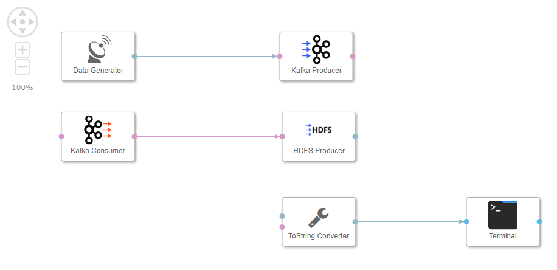
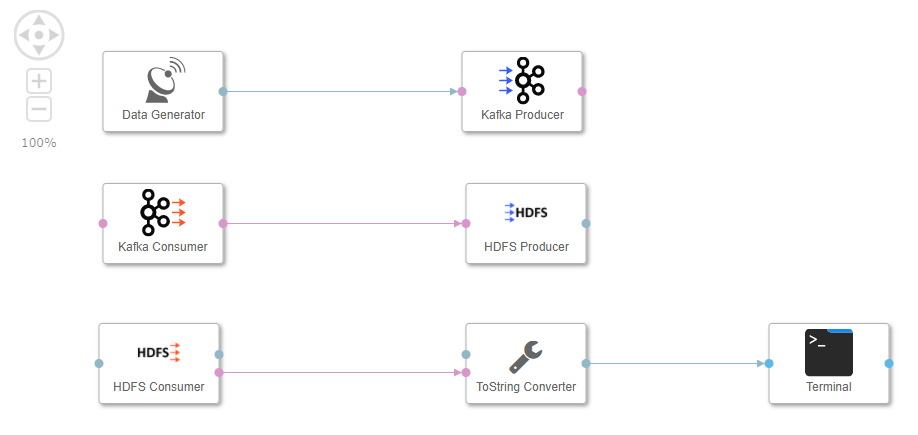
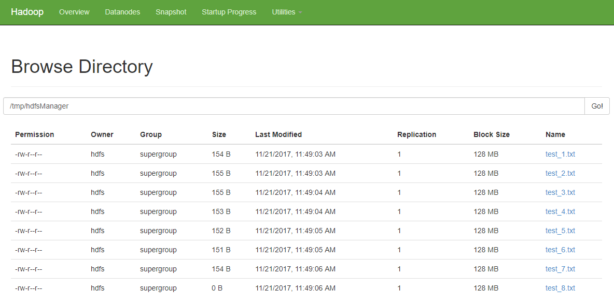

## Prerequisites  
 - **Proficiency:** Beginner
 - You have completed [Use a message broker](http://www.sap.com/developer/tutorials/datahub-pipelines-broker.html)

## Next Steps
 - [Bundle data (via JavaScript)](http://www.sap.com/developer/tutorials/datahub-pipelines-bundledata.html)

## Details
### You will learn  
During this tutorial, you will learn how to store sensor data in the Hadoop Distributed File System (HDFS). You will use an **HDFS Producer** operator for this.

### Time to Complete
**15 Min**

---

[ACCORDION-BEGIN [Step 1: ](Check Hadoop)]
The SAP Data Hub, developer edition per default comes with an Apache Hadoop installation. Open http://localhost:50070 and check that HDFS is up and running.

  

Navigate to **Utilities -> Browse the file system (1)** and display the **/tmp/hdfsManager** directory (when you install SAP Data Hub, developer edition initially, this directory is empty).

[ACCORDION-END]

[ACCORDION-BEGIN [Step 2: ](Add and configure HDFS Producer)]
Open the pipeline which you have created during the previous tutorials (`test.myFirstPipeline`) in the modelling environment `http://localhost:8090`.

Remove the connection between the **Kafka Consumer** operator and the **ToString Converter** operator.

Add a **HDFS Producer** operator to the pipeline by drag & drop. Then connect the **message** port of the **Kafka Consumer** operator to the **inFile** port of the **HDFS Producer** operator.

  

Configure the **HDFS Producer** operator. You need to maintain the following properties:

| Property                       | Value                                 |
| ------------------------------ | ------------------------------------- |
| `append`                       | `false`                               |
| `hadoopNamenode`               | `hdfs:9000`                           |
| `hadoopUser`                   | `hdfs`                                |
| `path`                         | `/tmp/hdfsManager/test_<counter>.txt` |

The **HDFS Producer** will write the received data to files in the `/tmp/hdfsManager` directory. The files follow the scheme `test_<counter>.txt` (whereas `<counter>` is an incremental integer).

[ACCORDION-END]

[ACCORDION-BEGIN [Step 3: ](Add and configure HDFS Consumer)]
Add a **HDFS Consumer** operator to the pipeline by drag & drop. Then connect the **outFile** port of the **HDFS Consumer** operator to the **inmessage** port of the **ToString Converter** operator.

  

Configure the **HDFS Consumer** operator. You need to maintain the following properties:

| Property                       | Value                               |
| ------------------------------ | ----------------------------------- |
| `hadoopNamenode`               | `hdfs:9000`                         |
| `hadoopUser`                   | `hdfs`                              |
| `onlyReadOnChange`             | `true`                              |
| `path`                         | `/tmp/hdfsManager/`                 |

Afterwards press the **Save** button.

[ACCORDION-END]

[ACCORDION-BEGIN [Step 4: ](Execute the data pipeline)]
Press the **Run** button to execute the pipeline.

When the **Status** tab indicates that the pipeline is running, use the context menu **Open UI** of the **Terminal** operator to see the generated sensor data.

In contrast to the previous tutorial, this time the generated sensor data is not sent from the **Kafka Receiver** operator to the **Terminal** operator directly, but via HDFS. Hence the **Terminal** also shows you information about the created files.

Open http://localhost:50070 and display the `/tmp/hdfsManager` directory. The longer the pipeline runs, the more files you will find there.

  

Stop the pipeline by pressing the **Stop** button.

[ACCORDION-END]

---

## Next Steps
[Bundle data (via JavaScript)](http://www.sap.com/developer/tutorials/datahub-pipelines-bundledata.html)
