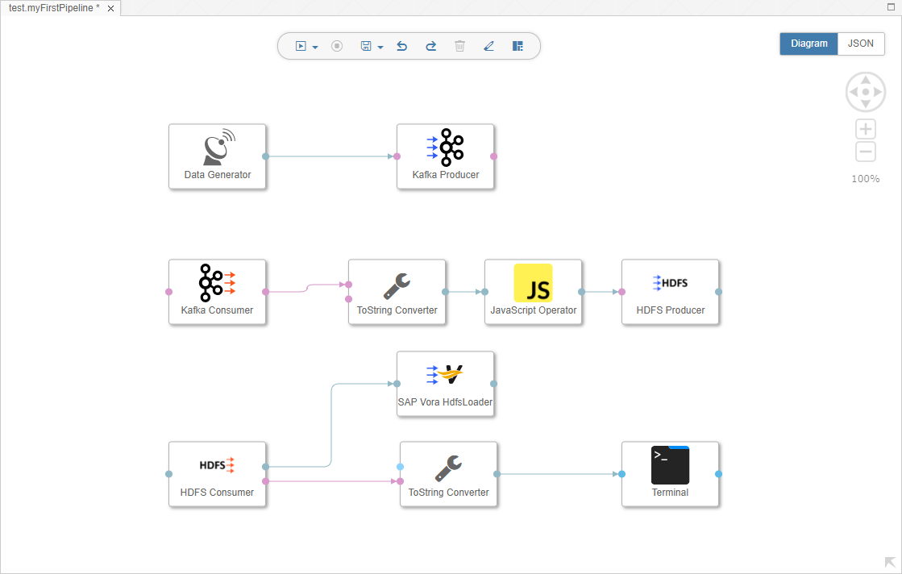

## Prerequisites  
 - **Proficiency:** Beginner
 - You have completed [Bundle data (via JavaScript)](https://www.sap.com/developer/tutorials/datahub-pipelines-bundledata.html)

## Details
### You will learn  
During this tutorial, you will store sensor data in SAP Vora. Thereto you will load the data which you have stored in HDFS to SAP Vora.

### Time to Complete
**15 Min**

---

[ACCORDION-BEGIN [Step 1: ](Add and configure SAP Vora HdfsLoader)]
Open the pipeline which you have created during the previous tutorials (`test.myFirstPipeline`) in the modelling environment `http://localhost:8090`.

Add a **`SAP Vora HdfsLoader`** operator to the pipeline by drag & drop. Then connect the **`outFilename`** port of the **`HDFS Consumer`** operator to the **`inhdfsfilename`** port of the **`SAP Vora HdfsLoader`**.

  

Configure the **`SAP Vora HdfsLoader`** operator. You need to maintain the following properties:

| Property                       | Value                                |
| ------------------------------ | ------------------------------------ |
| `dsn`                          | `v2://vora:2202/?binary=true`        |
| `hadoopNamenode`               | `hdfs:9000`                          |
| `initStatements`               | `DROP TABLE IF EXISTS SENSORDATA; CREATE TABLE SENSORDATA (counter INTEGER, deviceid INTEGER, temperature DOUBLE, humidity DOUBLE, co2 DOUBLE, co DOUBLE, lpg DOUBLE, smoke DOUBLE, presence INTEGER, light DOUBLE, sound DOUBLE);`   |
| `tableName`                    | `SENSORDATA`                         |

Afterwards press the **Save** button.

[ACCORDION-END]

[ACCORDION-BEGIN [Step 2: ](Execute the data pipeline and check result in SAP Vora)]
Press the **Run** button to execute the pipeline.

When the **Status** tab indicates that the pipeline is running, wait a moment and then open the SAP Vora Tools `http://localhost:9225`. Navigate to **Data Browser (1)**. Select table `SENSORDATA`. If necessary (i.e. if an error message `table SENSORDATA is not registered with Spark` is displayed), register table `SENSORDATA` with Spark via the the **context menu (2)**.

  

Stop the pipeline by pressing the **Stop** button.

[ACCORDION-END]

---
