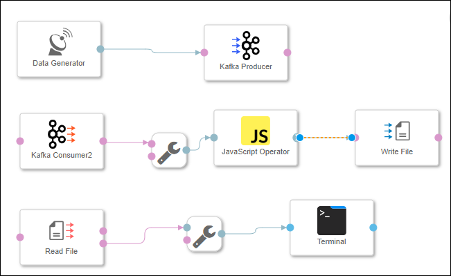
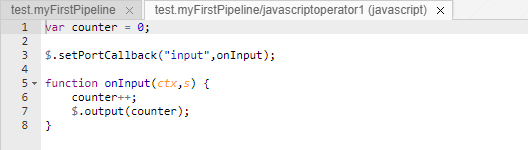
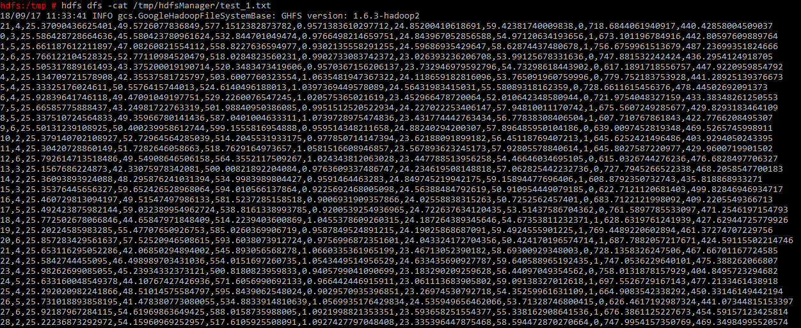

## Prerequisites

## Details
Please note this tutorial will be removed on 6th February 2019. SAP Data Hub 2.4 tutorials will be released instead.
### You will learn  
During this tutorial, you will learn how you can "bundle" (in the sense that not each single sensor record creates a new file) the sensor data before you store it in HDFS. You will use a **JavaScript Operator** for this.

### Time to Complete
**15 Min**

---

[ACCORDION-BEGIN [Step 1: ](Add JavaScript Operator)]
Open the pipeline which you have created during the previous tutorials (`test.myFirstPipeline`) in the modelling environment `http://localhost:8090`. For this, select the **Graphs** tab in the tab bar on the left side and search for `test.myFirstPiepline`.

Remove the connection between the **`Kafka Consumer2`** operator and the **Write File** operator.

Add a **`ToString` Converter** operator to the pipeline by drag & drop. Also add a **JavaScript Operator** to the pipeline by drag & drop.

Connect the `message` out port of the **`Kafka Consumer2`** operator to the `ininterface` in port of the **`ToString` Converter** operator. Connect the `outstring` out port of the **`ToString` Converter** operator to the `input` in port of the **JavaScript Operator**. Connect the `output` out port of the **JavaScript Operator** to the `inFile` in port of the **Write File** operator.

  

[ACCORDION-END]

[ACCORDION-BEGIN [Step 2: ](Create JavaScript extension)]
Right click on the **JavaScript Operator** and click on **Open Script** to display the JavaScript snippet which is executed by the **JavaScript Operator**. The JavaScript snippet opens in a new tab.

  

Currently the JavaScript snippet creates an incremental **counter** every time it receives data via the `input` port and sends the **counter** to the `output` port.

Replace the code with the following snippet to ensure that "bundles" of 30 sensor records are sent to the `output` port.

```javascript
var counter = 0;
var bundle = "";

$.setPortCallback("input",onInput);

function onInput(ctx,s) {
    counter++;
    bundle = bundle + s;

    if(counter==30) {
      $.output(bundle);
      counter = 0;
      bundle = "";
    }
}
```

**Close** the window with the JavaScript snippet. Afterwards press the **Save** button to save the graph.

[ACCORDION-END]

[ACCORDION-BEGIN [Step 3: ](Execute the data pipeline)]
Before you execute the pipeline, delete the contents from the `/tmp/hdfsManager` directory. To find out the container for **HDFS**, run the the following command:

```sh
docker ps
```
This will provide you a list of all the running containers. From the list, copy the **`Container ID`** for the container with the name **`hdfs`**. For this example, we are assuming that our **`Container ID`** is `8560ee632f69`

Now log into the running container.

```sh
docker exec -it 8560ee632f69 /bin/bash
```
>Replace `8560ee632f69` with your **`Container ID`** while executing

Then enter the following command.

```sh
hdfs dfs -rm /tmp/hdfsManager/*
```

You can check the deletion via `http://localhost:50070`.

Press the **Run** button to execute the pipeline.

When the **Status** tab indicates that the pipeline is running, use the context menu **Open UI** of the **Terminal** operator to see the generated sensor data.

Open `http://localhost:50070` and display the `/tmp/hdfsManager` directory. You see that the system does not create a file for each single sensor record, but only for each 30 sensor records.

Stop the pipeline by pressing the **Stop** button.

[ACCORDION-END]

[ACCORDION-BEGIN [Step 3: ](Check the created files in HDFS)]
To check the content of the created files, log into the running container and enter the following (to see, for example, the content of file `test_1.txt` ).

```sh
hdfs dfs -cat /tmp/hdfsManager/test_1.txt
```


  

**Attention:** You might notice that the first line of file `test_1.txt` does not necessarily have the counter `0` (that is the first column of the file and in the above screenshot it has the counter `123`) as one might expect when looking at the JavaScript snippet which is executed by the **Data Generator**. The reason for this can be that the **Kafka Producer** had sent a message to Kafka, but then you most likely stopped the pipeline before the **Kafka Consumer** consumed the message. When you afterwards restarted the pipeline, the **Kafka Consumer** first of all processed this "previous" message. For the sake of this tutorial you do not have to bother about this behavior.

[ACCORDION-END]

---
