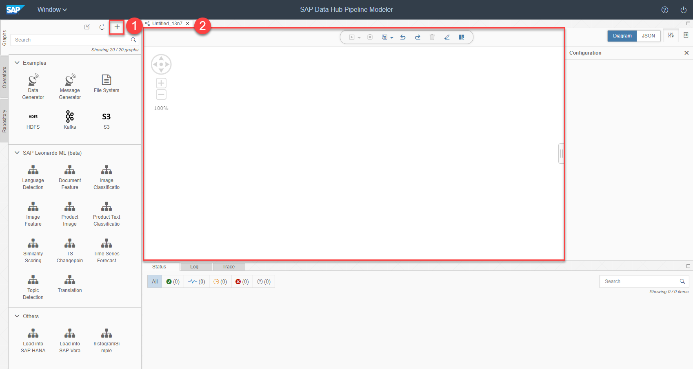
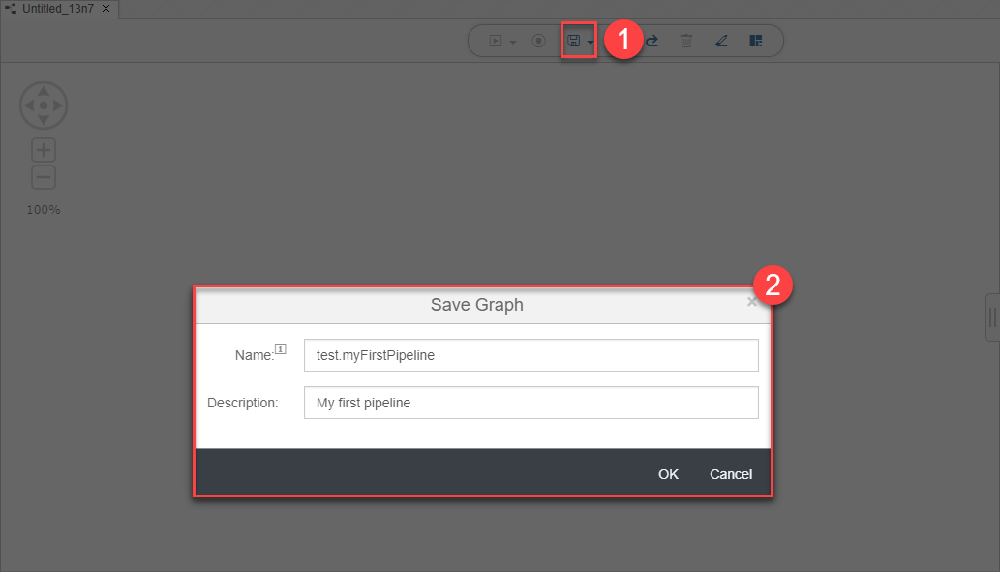
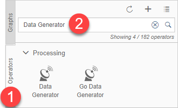
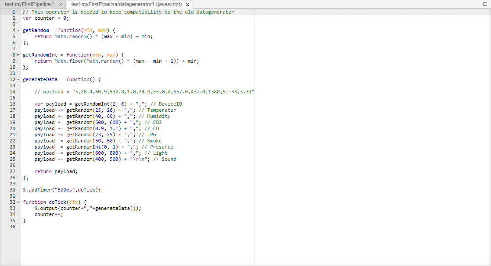
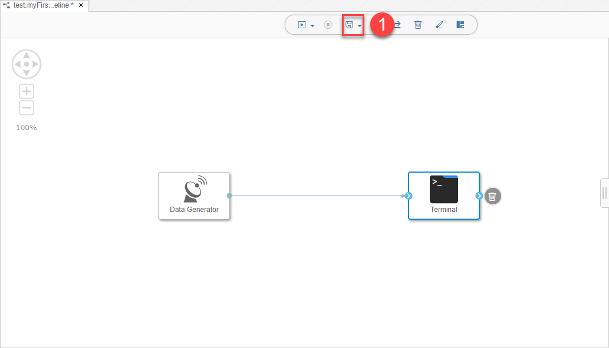
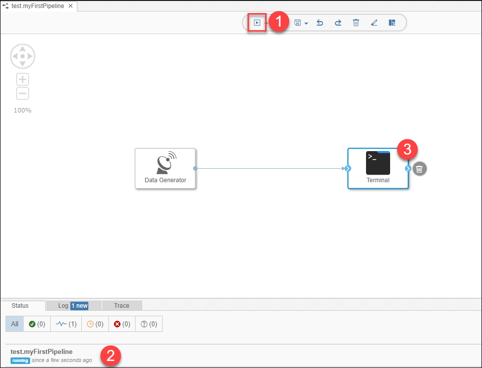
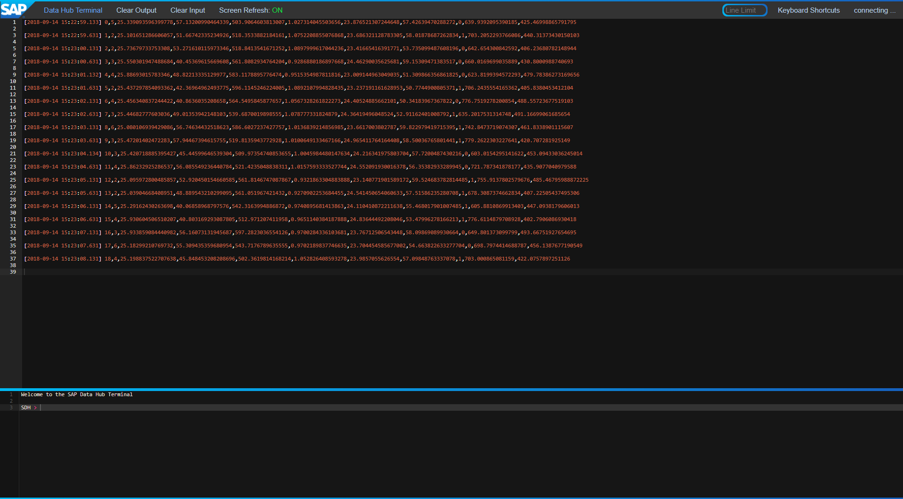

## Prerequisites  
 - You have successfully installed SAP Data Hub, developer edition.

## Details
### You will learn  
During this tutorial, you will learn how to use a **Data Generator** to generate random sample data and how to visualize the generated data via a **Terminal**

### Time to Complete
**15 Min**

---

[ACCORDION-BEGIN [Step 1: ](Create a data pipeline)]
Open the modelling environment for building pipelines via `http://localhost:8090` (SAP Data Hub Modeler).

Press the **Create Graph (1)** button to create a new pipeline. The pipeline opens in the **editor (2)**.

  

Press the **Save (1)** button. Then enter a **Name** (`test.myFirstPipeline`) and **Description** (`My first pipeline`) in the **pop-up window (2)**.

  

[DONE]

[ACCORDION-END]

[ACCORDION-BEGIN [Step 2: ](Add and configure Data Generator)]
Open the **Operators (1)** tab in the **Navigation** on the left. Then search for **Data Generator (2)**.

  

Add the **Data Generator (3)** operator to the pipeline by drag & drop.

  

**Attention:** The SAP Data Hub, developer edition comes with a pipeline as well as with an operator called **Data Generator**. If you miss to open the **Operators** tab, you might end up opening the pipeline called **Data Generator** instead of adding the operator.

Press the **Script (4)** button to display the JavaScript snippet which is executed by the **Data Generator**. The JavaScript snippet opens in a new tab of the editor.

You see that the **Data Generator** creates a new random sample record every 500 milliseconds and sends it via the `output` port of the operator.

The sample data represents sensors for humidity, temperature etc.

  

Close the tab for the JavaScript snippet.

[DONE]

[ACCORDION-END]

[ACCORDION-BEGIN [Step 3: ](Add and configure Terminal)]
Add a **Terminal** operator to the pipeline by drag & drop (you find this also in the **Operators** tab). Then connect the `output` port of the **Data Generator** operator to the `in1` port of the **Terminal** operator. **You need to place the connection exactly on the "green circle".**

  

Afterwards press the **Save (1)** button.

[DONE]

[ACCORDION-END]

[ACCORDION-BEGIN [Step 4: ](Execute the data pipeline)]
Press the **Run (1)** button to execute the pipeline.

  

When the **Status (2)** tab indicates that the pipeline is running, use the context menu **Open UI** of the **Terminal (3)** operator to see the generated sensor data.

  

Copy any row of the terminal output and paste it in the frame below and click on **Validate**.

[VALIDATE_1]

Stop the pipeline by pressing the **Stop** button (you find it next to the **Run** button).

[ACCORDION-END]

---
