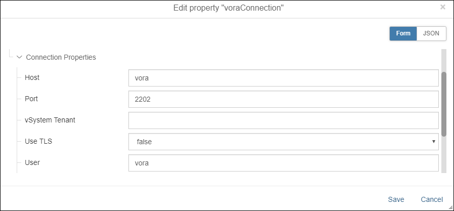
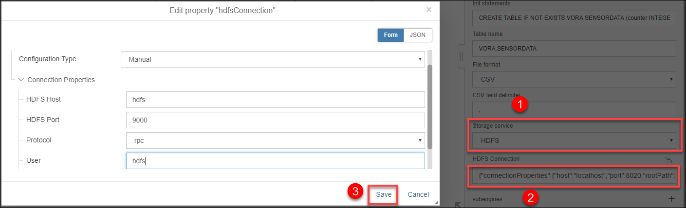
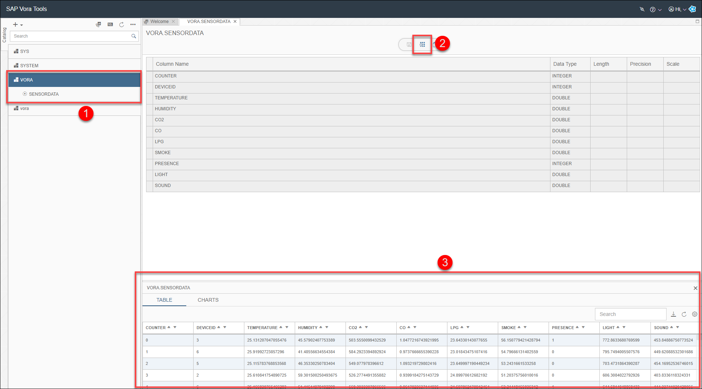

## Prerequisites

## Details
### You will learn  
During this tutorial, you will store sensor data in SAP Vora. Thereto you will load the data which you have stored in HDFS to SAP Vora.

### Time to Complete
**15 Min**

---

[ACCORDION-BEGIN [Step 1: ](Add and configure SAP Vora Loader)]
Open the pipeline which you have created during the previous tutorials (`test.myFirstPipeline`) in the modelling environment `http://localhost:8090`.

Add a **`ToString Converter`** operator and a **`SAP Vora Loader`** operator to the pipeline by drag & drop. Then connect the `outFilename` out port of the **Read File** operator to the `ininterface` in port of the **`ToString Converter`** operator and also connect the `outstring` out port of the **`ToString Converter`** to the `filename` in port of the **`SAP Vora Loader`**.

  

Configure the **`SAP Vora Loader`** operator. You need to maintain the following properties:

| Property &nbsp;&nbsp;&nbsp;&nbsp;&nbsp;&nbsp;&nbsp;&nbsp;&nbsp;&nbsp;&nbsp;&nbsp;&nbsp;&nbsp;&nbsp;&nbsp;&nbsp;&nbsp;&nbsp;&nbsp;&nbsp;&nbsp;&nbsp;&nbsp;&nbsp;&nbsp;&nbsp;&nbsp;&nbsp;&nbsp;&nbsp;&nbsp;&nbsp;&nbsp;                     | Value                                |
| :------------------------------ | :------------------------------------ |
| `initStatements`               | `CREATE TABLE IF NOT EXISTS VORA.SENSORDATA (counter INTEGER, deviceid INTEGER, temperature DOUBLE, humidity DOUBLE, co2 DOUBLE, co DOUBLE, lpg DOUBLE, smoke DOUBLE, presence INTEGER, light DOUBLE, sound DOUBLE) TYPE DATASOURCE STORE ON DISK;`   |
| `tableName`                    | `VORA.SENSORDATA`                         |

Click on the text box for **`Vora Connection`**. Select **Manual** as the **Configuration Type** and maintain the following configuration :

Please note you need to use the same password for the **`vora`** user that you provided when you setup your docker container for **`datahub`**.
Click on **Save**. Scroll down in the configuration list and select **`HDFS`** as **Storage Service (1)**. Then click on the text box for **`HDFS Connection (2)`**. Now maintain the following configuration :

Afterwards press the **Save (3)** button. Also **Save** the changes to the graph.

[DONE]

[ACCORDION-END]

[ACCORDION-BEGIN [Step 2: ](Execute the data pipeline and check result in SAP Vora)]
Press the **Run** button to execute the pipeline.

When the **Status** tab indicates that the pipeline is running, wait a moment and then open the SAP Vora Tools `http://localhost:9225`.
Find table `SENSORDATA` on the **left (1)** under the `VORA` schema and click on the table name. Then press the **Data Preview (2)**  button.

  

Stop the pipeline by pressing the **Stop** button.

**Attention**: If no data is stored in SAP Vora, you can add a **Terminal** operator to the pipeline and connect it with the `result` out port of the **`SAP Vora Loader`** operator. If you see an error message like `could not handle api call, failure reason : execution of scheduler plan failed`, you might have incorrectly connected the **`Kafka Consumer2`** operator and the **`ToString` Converter** operator. Please review the previous tutorial.

[VALIDATE_1]

[ACCORDION-END]

---
