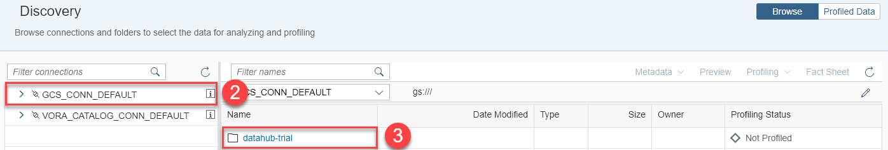
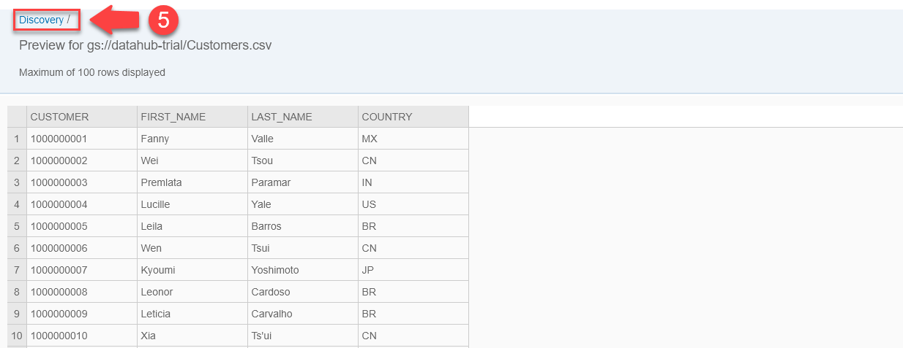
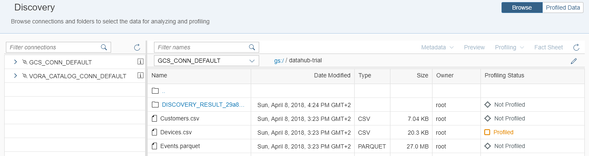
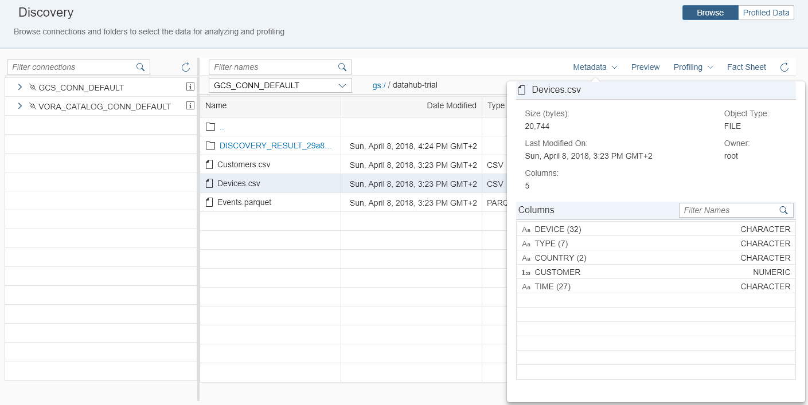
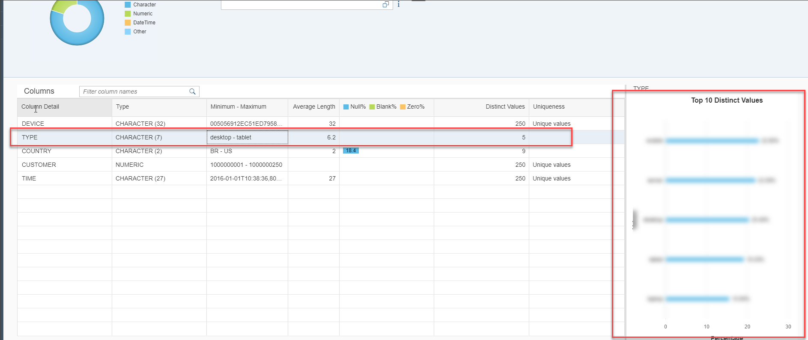

## Prerequisites  
 - **Proficiency:** Beginner

## Next Steps
 - [Explore data in SAP Vora](https://www.sap.com/developer/tutorials/datahub-trial-discovery-part02.html)

## Details
### You will learn  
During this tutorial, you will learn how to use Data Discovery in SAP Data Hub. This allows you to learn more about data residing in, for example, Google Cloud Storage by profiling, previewing and viewing the metadata. You will use data residing in Google Cloud Storage.

### Time to Complete
**30 Min**

---

[ACCORDION-BEGIN [Step 1: ](Discover data in Google Cloud Storage)]
Open the SAP Data Hub Cockpit (`https://vhcalhxedb:51076/`) via a web browser.

Enter `DATAHUB` as **HANA Username** and the password which you have selected during system setup as **HANA Password** to logon to SAP Data Hub Cockpit. The system displays the **Overview** page.

  

Navigate to **Discovery (1)** by clicking the button on the left side of the screen.

  

Click the `GCS_CONN_DEFAULT (2)` connection to display the directories / files on Google Cloud Storage. In our example the files are stored in a bucket called `datahub-trial`. Click this **bucket (3)**.

  
You see three files (assuming that you have completed the previous tutorials):

- [`Customers.csv`](https://raw.githubusercontent.com/SAPDocuments/Tutorials/master/tutorials/datahub-trial-setup/Customers.csv)
- [`Devices.csv`](https://raw.githubusercontent.com/SAPDocuments/Tutorials/master/tutorials/datahub-trial-setup/Devices.csv)
- [`Events.parquet`](https://github.com/SAPDocuments/Tutorials/raw/master/tutorials/datahub-trial-setup/Events.parquet)

[DONE]

[ACCORDION-END]

[ACCORDION-BEGIN [Step 2: ](Preview files)]
Select the `Customers.csv` file and take a look at the content of the file by pressing the **Preview (4)** button in the toolbar in the upper right section of the screen.

You see the first 100 rows of the file. Obviously the file stores customer data. Navigate back by clicking on the **Discovery (5)** link.

  

Next also take a look at the content of the two other files. You see that these two files store device and event data.

[DONE]

[ACCORDION-END]

[ACCORDION-BEGIN [Step 3: ](Profile files)]
Next you profile the files. Profiling determines all kind of metadata about the files.

  

To profile the files, you first need to setup a cloud storage location to store the profiling information by clicking **Profiling -> Setup Cloud Storage (6)**. Store the profiling information in the same bucket as the files themselves are stored (in our example `datahub-trial`).

Select the `Devices.csv` file and profile it by clicking the **Profiling -> Start Profiling (6)** button.

The system indicates that profiling started. It can take several minutes for profiling to complete. You can refresh the screen by clicking **Refresh (6)**. That is the right-most button in the toolbar in the upper right of the screen.

  

>Even though the data volume is comparatively small, it profiling can take comparatively long to complete. Profiling uses Apache Spark and it takes time to spin up the Spark workers.
>&nbsp;
If you see an error like `Error during profiling "Adapter Error Message "code": "ECONNRESET"`, then refer to the [**Getting Started with SAP Data Hub, trial edition**] (https://caldocs.hana.ondemand.com/caldocs/help/Getting_Started_Data_Hub_SP04.pdf) guide (chapter 7).

When profiling completed, the system will display the profiling status as `Profiled` and there will be a new folder (with a rather cryptic name `DISCOVER_RESULT_...`).

[DONE]

[ACCORDION-END]

[ACCORDION-BEGIN [Step 4: ](Display metadata and fact sheet)]
Now you can display the **Metadata (1)** as well as the **Fact sheet (2)** for the `Devices.csv` file.

  

The metadata is displayed in a popup. You see the columns, corresponding types as well as the size of the `Devices.csv` file.

The `Devices.csv` file has five columns. The columns are mostly of character type. The file size is 20,744 bytes.

  

The fact sheet again displays the columns as well as corresponding types. But it also displays much more information such as minimum and maximum values of the columns, percentage of null values and top 10 distinct values.

As you can see the `Devices.csv` file has a lot of null values (18.4%) in the `COUNTRY` column. There seems to be a problem with the quality of the data in this particular column.

Next also profile the content of the two other files and afterwards take a look at metadata and fact sheet. You will in particular notice that the `Customers.csv` file is complete in terms of the `COUNTRY` column.

From the fact sheet for `Devices.csv`, click on the column **Type** and open details about that column.

[VALIDATE_1]

[ACCORDION-END]
---

## Next Steps
[Explore data in SAP Vora](https://www.sap.com/developer/tutorials/datahub-trial-discovery-part02.html)
