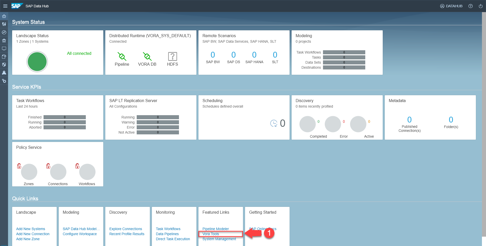
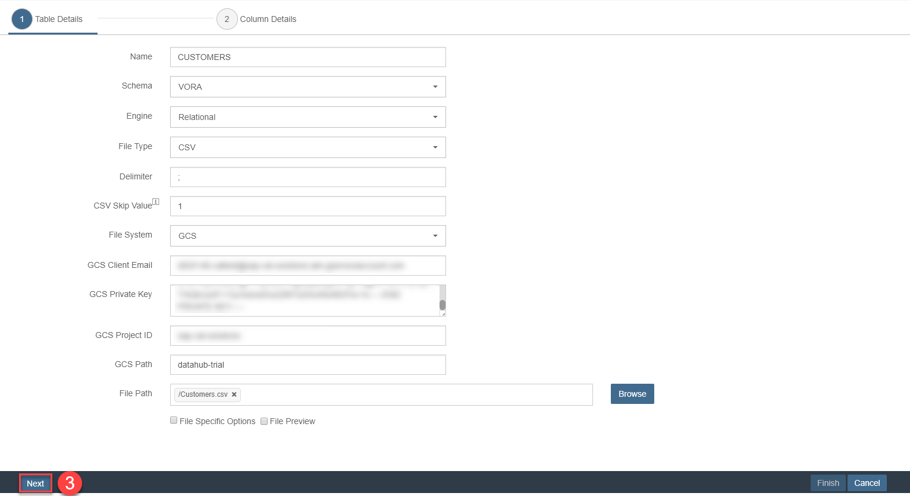
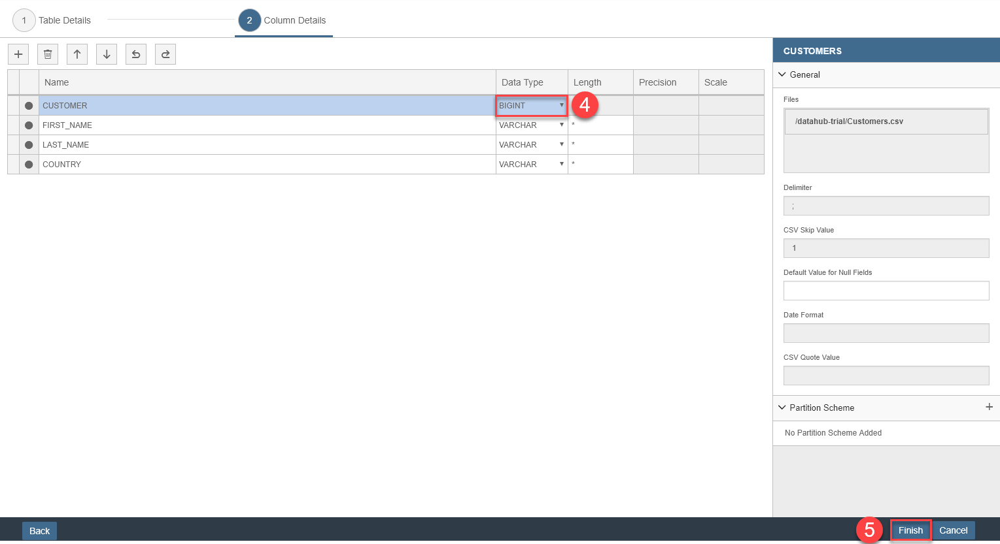
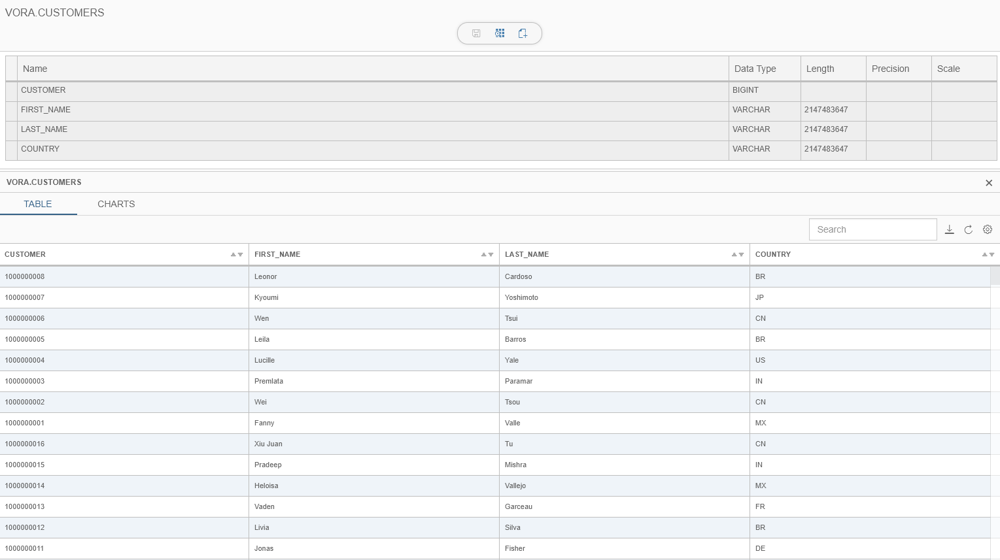
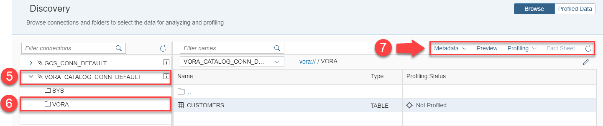
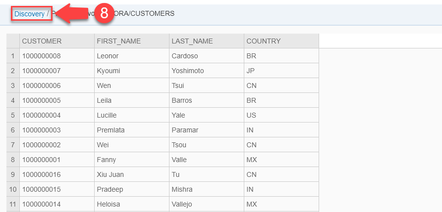
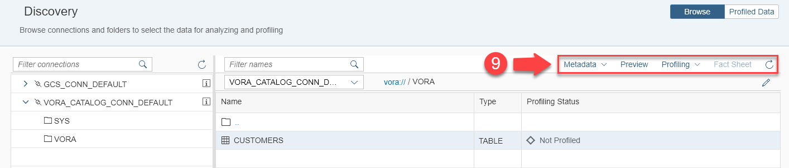
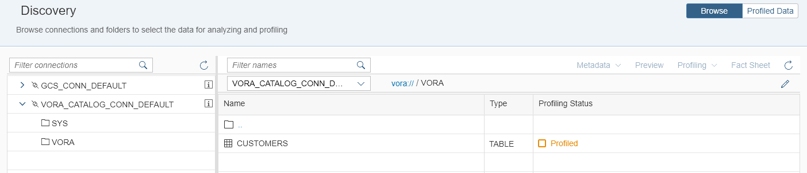

## Prerequisites  
 - **Proficiency:** Beginner
 - You have completed [Explore data in Google Cloud Storage](https://www.sap.com/developer/tutorials/datahub-trial-discovery-part01.html)

## Details
### You will learn  
During this tutorial, you will learn that Data Discovery cannot only be used on files (for example stored in Google Cloud Storage). Data Discovery also works on other data stores, in particular SAP Vora.

### Time to Complete
**30 Min**

---

[ACCORDION-BEGIN [Step 1: ](Load data into SAP Vora)]
To be able to profile data in SAP Vora, you first need to load data into SAP Vora. Thereto open the SAP Data Hub Cockpit [`https://vhcalhxedb:51076/`](https://vhcalhxedb:51076/) via a web browser.

Enter `DATAHUB` as **HANA Username** and the password which you have selected during system setup as **HANA Password** to logon to SAP Data Hub Cockpit. The system displays the **Overview** page.

  

Navigate to the **SAP Vora Tools** by clicking **link (1)** on the bottom of the screen. You have to logon again. Enter `default` as **Tenant ID**, `DATAHUB` as **Username** and the password which you have selected during system setup as **Password**. The system displays the **SAP Vora Tools**.

  

Create a new relational table by clicking **Create New (2)**.

  

Enter the following information to create the relational table and then click **Next (3)** :

| Field                          | Value                                                                                       |
| ------------------------------ | ------------------------------------------------------------------------------------------- |
| `Name`                         | `CUSTOMERS`                                                                                 |
| `Schema`                       | `VORA`                                                                                      |
| `Engine`                       | `Relational`                                                                                |
| `File Type`                    | `CSV`                                                                                       |
| `Delimiter`                    | `;`                                                                                         |
| `CSV Skip Value`               | `1`                                                                                         |
| `File System`                  | `GCS`                                                                                       |
| `GCS Client Email`             | from your Google Cloud Platform service account (attribute `client_email` from .json file)  |
| `GCS Private Key`              | from your Google Cloud Platform service account (attribute `private_key` from .json file **without** `\n` at the end of the attribute ) |
| `GCS Project ID`               | from your Google Cloud Platform service account (attribute `project_id` from .json file)    |
| `GCS Path`                     | bucket, in our case `datahub-trial`                                                         |
| `GCS File Path`                | file path via **Browse** button, in our case `/Customers.csv`                               |

  

On the next screen, change the **data type (4)** of the `CUSTOMER` column to `BIGINT`. Finally click **Finish** to create the table.

  

[ACCORDION-END]

[ACCORDION-BEGIN [Step 2: ](Preview table)]
Go back to the SAP Data Hub Cockpit and Navigate to **Discovery**.

  

Expand the `VORA_CATALOG_CONN_DEFAULT (5)` connection and click on **VORA (6)** to display the tables in SAP Vora in schema `VORA`. In our example you see exactly one table, namely the table `CUSTOMERS`, which you created during the previous step.

Select the `CUSTOMERS` table and then take a look at the content of the table by clicking **Preview (7)** in the toolbar in the upper right of the screen.

  

You see the first 100 rows of the table. Obviously the table stores the same customer data as the `Customers.csv` file (that is where you loaded the data from into the table). Navigate back by clicking on the **Discovery (8)** link.

[ACCORDION-END]

[ACCORDION-BEGIN [Step 3: ](Profile table)]
Next you profile the table. Profiling determines all kind of metadata about the table.

  

Select the `CUSTOMERS` table and profile it by clicking **Profile -> Start Profiling (9)**.

The system indicates that profiling started. It can take several minutes for profiling to complete. You can refresh the screen by clicking **Refresh (9)**. That is the right-most button in the toolbar in the upper right of the screen.

  

When profiling completed, the system will display the profiling status as `Profiled`.

[ACCORDION-END]

[ACCORDION-BEGIN [Step 4: ](Display metadata and fact sheet)]
You can take a look at metadata and fact sheet of the `CUSTOMERS` table just like you did during the previous tutorial for the files.

[ACCORDION-END]

---
