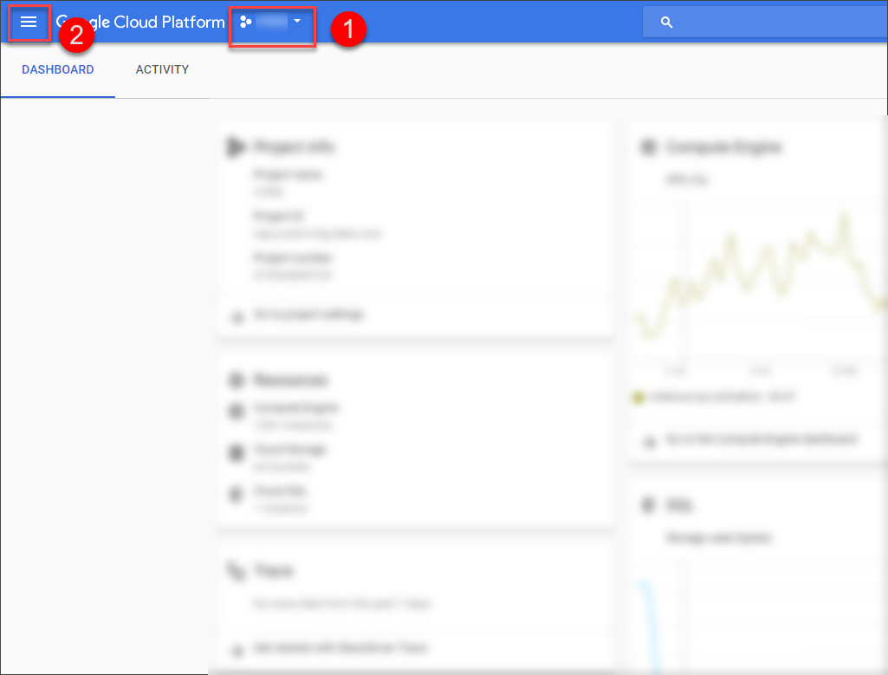
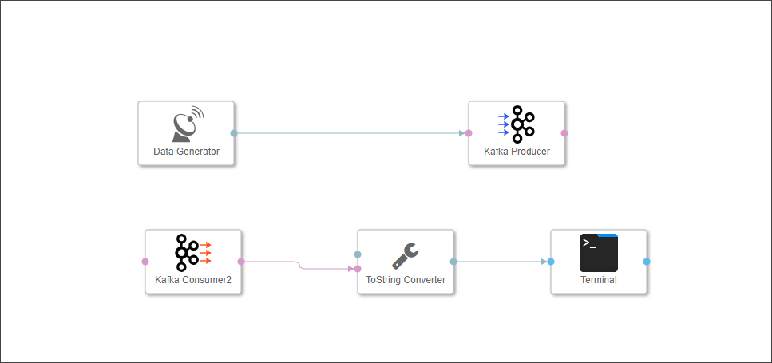
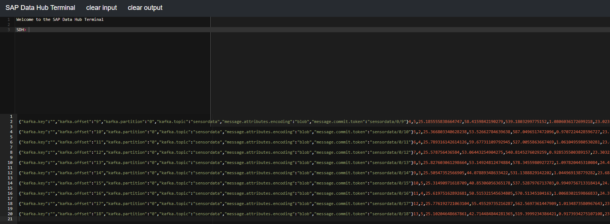

## Details
**This tutorial is obsolete and will be removed shortly (mid-November 2018).**
### You will learn  
  - How to use a message broker within a pipeline.

Please note that this tutorial is similar to the `Use a message broker` tutorial from [SAP Data Hub, developer edition tutorial group](https://www.sap.com/developer/groups/datahub-pipelines.html).

### Time to Complete
**30 Mins**

---

[ACCORDION-BEGIN [Step 1: ](Set up Apache Kafka)]
For this tutorial, we will use **Apache Kafka** as a message broker to produce and consume stream sensor data with the help of **Kafka Producer** and **Kafka Consumer 2** operators.

>Apache Kafka is a distributed streaming platform. Simply spoken, it allows you to publish and subscribe to message streams. You can find more information on [https://kafka.apache.org](https://kafka.apache.org).

As we are using **Google Cloud Platform (GCP)** to host the trial edition, we will deploy Kafka in the same platform as well. To perform the deployment, we are going to leverage the **Click to Deploy** functionality provided by Google Cloud Launcher.

First, go to your **Instance details** from **SAP Cloud Application Library** and note down the following things – **Region, Zone, Network** for your instance as we are going to need this later in the setup. You can find it here:

Login to Google Cloud Platform - [http://console.cloud.google.com](http://console.cloud.google.com)

Select your project from the **Top Ribbon (1)**. Then, navigate to the **Cloud Launcher** using the **GCP Left Menu Button (2)**.

In the Cloud Launcher search box, search for `kafka`. There are multiple providers that have made different Kafka versions available. For the sake of this tutorial we would be selecting the version from Kafka itself, so proceed by selecting the following:

On the next page, click **Launch on Compute Engine**. Following details should be configured in Kafka properties –

|  Field Name &nbsp;&nbsp;&nbsp;&nbsp;&nbsp;&nbsp;&nbsp;&nbsp;&nbsp;&nbsp;&nbsp;&nbsp;&nbsp;&nbsp;&nbsp;&nbsp;&nbsp;&nbsp;&nbsp;&nbsp;&nbsp;&nbsp;&nbsp;&nbsp;&nbsp;&nbsp;&nbsp;&nbsp;&nbsp;&nbsp;&nbsp;&nbsp;    | Value
|  :------------- | :-------------
|  Deployment name | `kafka-1`
|  Zone           | Combine the region and zone for your instance which we have noted down earlier. `europe-west1-d` in this example
|  Network name   | From the dropdown box choose the network for your instance which we have noted down earlier

Rest of the defaults have to be kept as is and then click on **Deploy**. After deployment completes, all the details for the new instance are displayed.

Navigate to **GCP Left menu** > **Compute Engine** > **VM Instances** and filter for `kafka-1-vm` using the search box and open the instance details by clicking on the name of the instance

From the instance details page, note down the **Primary Internal IP** of this VM instance which would be used later in this tutorial

>Primary Internal IP will be referred to as Internal IP in step 2 and 3 below.

[DONE]

[ACCORDION-END]

[ACCORDION-BEGIN [Step 2: ](Add and configure Kafka Producer)]

Open the pipeline which you have created in the previous tutorial `(test.myFirstPipeline)`, in the modelling environment (`https://vhcalruntime/app/pipeline-modeler`)

>As the above URL is a local URL, it will be accessible only if you are doing the tutorials and have already configured the hosts file. If not, please refer to [Getting Started with SAP Data Hub, trial edition](https://caldocs.hana.ondemand.com/caldocs/help/Getting_Started_Data_Hub_SP04.pdf) guide.

Remove the connection between **Data Generator** operator and the **Terminal** operator

From the **Operators** tab in the left menu pane, drag and drop a **Kafka Producer** to the pipeline. Then connect the `output` port of the **Data Generator** to the `message` port of the **Kafka Producer**.

Configure the **Kafka Producer** operator by maintaining the following properties :

|  Field Name     | Value
|  :------------- | :-------------
|  Brokers  | **Internal IP:9092**, Example – 0.0.0.0:9092 (Refer to step 1 for the IP)
|  Topic  | `sensordata`

[DONE]

[ACCORDION-END]

[ACCORDION-BEGIN [Step 3: ](Add and configure Kafka Consumer)]

From the **Operators** tab in the left menu pane, add a `Kafka Consumer2` to the pipeline by drag and drop. Similarly also add a `ToString Converter` operator to the pipeline.

>For this demonstration, we have used `Kafka Consumer2` as it supports `0.9.x` or newer versions better than the Kafka Consumer operator.

Now connect `message` port of the `Kafka Consumer2` to the `inmessage` port of the `ToString Converter`. Then connect `outstring` port of the `ToString Converter` operator to the `in1` port of the **Terminal operator**.

Configure the **Kafka Consumer 2** operator by maintaining the following properties :

|  Field Name     | Value
|  :------------- | :-------------
|  Brokers  | **Internal IP:9092**, Example – 0.0.0.0:9092 (Refer to step 1 for the IP)
|  Topic  | `sensordata`

Once done, click **Save**.

[DONE]

[ACCORDION-END]

[ACCORDION-BEGIN [Step 4: ](Execute the data pipeline)]

Click **Run** to execute the pipeline

When the **Status** tab indicates that the pipeline is running, use the context menu **Open UI** of the **Terminal** operator to see the generated sensor data.

Copy any row of the terminal output and paste it in the frame below and click on **Validate**.

[VALIDATE_1]

Stop the pipeline by clicking **Stop**.

[ACCORDION-END]

---
