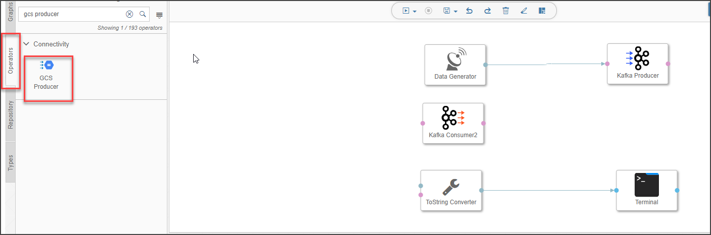
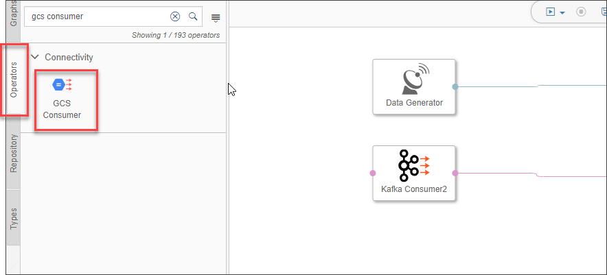
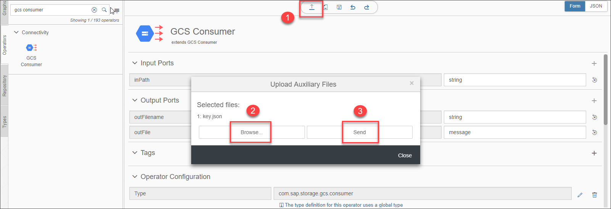
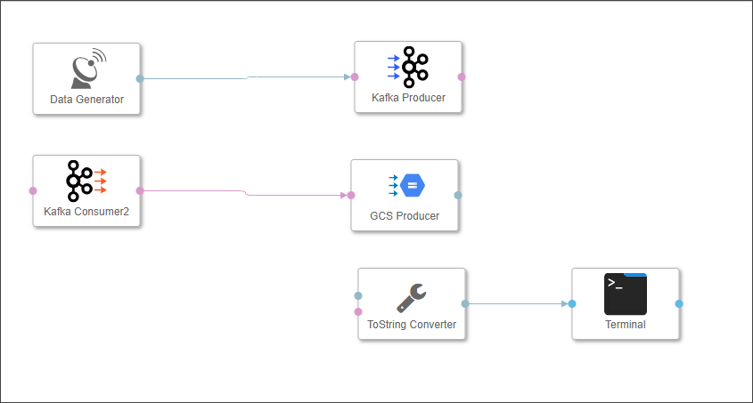
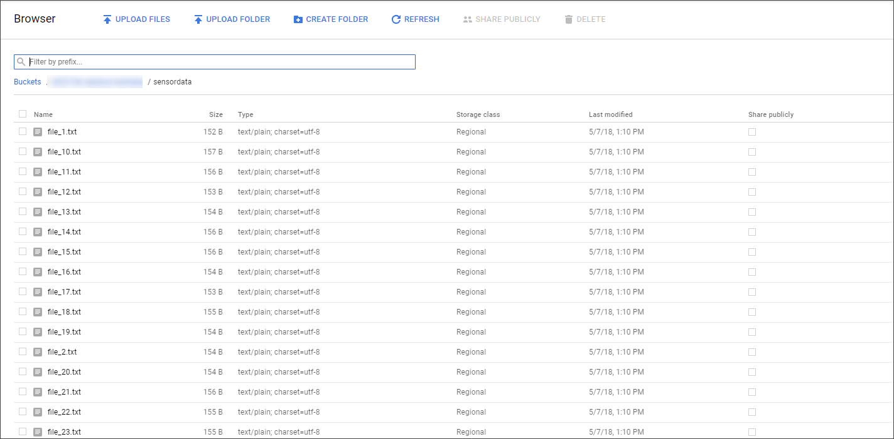

## Prerequisites  
 - **Proficiency:** Beginner
 - You have completed [Use a message broker](https://www.sap.com/developer/tutorials/datahub-trial-pipelines-part02.html)

## Next Steps
- [Bundle data (via JavaScript)](https://www.sap.com/developer/tutorials/datahub-trial-pipelines-part04.html)

## Details#
**This tutorial is obsolete and will be removed shortly (mid-November 2018).**
### You will learn  
- How to store sensor data in **Google Cloud Storage**
- How to use the operators **GCS Consumer** and **GCS Producer**

Please note that this tutorial is similar to the `Store sensor data in HDFS` tutorial from [SAP Data Hub, developer edition tutorial group](https://www.sap.com/developer/groups/datahub-pipelines.html).

### Time to Complete
**30 Mins**

---

[ACCORDION-BEGIN [Step 1: ](Collect GCS Details)]
The SAP Data Hub, trial edition is deployed on Google Cloud Platform. Therefore we will use Google Cloud Storage for storing sensor data. For this purpose we need the following:

- **GCS Bucket Details**
- **GCS JSON Key**

If you don't already have the JSON Key, refer the [**Getting Started with SAP Data Hub, trial edition**] (https://caldocs.hana.ondemand.com/caldocs/help/Getting_Started_Data_Hub_SP04.pdf) guide, which contains step-by-step explanation to download the key and get the bucket details.

[DONE]

[ACCORDION-END]

[ACCORDION-BEGIN [Step 2: ](Edit GCS Consumer and Producer Operators [For SAP Data Hub, trial edition v1.3])]

>This step of editing GCS Consumer and Producer Operators, is specific to SAP Data Hub, trial edition v 1.3 and not required for  v 1.4. In case of v 1.4, skip this step and continue from Step 3 of this tutorial.

In this pipeline, we would be using the operators - **GCS Consumer and Producer**. But for them to communicate with the Google Cloud Storage, we also have to provide the JSON key. We do this by uploading the key as an auxiliary file on both the operators.

From the **Operators** tab in the left menu pane, search for **GCS Producer** and right click on the operator and click on **Edit**

On the Operator Edit page, click on the **Upload button (1)**. Then on the file upload dialog box, click on **Browse (2)** and select the key file `(key.json)` which we have discussed in Step 1 and click on **Send (3)**. Once uploaded successfully, close the dialog box and return to the graph.

Similarly, from the **Operators** tab in the left menu pane, search for **GCS Consumer** and right click on the operator and click on **Edit**

Follow the above steps again but this time to upload the JSON key on to the **GCS Consumer** operator.

[DONE]

[ACCORDION-END]

[ACCORDION-BEGIN [Step 3: ](Add and configure GCS Producer)]

Open the pipeline which you have created in the previous tutorial `(test.myFirstPipeline)`, in the modelling environment (`https://vhcalruntime/app/pipeline-modeler`).

>As the above URL is a local URL, it will be accessible only if you are doing the tutorials and have already configured the hosts file. If not, please refer to [Getting Started with SAP Data Hub, trial edition](https://caldocs.hana.ondemand.com/caldocs/help/Getting_Started_Data_Hub_SP04.pdf) guide.

Remove the connection between the **Kafka Consumer 2** operator and the `ToString Converter` operator. Now drag and drop **GCS Producer** to the existing graph, and connect `message` output port of the `Kafka Consumer2` to the `inFile` input port of the **GCS Producer**

Configure the **GCS Producer** operator by maintaining the following properties :

|  Field Name&nbsp;&nbsp;&nbsp;&nbsp;&nbsp;&nbsp;&nbsp;&nbsp;&nbsp;&nbsp;&nbsp;&nbsp;&nbsp;     | Value
|  :------------- | :-------------
|  `projectID`  | Value of `project_id` from the `key.json` file without the quotes. Example - `xxx-xx-x-xxxx-xx`. Second attribute in the file
|  bucket  | Name of the bucket we had earlier noted down
|  path  | `sensordata/file_<counter>.txt`

Only in the case of Data Hub trial edition, version 1.4, following additional property is to be configured :

>Below configuration property is not available in `v1.3` and is specific to `v1.4`. In `v1.3`, we upload the JSON key file to the operator (Step 2 of this tutorial) and keep the JSON key file name as default.

|  Field Name&nbsp;&nbsp;&nbsp;&nbsp;&nbsp;&nbsp;&nbsp;     | Value
|  :------------- | :-------------
|  `jsonKey`  | Open the `key.json` file in any editor of your choice and copy the entire contents of that file and paste it in the property text box.

The **GCS Producer** will write the received data to files in the `/sensordata` directory in the specified GCS bucket. The files follow the scheme `test_<counter>.txt` (where counter is an incremental integer).

[DONE]

[ACCORDION-END]

[ACCORDION-BEGIN [Step 4: ](Add and configure GCS Consumer)]

Now drag and drop **GCS Consumer** to the existing graph `(test.myFirstPipeline)`. Then connect `outFile` output port of the **GCS Consumer** to the `inMessage` input port of the `ToString Converter`

Configure the **GCS Consumer** operator by maintaining the following properties :

|  Field Name&nbsp;&nbsp;&nbsp;&nbsp;&nbsp;&nbsp;&nbsp;&nbsp;&nbsp;&nbsp;&nbsp;&nbsp;&nbsp;&nbsp;&nbsp;&nbsp;&nbsp;&nbsp;&nbsp;&nbsp;&nbsp;&nbsp;&nbsp;&nbsp;&nbsp;&nbsp;&nbsp;     | Value
|  :------------- | :-------------
|  `projectID`  | Value of `project_id` from the `key.json` file without the quotes. Example - `xxx-xx-x-xxxx-xx`. Second attribute in the file
|  bucket  | Name of the bucket we had earlier noted down
|  path  | `sensordata/`
|  `onlyReadOnChange`  | true

Only in the case of Data Hub trial edition, version 1.4, following additional property is to be configured :

>Below configuration property is not available in `v1.3` and is specific to `v1.4`. In `v1.3`, we upload the JSON key file to the operator (Step 2 of this tutorial) and keep the JSON key file name as default.

|  Field Name&nbsp;&nbsp;&nbsp;&nbsp;&nbsp;&nbsp;&nbsp;     | Value
|  :------------- | :-------------
|  `jsonKey`  | Open the `key.json` file in any editor of your choice and copy the entire contents of that file and paste it in the property text box.

> We specify only the path without the file names because the Consumer operator will listen to any new file being created in the given path and access it as soon as it finds one. Also if any file is changed, the Consumer operator reads it. This task is performed because of the `onlyReadOnChange` attribute that we set above.

Afterwards click **Save**.

[DONE]

[ACCORDION-END]

[ACCORDION-BEGIN [Step 5: ](Execute the data pipeline)]

Click **Run** to execute the pipeline

When the **Status** tab indicates that the pipeline is running, use the context menu **Open UI** of the **Terminal** operator to see the generated sensor data.

In contrast to the previous tutorial, this time the generated sensor data is not sent from the **Kafka Consumer 2** operator to the **Terminal** operator directly, but via **GCS**. Hence the **Terminal** also shows you information about the created files.

Open [http://console.cloud.google.com](http://console.cloud.google.com) and navigate to **GCP Left menu** > **Storage** > **Browser** > **Your Bucket name** > `sensordata folder`. The longer the pipeline runs, the more files you will find there.

Open the output **Terminal**. Copy any row from the output and paste it in the frame below and click on **Validate**.

[VALIDATE_1]

Stop the pipeline by clicking **Stop**.

[ACCORDION-END]

---
