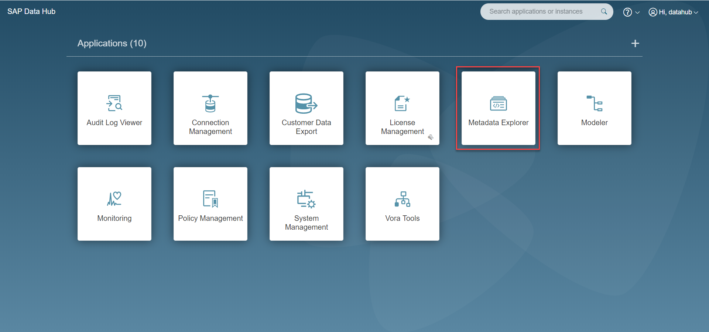
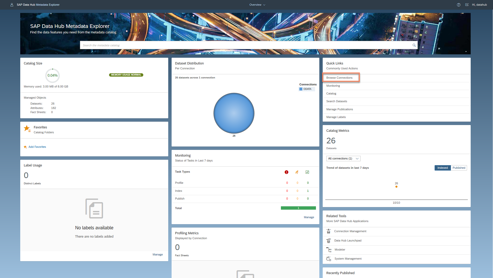
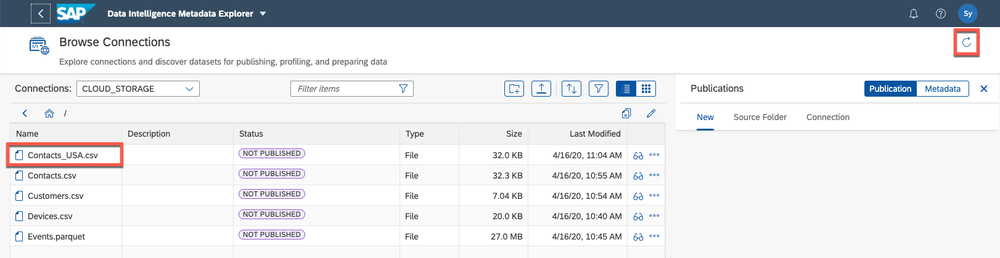
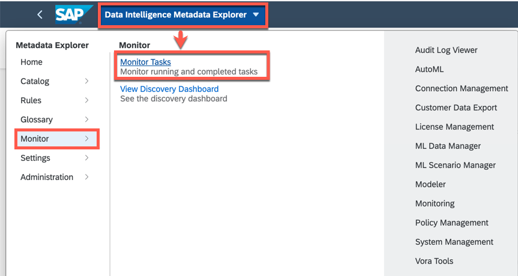

## Details
### You will learn  
- How to use SAP Data Intelligence Metadata Explorer
- How to use Browse Connection
- How to Profile a Dataset

SAP Data Intelligence Metadata Explorer allows you to learn more about data residing in external storages, for example, Google Cloud Storage, AWS S3 or Windows Azure Storage Blob by profiling, previewing and viewing the metadata.

The Metadata Explorer gathers information about the location, attributes, quality, and sensitivity of data. With this information, you can make informed decisions about which datasets to share with other users and determine who has access to viewing or modifying the datasets.

---

[ACCORDION-BEGIN [Step 1: ](Discover and prepare data in Cloud Storage)]
In this section, you will use the data preparation tool to create a copy of a `csv` dataset that you will be working on and modifying throughout the four parts of this tutorial. A more in depth exercise of the data preparation tool will be covered in part 3.

1. Log on as the `system` user and navigate to the **Metadata Explorer** application by clicking on the title at the launchpad.

    !  

2. Go to Browse Connections. Connections are displayed in the grid view by default.

    - Click **Browse Connections**.

    - It can be changed into list view by selecting the "List View" button on the upper right.

    !

3. Click the `CLOUD_STORAGE` connection to display the directories / files. The type of the `CLOUD_STORAGE` connection depends on the cloud provider you are using for the trial.

    !

4. On the `Contacts.csv` file use the *more actions* button to **Prepare Data**

    !

5. Select **Run Preparation** under the *Actions* menu. In a few moments a copy of this CSV file will be written into **`CLOUD_STORAGE`** with the filename **`Contacts_USA.csv`**

    !

    Return to the connection browser using the **<** icon in the upper left corner. After a minute or less a new copy of the file will appear. You may need to use the refresh button in the upper right corner to scan for changes.

    !

You now have a copy of the original dataset with the new name `Contacts_USA.csv` that you will run data preparation on in a later section of this tutorial.

[DONE]
[ACCORDION-END]

[ACCORDION-BEGIN [Step 2: ](Profile dataset)]
Profiling produces additional metadata about the values in the dataset. For example, you can view the unique or distinct values, the minimum and maximum values, average length, and whether there are null, blank, or zero values. This information can help you determine which datasets may need cleansing, masking, or any number of options available in SAP Data Intelligence.

In this section, you will use the Metadata Explorer in SAP Data Intelligence to profile the `Contacts_USA.csv` dataset that you copied in the previous section.

1. Begin by going to the **Browse connection** button via the Metadata Explorer drop down menu or the Metadata Explorer front page

    !

2.  Open the **`CLOUD_STORAGE`** connection

    !

3. Start profiling.

    - Click on the **More Actions** button for **`Contacts_USA.csv`** and from the context menu, click **Start Profiling**.

    - Click **Yes** to start the profiling task.

    - A pop-up message confirms that profiling has started. It can take up to several minutes for the profiling process to complete.

    !

4. As soon as the profiling started, you will see a notification in the top right corner and you will see more details after you click on the icon.

    !

5. This process can take several minutes to complete and can be monitored using the Monitor Tasks menu

    !

    !

In the next section you will inspect the fact sheet of the dataset that was generated by the profiling job.

[DONE]

[ACCORDION-END]

[ACCORDION-BEGIN [Step 3: ](View metadata and fact sheet)]
1. After profiling is completed use the *Refresh* button in the Metadata Explorer application to update the file's status and then *More Options* to view the fact sheet for the file `Contacts_USA.csv`.

    !

2.  The fact sheet displays the dataset's columns as well as its inferred data types. It can also display minimum and maximum values of the columns, percentage distribution between null values and top 10 distinct values.

    !

3. Select the column name **Country** and observe that you have multiple variations of USA. Note that the "no value" also includes null values.  Also observe that the column **`ZipCode`** was automatically selected to be of data type *Integer*. You will be working with these two columns in the next section.

Take a moment to explore this dataset using **Data Preview** and the **More Actions** button on each of the columns.

[VALIDATE_1]

[ACCORDION-END]
---
