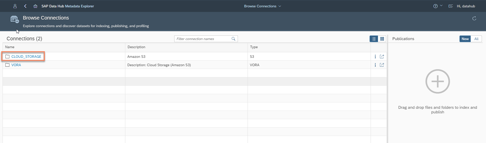
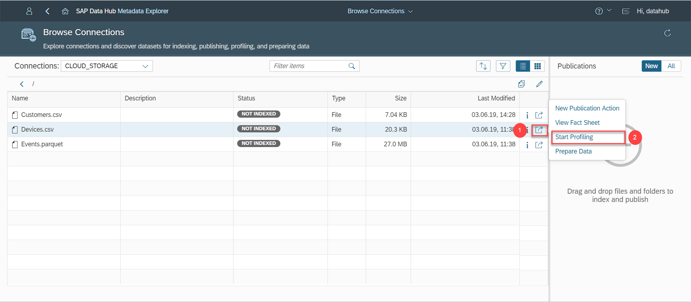
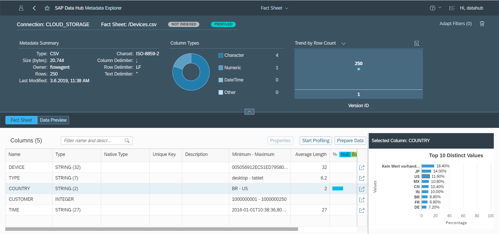
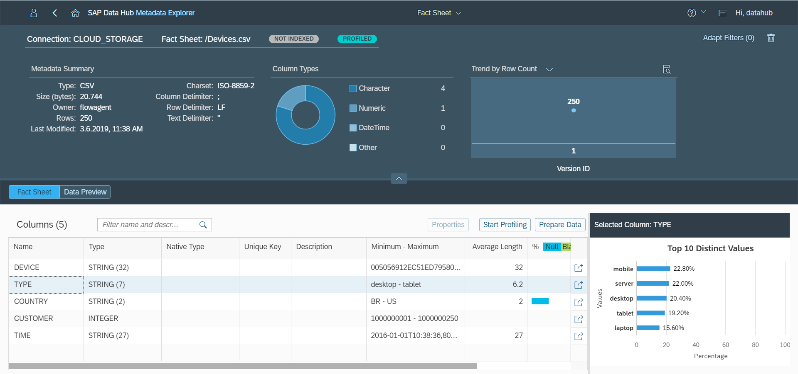

## Next Steps
 - [Explore data in SAP Vora](https://developers.sap.com/germany/tutorials/datahub-trial-v2-discovery-part02.html)

## Details
Please note this tutorial will be removed on 6th Febuary 2019. SAP Data Hub 2.4 tutorials will be released instead.
### You will learn  
During this tutorial, you will learn how to use Sap Data Hub Metadata Explorer. This application allows you to learn more about data residing in external storages, for example, Google Cloud Storage by profiling, previewing and viewing the metadata. You will use data residing in Google Cloud Storage. The Metadata Explorer gathers information about the location, attributes, quality, and sensitivity of data. With this information, you can make informed decisions about which datasets to publish and determine who has access to use or view information about the datasets.

### Time to Complete
**30 Min**

---

[ACCORDION-BEGIN [Step 1: ](Discover data in Google Cloud Storage)]
Open the SAP Data Hub App Launchpad (`https://sapdatahubtrial/`) via a web browser.

Enter **DEFAULT** as the **Tenant**, `DATAHUB` as **Username** and the password which you have selected during system setup as **Password** to logon to the Launchpad. The system displays the **Application Launchpad** page.

  

Navigate to **Metadata Explorer** by clicking on the icon from the launchpad.

From the quick links, click on **Browse Connections**

Click the `Google_Cloud_Storage` connection to display the directories / files on Google Cloud Storage. Once the connection opens, click on your bucket from GCS.

[DONE]

[ACCORDION-END]

[ACCORDION-BEGIN [Step 2: ](Profile files)]
Next you profile the files. Profiling determines all kind of metadata about the files.

Click on the **More Actions(1)** button for `Devices.csv` and from the context menu, click on **Start Profiling(2)**. The system indicates that profiling has started. It can take several minutes for profiling to complete.

As soon as the profiling completes, you will see a notification in the top right corner and you will see more details after you click on the icon.

  

The file size is 20,493 bytes.

[DONE]

[ACCORDION-END]

[ACCORDION-BEGIN [Step 3: ](Display metadata and fact sheet)]
You can display the **Metadata** of the files by clicking the highlighted button in each file row.

  

The metadata is displayed in a popup. You see the number of columns, corresponding types as well as the size of the `Devices.csv` file. The `Devices.csv` file has five columns. The file size is 20,744 bytes.

After the profiling completes, you can also check the **Fact sheet** for the `Devices.csv` file. Click the **More Actions** button for the file `Devices.csv` and click on **View Fact Sheet**

  

The fact sheet again displays the columns as well as corresponding types. But it also displays much more information such as minimum and maximum values of the columns, percentage of null values and top 10 distinct values.

As you can see the `Devices.csv` file has a lot of null values (18.4%) in the `COUNTRY` column. There seems to be a problem with the quality of the data in this particular column.

From the fact sheet for `Devices.csv`, click on the column **Type** and open details about that column.

[VALIDATE_1]

Next also profile the content of the two other files and afterwards take a look at metadata and fact sheet. You will in particular notice that the `Customers.csv` file is complete in terms of the `COUNTRY` column.

[ACCORDION-END]
---
