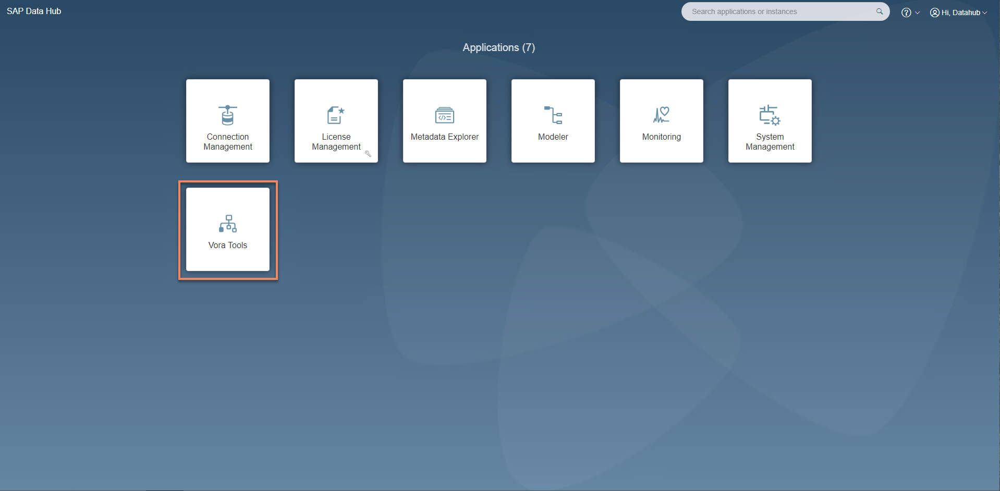
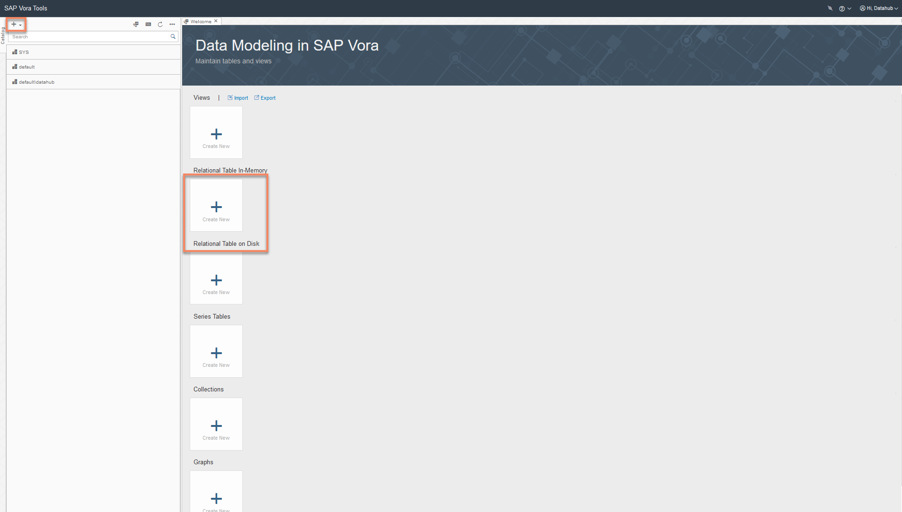
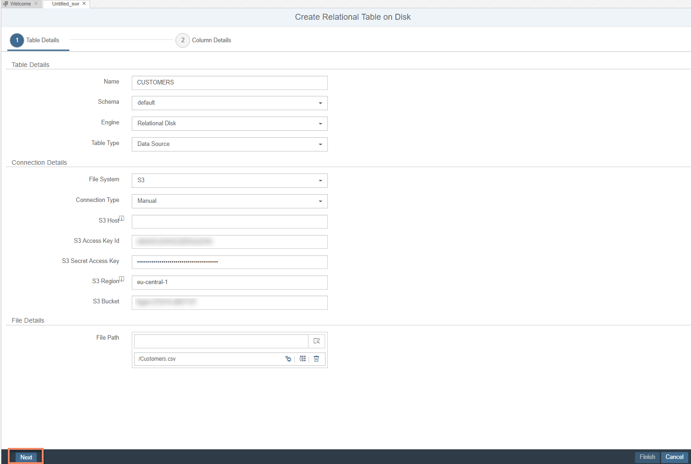
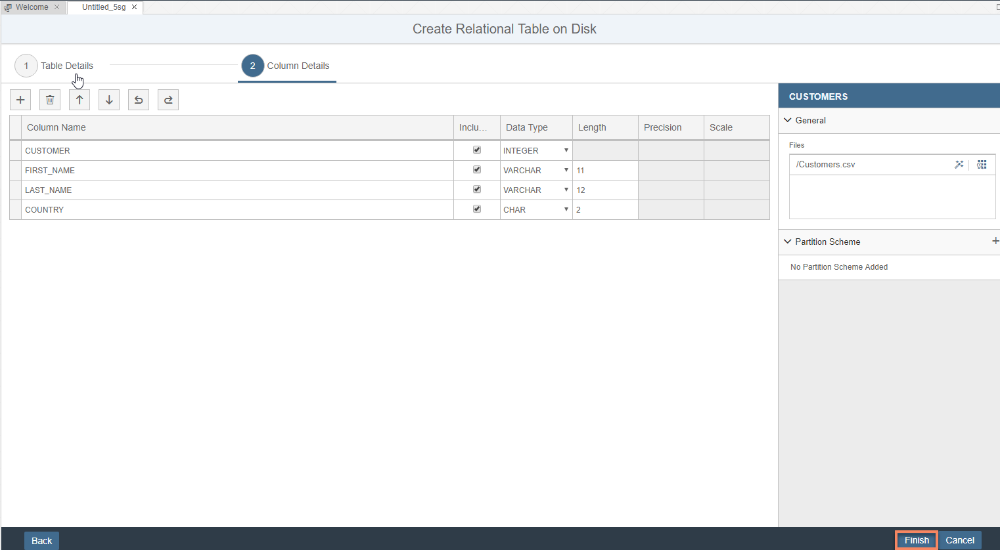
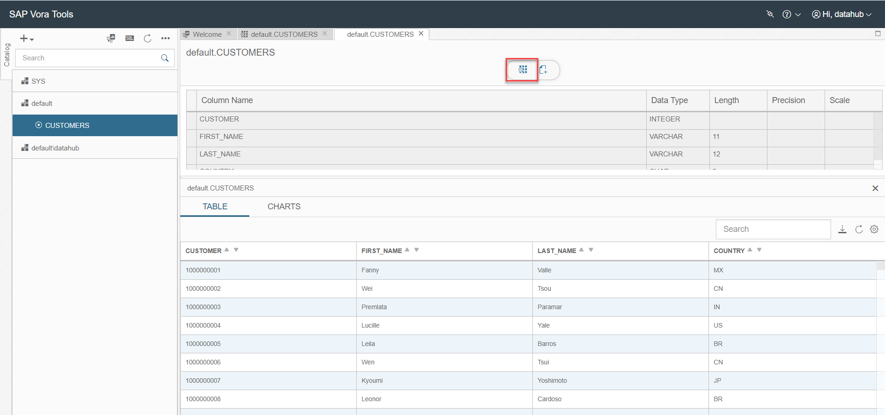
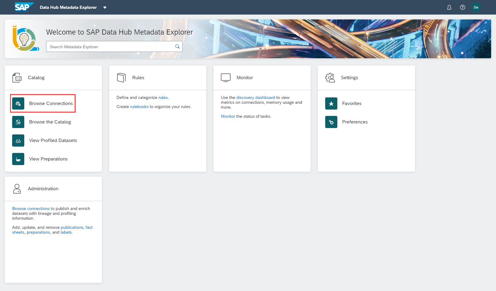
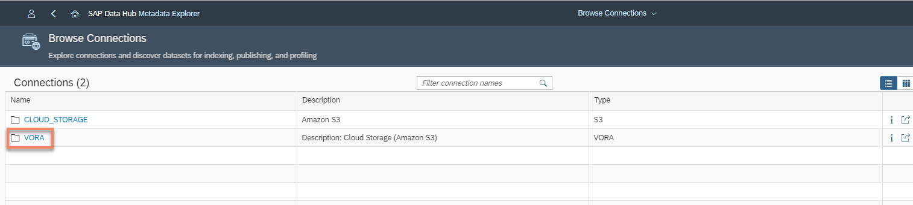
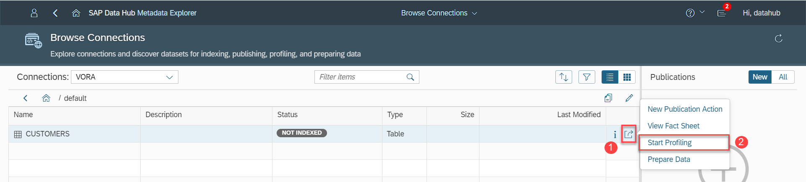
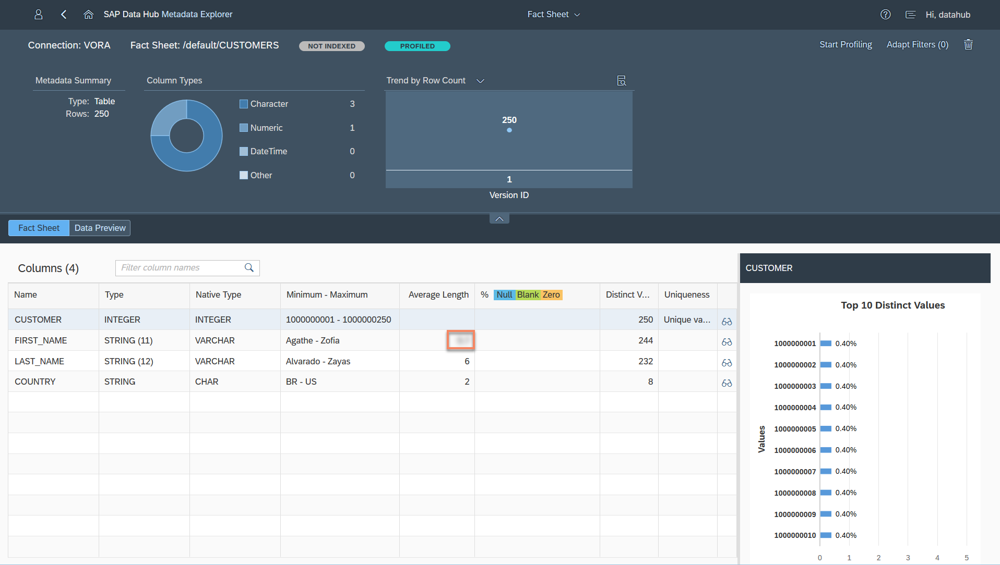

## Details
### You will learn  
During this tutorial, you will learn that Metadata Explorer cannot only be used on files (for example stored in Google Cloud Storage). Metadata Explorer also works on other data stores, in particular SAP Vora.

### Time to Complete
**30 Min**

---

[ACCORDION-BEGIN [Step 1: ](Load data into SAP Vora)]
To be able to profile data in SAP Vora, you first need to load data into SAP Vora. Thereto open the SAP Data Hub App Launchpad (`https://sapdatahubtrial/`) via a web browser.

Enter **DEFAULT** as the **Tenant**, `DATAHUB` as **Username** and the password which you have selected during system setup as **Password** to logon to the Launchpad. The system displays the **Application Launchpad** page.

  

Navigate to the **SAP Vora Tools** by clicking on the icon from the launchpad. The system then displays the **SAP Vora Tools**.

  

Create a new On Disk Relational Table by clicking **Create New** button. If you don't see the welcome screen like the one in the above screenshot, click on the **+** button (highlighted in the screenshot, in upper left corner) and navigate to **Create Relational Table on Disk**.

  

Enter the following information to create the relational table and then click **Next** :

| Field &nbsp;&nbsp;&nbsp;&nbsp;&nbsp;&nbsp;&nbsp;&nbsp;&nbsp;&nbsp;&nbsp;&nbsp;&nbsp;&nbsp;&nbsp;&nbsp;&nbsp;&nbsp;&nbsp;&nbsp;&nbsp;&nbsp;&nbsp;&nbsp;&nbsp;&nbsp;&nbsp;&nbsp;&nbsp;&nbsp;&nbsp;&nbsp;&nbsp;&nbsp;&nbsp;&nbsp;&nbsp;&nbsp;&nbsp;&nbsp;&nbsp;&nbsp;&nbsp;&nbsp;                          | Value                                                                                       |
| :------------------------------ | :------------------------------------------------------------------------------------------- |
| `Name`                         | `CUSTOMERS`                                                                                 |
| `Schema`                       | `default`                                                                                      |
| `Engine`                       | `Relational Disk`                                                                                |
| `File Type`                    | `CSV`                                                                                       |
| `Delimiter`                    | `;`                                                                                         |
| `CSV Skip Value`               | `1`                                                                                         |
| `File System`                  | `GCS`                                                                                       |
| `GCS Client Email`             | from your Google Cloud Platform service account (attribute `client_email` from .json file)  |
| `GCS Private Key`              | from your Google Cloud Platform service account (attribute `private_key` from .json file **without** `\n` at the start and end of the attribute ) |
| `GCS Project ID`               | from your Google Cloud Platform service account (attribute `project_id` from .json file)    |
| `GCS Path`                     | your GCS bucket                      |
| `GCS File Path`                | file path via **Browse** button, in our case `/Customers.csv`                               |

  

Finally click **Finish (2)** to create the table.

After the table is created, click on the **Data Preview** button to display the preview of the loaded table data.

[DONE]

[ACCORDION-END]

[ACCORDION-BEGIN [Step 2: ](Profile table)]
Go back to the SAP Data Hub Application Launchpad and Navigate to **Metadata Explorer**.

From the Metadata Explorer, click on **Browse Connections**

  

From the connections page, click on **VORA** and then click on **default** to display the tables in SAP Vora in schema `default`.
Based on our example, we select the table `CUSTOMERS`, which you have created during the previous step.

Click on the **More Actions(1)** button for `CUSTOMERS` and from the context menu, click on **Start Profiling(2)**. The system indicates that profiling has started. It can take several minutes for profiling to complete.

As soon as the profiling completes, you will see a notification in the top right corner and you will see more details after you click on the icon.

[DONE]

[ACCORDION-END]

[ACCORDION-BEGIN [Step 3: ](Display metadata and fact sheet)]
You can take a look at metadata and fact sheet of the `CUSTOMERS` table just like you did during the previous tutorial for the files.

Open the fact sheet for `CUSTOMERS` that you have profiled just now and answer the following questions with the help of the below screenshot :

  

[VALIDATE_1]

[ACCORDION-END]

---
