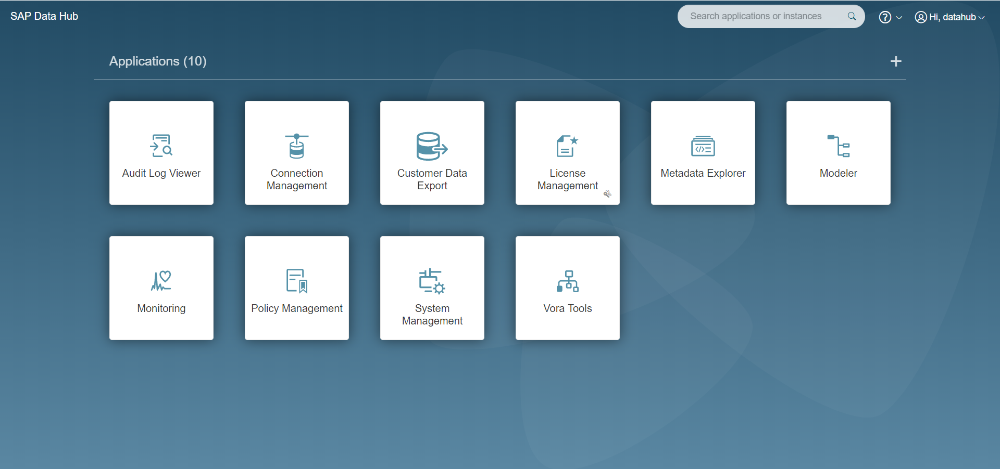
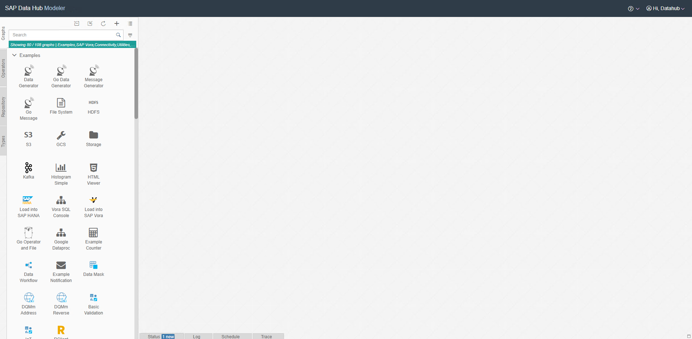
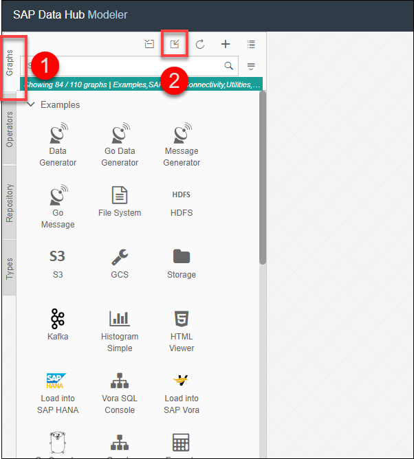
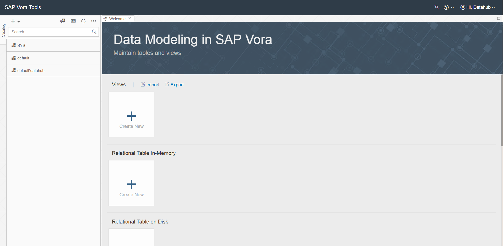
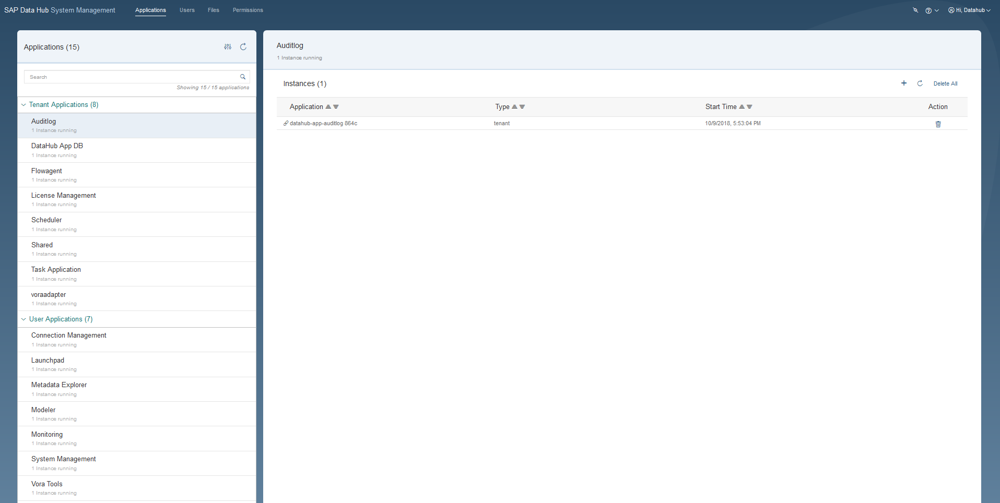

## Prerequisites  
 - **Proficiency:** Beginner
 - You have completed [Set up SAP Data Hub, trial edition](https://developers.sap.com/germany/tutorials/datahub-trial-v2-setup.html).

## Details
### You will learn  
During this tutorial, you will learn how to find your way around SAP Data Hub, trial edition. You will also learn how to troubleshoot problems.

### Time to Complete
**15 Min**

---

[ACCORDION-BEGIN [Step 1: ](Access UIs via a web browser)]
The SAP Data Hub App Launchpad serves as central entry point to all user interfaces of SAP Data Hub. You access it by opening (`https://sapdatahubtrial/`) via a web browser.

Enter **DEFAULT** as the **Tenant**, `DATAHUB` as **Username** and the password which you have selected during system setup as **Password** to logon to the Launchpad. The system displays the **Application Launchpad** page.

  

From the SAP Data Hub Application Launchpad, you can navigate to:

 - SAP Data Hub Modeler (direct link: `https://sapdatahubtrial/app/pipeline-modeler`)
 - SAP Vora Tools (direct link: `https://sapdatahubtrial/app/vora-tools`)
 - SAP Data Hub System Management (direct link: `https://sapdatahubtrial/app/datahub-app-system-management/`)

Subsequently we will describe each of the user interfaces briefly.

>In a production environment you would, of course, access all user interfaces via fully-qualified domain names. SAP Data Hub, trial edition currently does not use such.

[DONE]

[ACCORDION-END]

[ACCORDION-BEGIN [Step 2: ](SAP Data Hub Pipeline Modeler)]
The SAP Data Hub Modeler (direct link: `https://sapdatahubtrial/app/pipeline-modeler`) allows you to create data-driven applications, so-called data pipelines as well as data Workflows.

>Use "default" as the tenant while logging in to Data Hub Pipeline Modeler

  

Check the below screenshot and answer the question based on the same :

[VALIDATE_2]

>Hint : You can hover over the button icon to know more about it.

[ACCORDION-END]

[ACCORDION-BEGIN [Step 3: ](SAP Vora Tools)]
The SAP Vora Tools (direct link: `https://sapdatahubtrial/app/vora-tools`) provide you with a data modeling environment for creating and maintaining tables and views.

  

[VALIDATE_3]

>Hint : You can check the welcome page of SAP Vora Tools to find the answer

[ACCORDION-END]

[ACCORDION-BEGIN [Step 4: ](SAP Data Hub System Management)]
The SAP Data Hub System Management (direct link: `https://sapdatahubtrial/app/datahub-app-system-management/`) allows you to manage Sap Data Hub, including tenants, users and applications.

[DONE]

[ACCORDION-END]

[ACCORDION-BEGIN [Step 5: ](Troubleshoot problems and show logs)]
To troubleshoot problems you can access the operating system of the virtual machines as well as the Kubernetes cluster underlying your solution instance. You also have access to Grafana and Kibana web users interfaces for monitoring and troubleshooting.

If you need to troubleshoot problems, please refer to the corresponding chapters of the [**Getting Started with SAP Data Hub, trial edition**] (https://caldocs.hana.ondemand.com/caldocs/help/Getting_Started_Data_Hub_23.pdf) guide.

[DONE]

[ACCORDION-END]

---
