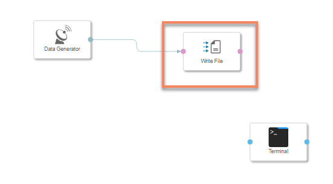
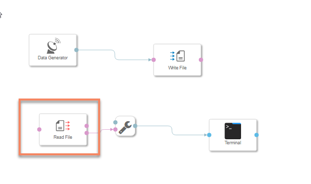
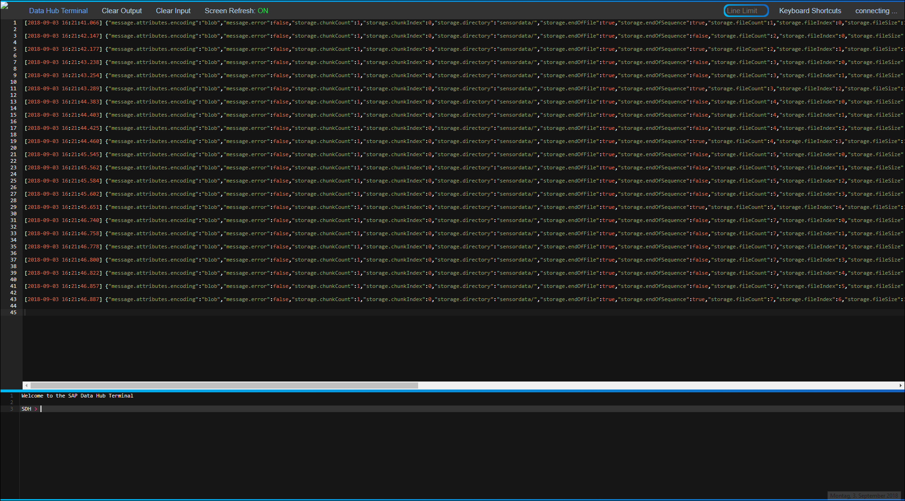
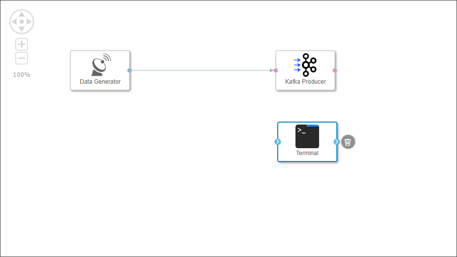
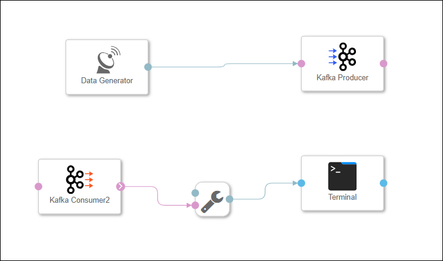

## Details
### You will learn  
- How to store sensor data in **`CLOUD_STORAGE`**
- How to use the operators **Write File** and **Read File**

Please note that this tutorial is similar to the `Store sensor data in HDFS` tutorial from [SAP Data Hub, developer edition tutorial group](https://developers.SAP.com/group.datahub-pipelines.html).
Also note here in this tutorial GCP refers to Google Cloud platform and AWS refers to Amazon Web Services.

### Time to Complete
**30 Mins**

---

[ACCORDION-BEGIN [Step 1: ](Collect GCS or AWS S3 Details)]
The SAP Data Hub, trial edition is deployed on AWS EKS or Google Cloud Platform. Therefore we will use AWS S3 or Google Cloud Storage for storing sensor data. You can note down the name of the bucket by going to the Connection Management in SAP Data Hub , clicking on **`CLOUD_STORAGE`**, on the "Edit" button under "Action" and looking at the ROOT PATH. Bucket name is required when you use the operators **Write File** and **Read File**.

[DONE]

[ACCORDION-END]

[ACCORDION-BEGIN [Step 2: ](Add and configure Write File Operator)]

Open the pipeline which you have created in the previous tutorial `(test.myFirstPipeline)`, in the modelling environment. To access the SAP Data Hub Launchpad in AWS or GCP you need go to the chapters 3.3 and 3.4 as described in the [**Getting Started with SAP Data Hub, trial edition**] (https://caldocs.hana.ondemand.com/caldocs/help/Getting_Started_Data_Hub24.pdf) guide. From SAP Data Hub Launchpad you could access the SAP Data Hub Modeler.

>As the above URL is a local URL, it will be accessible only if you are doing the tutorials and have already configured the hosts file. If not, please refer to [Getting Started with SAP Data Hub, trial edition 2.4](https://caldocs.hana.ondemand.com/caldocs/help/Getting_Started_Data_Hub24.pdf) guide.

 Now drag and drop **Write File** operator to the existing graph, and connect output port of the `Data Generator` to the `inFile` input port of the **Write File**

Configure the **Write File** operator by maintaining the following properties :

|  Field Name&nbsp;&nbsp;&nbsp;&nbsp;&nbsp;&nbsp;&nbsp;&nbsp;&nbsp;&nbsp;&nbsp;&nbsp;&nbsp;     | Value
|  :------------- | :-------------
| service  | `GCS or S3`
| connection | Check the connection specific details after this table
|  bucket  | Name of the bucket we had earlier noted down
|  path  | `sensordata/file_<counter>.txt`

To specify connection details you can utilize the connections established in the Configuration Manager .

In case you are willing to re-use the Configuration Manager connections, click on the **Connection** input field and select **Configuration Type** as **Configuration Manager** and select the desired connection from the **Connection ID** dropdown box.

The **Write File** operator will write the received data to files in the `/sensordata` directory in the specified GCS or AWS S3 bucket. The files follow the scheme `file_<counter>.txt` (where counter is an incremental integer).

[DONE]

[ACCORDION-END]

[ACCORDION-BEGIN [Step 3: ](Add and configure Read File Operator)]

Now drag and drop **Read File** operator to the existing graph `(test.myFirstPipeline)`. Then connect `outFile` output port of the **Read File** operator to the `inMessage` input port of the `ToString Converter`

Configure the **Read File** operator by maintaining the following properties :

|  Field Name&nbsp;&nbsp;&nbsp;&nbsp;&nbsp;&nbsp;&nbsp;&nbsp;&nbsp;&nbsp;&nbsp;&nbsp;&nbsp;&nbsp;&nbsp;&nbsp;&nbsp;&nbsp;&nbsp;&nbsp;&nbsp;&nbsp;&nbsp;&nbsp;&nbsp;&nbsp;&nbsp;     | Value
|  :------------- | :-------------
| service  | `GCS or S3`
| connection | Use the same method as Read File operator that is described in previous step
|  bucket  | Name of the bucket we had earlier noted down
|  path  | `sensordata/`
|  `only Read On Change`  | true

Afterwards click **Save**.

[DONE]

[ACCORDION-END]

[ACCORDION-BEGIN [Step 4: ](Execute the data pipeline)]

Click **Run** to execute the pipeline

When the **Status** tab indicates that the pipeline is running, use the context menu **Open UI** of the **Terminal** operator to see the generated sensor data.

In contrast to the previous tutorial, this time the generated sensor data is not sent from the **Data Generator** operator to the **Terminal** operator directly, but via **GCS or AWS S3**. Hence the **Terminal** also shows you information about the created files.

For GCP open [http://console.cloud.google.com](http://console.cloud.google.com) and navigate to **GCP Left menu** > **Storage** > **Browser** > **Your Bucket name** > `sensordata folder`. The longer the pipeline runs, the more files you will find there.

For AWS open [https://s3.console.aws.amazon.com](https://s3.console.aws.amazon.com) and navigate to **Search for Buckets** > **Your Bucket name** > `sensordata folder`. The longer the pipeline runs, the more files you will find there.

Open the output **Terminal**. Copy any row from the output and paste it in the frame below and click on **Submit Answer**.

[VALIDATE_1]

Stop the pipeline by clicking **Stop**.

[ACCORDION-END]

---
