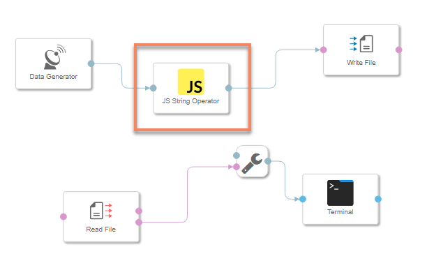
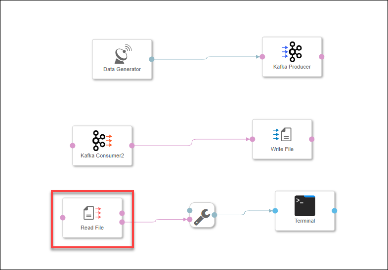
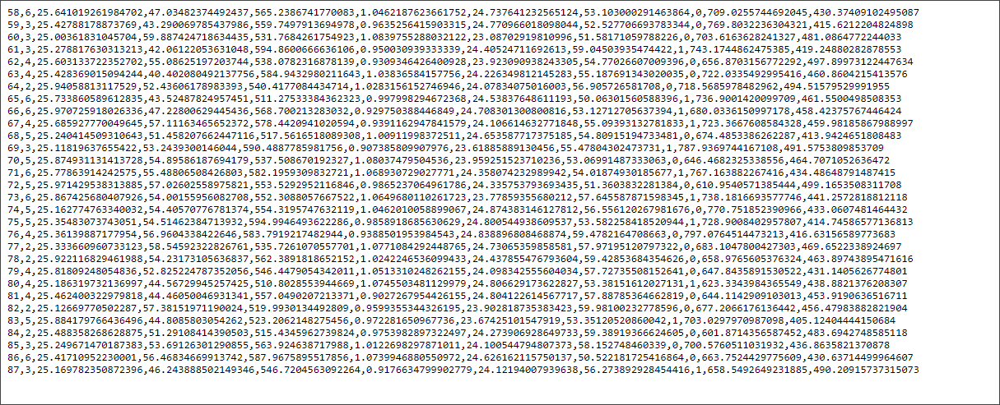

## Details
### You will learn  
- How to store sensor data in **Google Cloud Storage**
- How to use the operators **Write File** and **Read File**

Please note that this tutorial is similar to the `Store sensor data in HDFS` tutorial from [SAP Data Hub, developer edition tutorial group](https://developers.sap.com/group.datahub-pipelines.html).

### Time to Complete
**30 Mins**

---

[ACCORDION-BEGIN [Step 1: ](Collect GCS Details)]
The SAP Data Hub, trial edition is deployed on Google Cloud Platform. Therefore we will use Google Cloud Storage for storing sensor data. For this purpose we need the following:

- **GCS Bucket Details**
- **GCS JSON Key**

If you don't already have the JSON Key, refer the [**Getting Started with SAP Data Hub, trial edition**] (https://caldocs.hana.ondemand.com/caldocs/help/Getting_Started_Data_Hub23.pdf) guide, which contains step-by-step explanation to download the key and get the bucket details.

[DONE]

[ACCORDION-END]

[ACCORDION-BEGIN [Step 2: ](Add and configure Write File Operator)]

Open the pipeline which you have created in the previous tutorial `(test.myFirstPipeline)`, in the modelling environment (`https://sapdatahubtrial/app/pipeline-modeler`).

>As the above URL is a local URL, it will be accessible only if you are doing the tutorials and have already configured the hosts file. If not, please refer to [Getting Started with SAP Data Hub, trial edition 2.3](https://caldocs.hana.ondemand.com/caldocs/help/Getting_Started_Data_Hub23.pdf) guide.

Remove the connection between the **Kafka Consumer 2** operator and the `ToString Converter` operator. Now drag and drop **Write File** operator to the existing graph, and connect `message` output port of the `Kafka Consumer2` to the `inFile` input port of the **Write File**

Configure the **Write File** operator by maintaining the following properties :

|  Field Name&nbsp;&nbsp;&nbsp;&nbsp;&nbsp;&nbsp;&nbsp;&nbsp;&nbsp;&nbsp;&nbsp;&nbsp;&nbsp;     | Value
|  :------------- | :-------------
| service  | `GCS`
| connection | Check the connection specific details after this table
|  bucket  | Name of the bucket we had earlier noted down
|  path  | `sensordata/file_<counter>.txt`

To specify connection details you can either utilize the connections established in the Configuration Manager or provide the details manually.

In case you are willing to re-use the Configuration Manager connections, click on the **Connection** input field and select **Configuration Type** as **Configuration Manager** and select the desired connection from the **Connection ID** dropdown box. In case of Manual connection, select the **Configuration Type** as **Manual** and maintain the following properties:

|  Field Name&nbsp;&nbsp;&nbsp;&nbsp;&nbsp;&nbsp;&nbsp;&nbsp;&nbsp;&nbsp;&nbsp;&nbsp;&nbsp;     | Value
|  :------------- | :-------------
| `projectID`  | Value of `project_id` from the `key.json` file without the quotes. Example - `xxx-xx-x-xxxx-xx`. Second attribute in the file
| `KeyFile` | Using the browse button select the `key.json` file from GCS.

The **Write File** operator will write the received data to files in the `/sensordata` directory in the specified GCS bucket. The files follow the scheme `file_<counter>.txt` (where counter is an incremental integer).

[DONE]

[ACCORDION-END]

[ACCORDION-BEGIN [Step 3: ](Add and configure Read File Operator)]

Now drag and drop **Read File** operator to the existing graph `(test.myFirstPipeline)`. Then connect `outFile` output port of the **Read File** operator to the `inMessage` input port of the `ToString Converter`

Configure the **Read File** operator by maintaining the following properties :

|  Field Name&nbsp;&nbsp;&nbsp;&nbsp;&nbsp;&nbsp;&nbsp;&nbsp;&nbsp;&nbsp;&nbsp;&nbsp;&nbsp;&nbsp;&nbsp;&nbsp;&nbsp;&nbsp;&nbsp;&nbsp;&nbsp;&nbsp;&nbsp;&nbsp;&nbsp;&nbsp;&nbsp;     | Value
|  :------------- | :-------------
| service  | `GCS`
| connection | Use the same method as Read File operator that is described in previous step
|  bucket  | Name of the bucket we had earlier noted down
|  path  | `sensordata/`
|  `only Read On Change`  | true

Afterwards click **Save**.

[DONE]

[ACCORDION-END]

[ACCORDION-BEGIN [Step 4: ](Execute the data pipeline)]

Click **Run** to execute the pipeline

When the **Status** tab indicates that the pipeline is running, use the context menu **Open UI** of the **Terminal** operator to see the generated sensor data.

In contrast to the previous tutorial, this time the generated sensor data is not sent from the **Kafka Consumer 2** operator to the **Terminal** operator directly, but via **GCS**. Hence the **Terminal** also shows you information about the created files.

Open [http://console.cloud.google.com](http://console.cloud.google.com) and navigate to **GCP Left menu** > **Storage** > **Browser** > **Your Bucket name** > `sensordata folder`. The longer the pipeline runs, the more files you will find there.

Open the output **Terminal**. Copy any row from the output and paste it in the frame below and click on **Validate**.

[VALIDATE_1]

Stop the pipeline by clicking **Stop**.

[ACCORDION-END]

