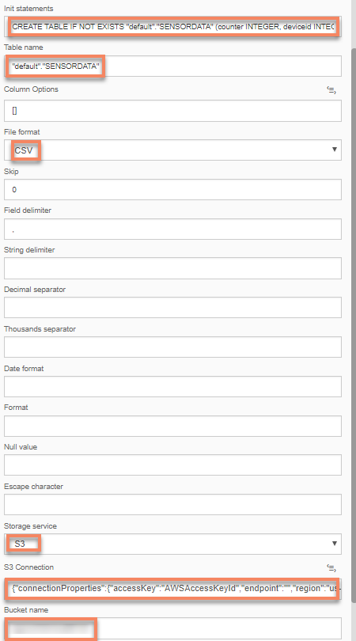
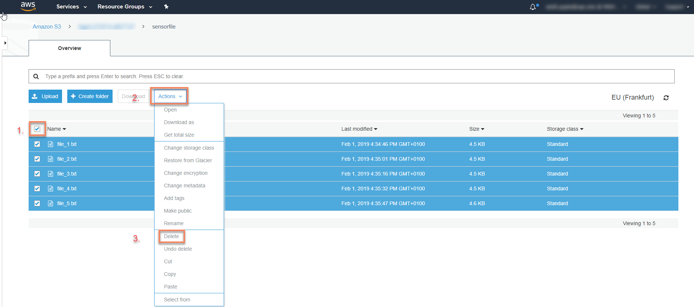
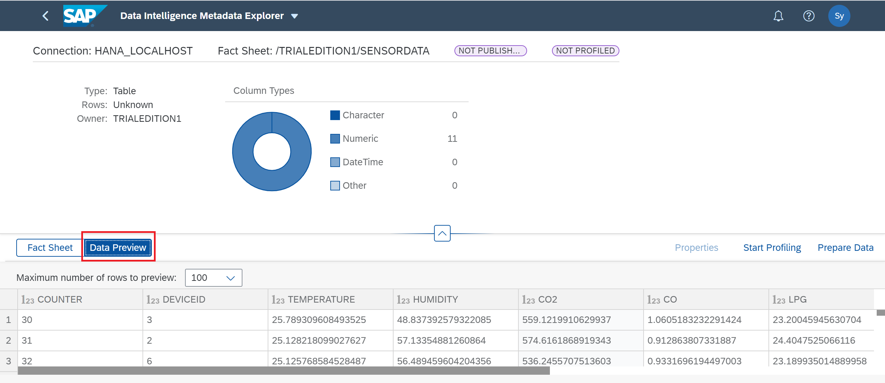

## Details
### You will learn  
- How to store the data in SAP VORA from Google Cloud Storage or AWS S3
- How to use a **SAP Vora Loader Operator**

Please note that this tutorial is similar to the `Store sensor data in SAP Vora` tutorial from [SAP Data Hub, developer edition tutorial group](https://www.SAP.com/developer/groups/datahub-pipelines.html).

Also note here in this tutorial GCP refers to Google Cloud platform and AWS refers to Amazon Web Services.
---

[ACCORDION-BEGIN [Step 1: ](Add SAP Vora Loader Operator)]

The  **SAP Vora Loader Operator** works as a client for the SAP Vora transaction coordinator and allows you to load data into SAP Vora. We need to provide the Vora Connection, the Init statement, Table name along with its Schema, storage service and the bucket created in that service to the **SAP Vora Loader Operator**. The **SAP Vora Loader** then reads the files from the GCS or AWS S3 and attaches the file as a data source to the Vora table. From the previous step, we have the API call ready with us which we can use now in the JavaScript code.

Open the pipeline which you have created in the previous tutorial `(test.myFirstPipeline)`, in the modelling environment. To access the SAP Data Hub Launchpad in AWS or GCP you need go to the chapters 3.3 and 3.4 as described in the [**Getting Started with SAP Data Hub, trial edition**] (https://caldocs.hana.ondemand.com/caldocs/help/Getting_Started_Data_Hub24.pdf) guide. From SAP Data Hub Launchpad you could access the SAP Data Hub Modeler.

>As the above URL is a local URL, it will be accessible only if you are doing the tutorials and have already configured the hosts file. If not, please refer to [Getting Started with SAP Data Hub, trial edition 2.4](https://caldocs.hana.ondemand.com/caldocs/help/Getting_Started_Data_Hub24.pdf) guide.

 Add a **SAP Vora Loader** operator. Then connect the `outFilename` port of the **Read File** (this is an unused port in the Read File operator) to the `ininterface` in port of the **`ToString Operator`**. Then connect the `outstring` out port of the **`ToString Operator`** to the `filename` in port of the **SAP Vora Loader Operator**.

[DONE]

[ACCORDION-END]

[ACCORDION-BEGIN [Step 2: ](Configure the SAP VORA Loader Operator)]

Now we would be configuring the second operator that we have added - **SAP Vora Loader**. Open the configuration window for the operator and click on the **Vora Connection** attribute as we only have to modify this value. To specify connection details you can utilize the connections established in the Configuration Manager.

In case you are willing to re-use the Configuration Manager connections, click on the **Connection** input field and select **Configuration Type** as **Configuration Manager** and select the desired connection from the **Connection ID** dropdown box which here should be **VORA**.

Provide the rest of the configuration Parameter values as follows:-

| Parameter &nbsp;&nbsp;&nbsp;&nbsp;&nbsp;&nbsp;&nbsp;&nbsp;&nbsp;&nbsp;&nbsp;&nbsp;&nbsp;&nbsp;&nbsp;&nbsp;&nbsp;&nbsp;&nbsp;&nbsp;&nbsp;&nbsp;&nbsp;&nbsp;&nbsp;&nbsp;&nbsp;&nbsp;&nbsp;&nbsp;&nbsp;&nbsp;&nbsp;&nbsp;&nbsp;&nbsp;&nbsp;&nbsp;&nbsp;&nbsp;&nbsp;&nbsp;&nbsp;&nbsp;                          | Value                                                                                       |
| :------------------------------ | :------------------------------------------------------------------------------------------- |
| `Init statements`              | `CREATE TABLE IF NOT EXISTS "default"."SENSORDATA" (counter INTEGER, deviceid INTEGER, temperature DOUBLE, humidity DOUBLE, co2 DOUBLE, co DOUBLE, lpg DOUBLE, smoke DOUBLE, presence INTEGER, light DOUBLE, sound DOUBLE) TYPE DATASOURCE STORE ON DISK;`                                |
| `Table name`                   | `"default"."SENSORDATA"`                                                                |
| `File format`                  | `CSV`                                                                                   |
| `Storage service`              | `GCS or S3`                                                                             |
| `Connection Type`              | `Configuration Manager`                                                                 |
| `Connection ID`                | `CLOUD_STORAGE`                                                                         |
| `Bucket name`                  | `COPY the ROOT PATH from the CLOUD_STORAGE connection ID in the Connection Management of SAP Data Hub`     |

>Please note  schema name and table name should be provide within the double quotes and dot in between. The Init statement provided should include a semicolon at the end.

 **Save** the graph.

[DONE]

[ACCORDION-END]

[ACCORDION-BEGIN [Step 3: ](Execute the data pipeline)]

Before you execute the pipeline, delete the contents from the `/sensordata/` folder in the GCS or AWS S3 bucket.

Therefore, login to Google Cloud Platform - [http://console.cloud.google.com](http://console.cloud.google.com) and navigate to **GCP Left menu** > **Storage** > **Browser** > **Your Bucket name** > `sensordata` folder. Please keep this window opened as we would be checking the generated files here again in the following steps.

Here you would be able to see all the files that were created in previous executions of the pipeline. Click on the **Select All Checkbox (1)** and then click on the **Delete (2)** button. Make sure that all the files in the folder are deleted.

For AWS open [https://s3.console.aws.amazon.com](https://s3.console.aws.amazon.com) and navigate to **Search for Buckets** > **Your Bucket name** > `sensordata` folder. Please keep this window opened as we would be checking the generated files here again in the following steps.

Click on the **Select All Checkbox (1)** , click on **Actions (2)** and then click on  **Delete (3)**. Make sure that all the files in the folder are deleted.

Go back to the SAP Data Hub Modeler and click **Run** to execute the pipeline. When the **Status** tab indicates that the pipeline is running, use the context menu **Open UI** of the **Terminal** operator to see the generated sensor data.

The longer the pipeline runs, the more files are generated. Therefore, after a while stop the pipeline execution.

[DONE]

[ACCORDION-END]

[ACCORDION-BEGIN [Step 4: ](Check the output in GCS or AWS S3 and VORA)]

For GCS open [http://console.cloud.google.com](http://console.cloud.google.com) and navigate to the `/sensordata/` directory.

For AWS open [https://s3.console.aws.amazon.com](https://s3.console.aws.amazon.com) and navigate to **Search for Buckets** > **Your Bucket name** > `sensordata` folder.

You can notice that the output files are generated similar to the earlier tutorial in the above mentioned storage buckets.

Now login to the **SAP Data Hub Launchpad** using the link (`https://SAPdatahubtrial/`) and click on the link **VORA Tools** tile

Now once Vora Tools open up, click on the `default` from the left menu and once you see our table `(SENSORDATA)`, right click on it and select **Data Preview**.

This will display all the sensor data that we have attached as a `datasource` to the VORA table.

[VALIDATE_1]
[ACCORDION-END]

---
