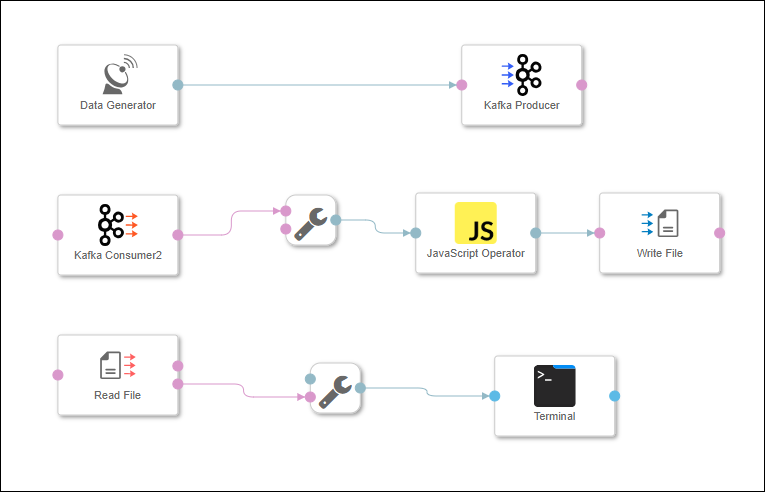
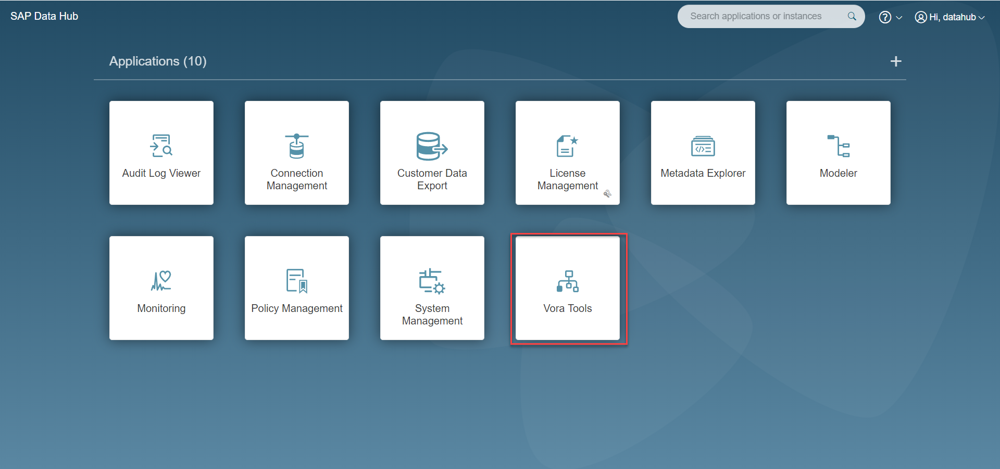
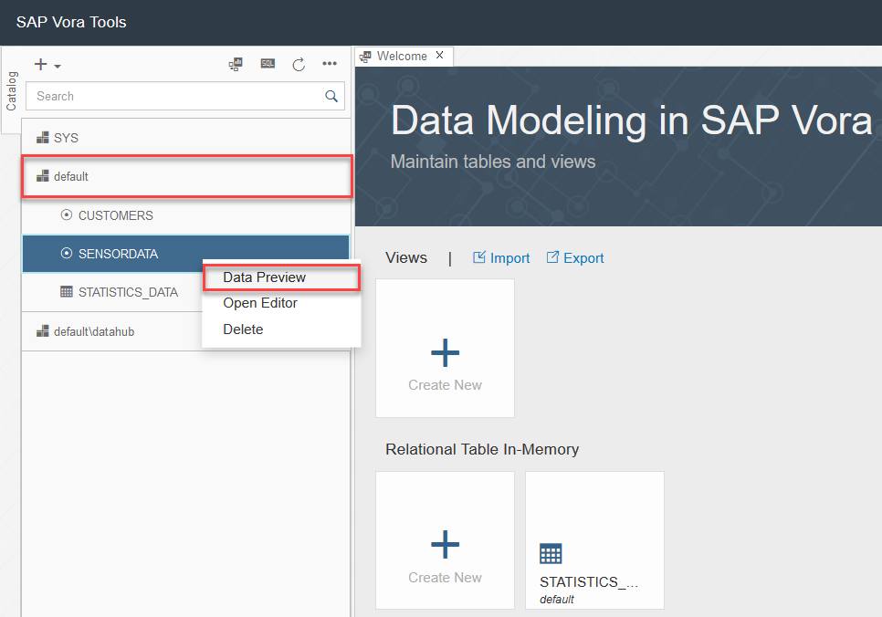

## Details
### You will learn  
- How to bundle the sensor data before storing in Google Cloud Storage
- How to use a **JavaScript operator**

Please note that this tutorial is similar to the `Bundle data (via JavaScript)` tutorial from [SAP Data Hub, developer edition tutorial group](https://www.sap.com/developer/groups/datahub-pipelines.html).

### Time to Complete
**15 Mins**

---

[ACCORDION-BEGIN [Step 1: ](Add JavaScript Operator)]

Open the pipeline which you have created in the previous tutorial `(test.myFirstPipeline)`, in the modelling environment (`https://sapdatahubtrial/app/pipeline-modeler`)

>As the above URL is a local URL, it will be accessible only if you are doing the tutorials and have already configured the hosts file. If not, please refer to [Getting Started with SAP Data Hub, trial edition 2.3](https://caldocs.hana.ondemand.com/caldocs/help/Getting_Started_Data_Hub_23.pdf) guide.

Remove the connection between the **Kafka Consumer 2** operator and the **Write File** operator.

Add a `ToString Converter` operator to the pipeline by drag & drop. Also add a **JavaScript Operator** to the pipeline by drag & drop.

Connect the `message` port of the **Kafka Consumer 2** operator to the `ininterface` port of the `ToString Converter` operator. Connect the `outstring` port of the `ToString Converter` operator to the `input` port of the **JavaScript Operator**. Connect the `output` port of the **JavaScript Operator** to the `inFile` port of the **Write File** operator.



[DONE]

[ACCORDION-END]

[ACCORDION-BEGIN [Step 2: ](Create JavaScript extension)]

Right click the JavaScript operator and click on **Open Script** to display the JavaScript snippet which is executed by the **JavaScript Operator**. The JavaScript snippet opens in a new tab.


Currently the JavaScript snippet creates an incremental **counter** every time it receives data via the input port and sends the **counter** to the output port.

Replace the code with the following snippet to ensure that "bundles" of 30 sensor records are sent to the output port.

```javascript

var counter = 0;
var bundle = "";

$.setPortCallback("input",onInput);

function onInput(ctx,s) {
    counter++;
    bundle = bundle + s;

    if(counter==30) {
      $.output(bundle);
      counter = 0;
      bundle = "";
    }
}
```
Click the **Save** button at the top of the page to save the script first. Close the tab for the JavaScript snippet. Afterwards click **Save** and save the pipeline. Make sure that you save both the script and the graph.

[DONE]

[ACCORDION-END]


[ACCORDION-BEGIN [Step 3: ](Execute the data pipeline)]

Before you execute the pipeline, delete the contents from the `/sensordata/` folder in the GCS bucket.

Therefore, login to Google Cloud Platform - [http://console.cloud.google.com](http://console.cloud.google.com) and navigate to **GCP Left menu** > **Storage** > **Browser** > **Your Bucket name** > `sensordata` folder. Please keep this window opened as we would be checking the generated files here again in the following steps.

Here you would be able to see all the files that were created in previous executions of the pipeline. Click on the **Select All Checkbox (1)** and then click on  **Delete (2)**. Make sure that all the files in the folder are deleted.



Click **Run** to execute the pipeline.

When the **Status** tab indicates that the pipeline is running, use the context menu **Open UI** of the **Terminal** operator to see the generated sensor data. You can notice that this time the output is grouped in a chunk of 30 records.

Open [http://console.cloud.google.com](http://console.cloud.google.com) and navigate to the `/sensordata/` directory. You see that the system does not create a file for each single sensor record, but only for each 30 sensor records.

Stop the pipeline by clicking **Stop**.

[DONE]

[ACCORDION-END]

[ACCORDION-BEGIN [Step 4: ](Check the created files in GCS)]

Login to Google Cloud Platform - [http://console.cloud.google.com](http://console.cloud.google.com) and navigate to **GCP Left menu** > **Storage** > **Browser** > **Your Bucket name** > `sensordata` folder.

You can open any of the generated file by clicking on the filename which opens in a new tab.



>**Attention**: You might notice that the first line of file `test_1.txt` does not necessarily have the counter 0 (that is the first column of the file and in the above screenshot it has the counter 123) as one might expect when looking at the JavaScript snippet which is executed by the **Data Generator**. The reason for this can be that the **Kafka Producer** had send a message to Kafka, but then you most likely stopped the pipeline before the **Kafka Consumer 2** consumed the message. When you afterwards restarted the pipeline, the **Kafka Consumer 2** first of all processed this "previous" message. For the sake of this tutorial you do not have to bother about this behavior.

[DONE]

[ACCORDION-END]

---

