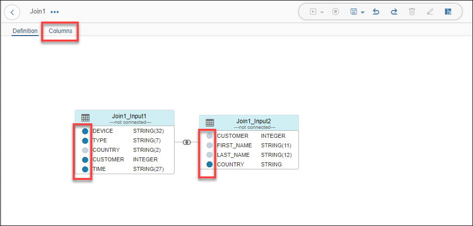

## Prerequisites  
 - **Proficiency:** Beginner

## Next Steps
 - [Create Workflow (part 2): Aggregate data with Data Transform ](https://www.sap.com/developer/tutorials/datahub-trial-workflow-part02.html)

## Details
### You will learn  
During this tutorial, you will learn how to create a Data Transform. This will enrich the `Devices.csv` file, which you have taken a look at during one of the previous tutorials, with country information.

### Time to Complete
**30 Min**

---

[ACCORDION-BEGIN [Step 1: ](Add Data Transform and Trigger)]
Open the modelling environment for building pipelines via SAP Data Hub Modeler (`https://sapdatahubtrial/app/pipeline-modeler`).

>As the above URL is a local URL, it will be accessible only if you are doing the tutorials and have already configured the hosts file. If not, please refer to [Getting Started with SAP Data Hub, trial edition](https://caldocs.hana.ondemand.com/caldocs/help/Getting_Started_Data_Hub_SP04.pdf) guide.

Enter **DEFAULT** as the **Tenant**, `DATAHUB` as **Username** and the password which you have selected during system setup as **Password** to logon.

Create a new graph by going to the navigation pane and select the Graphs tab navigation pane toolbar, choose + (Create Graph). The tool opens an empty graph editor in the same window, where you can define your graph. Add **`Workflow Trigger`** operator and **Data Transform** operator to the graph by drag and drop.


Now connect the `output` port of the **`Workflow Trigger`** to the `input` port of the **Data Transform** operator. Double click on the **Data Transform** operator and it will open the **Editor**. Here we have to model our Data Workflow by creating data sources and targets along with transformation operators.

[DONE]

[ACCORDION-END]

[ACCORDION-BEGIN [Step 2: ](Create Data Sources)]

From the **Nodes** menu on the left, drag and drop a **Data Source** to the editor.


As this is a **Data Transform** task, only **Nodes** can be added to the task.

  

Double click on the **Data Source** and open the **Data Source Editor**. Here we have to configure the details for the particular data source. Using the **Browse** button, select **Google Cloud Storage** connection from the list.

>You will see the connection here only, if you have configured the same under **Connection Management**.

As **Source**, browse the Google Cloud Storage and choose `Devices.csv` file. As soon as the file is selected, file configuration parameters will be Auto-proposed.

  

Using the **Back** button at the left top corner, navigate back to the **Data Transform** editor page. Using drag and drop, add another **Data Source** to the task and double click on it to open the **Data Source** editor. Using the **Browse** button, select **Vora** connection from the list. Then using the **Browse** button for **Schema**, select the table **CUSTOMERS** under the **default** schema. We have created this in the tutorial **Explore data in SAP Vora**.


Navigate back to the **Data Transform** editor page.


[DONE]

[ACCORDION-END]

[ACCORDION-BEGIN [Step 3: ](Join Data Sources)]

In this step we would be joining the two data sources we have created and then configure the join operator. Add **Join** to the task from the **Nodes** tab in the left side menu on the left through drag and drop.

Connect the **`DataSource1_Output1`** output port of the **`DataSource1`** to **`Join1_Input1`** input port of the **`Join1`** operator. Similarly, connect the **`DataSource2_Output1`** output port of the **`DataSource2`** to **`Join1_Input2`** input port of the **`Join1`** operator.


Double click on the **Join** operator and open its configuration. Both the **Data Sources** connected as inputs are displayed as Join inputs.


Click on **`Join1_Input1`** table. Now click on the **Join** button highlighted in **Step 1** of the above image. While holding the click, drag to the connecting point for the table **`Join1_Input2`** highlighted in **Step 2** of the above image and release the click once the second table turns green indicating successful connection. The resulting join will be similar to **Step 3** of the above image. As soon as the two tables are connected, a **Join Definition** dialog box will be displayed in the bottom part. Paste the following Join condition in the dialog box.

```sh
"Join1_Input1"."CUSTOMER" = "Join1_Input2"."CUSTOMER"
```


Now we select the output columns of the join condition. This can be done easily using the column selector shortcut on the same page. Make sure that you only select the following columns :

| Source      | Source Column  |
| ----------- | -------------- |
| `Join1_Input1 (Devices)`   | `DEVICE`       |
| `Join1_Input1 (Devices)`   | `TYPE`         |
| `Join1_Input1 (Devices)`   | `CUSTOMER`     |
| `Join1_Input1 (Devices)`   | `TIME`         |
| `Join1_Input2 (Customers)` | `COUNTRY`      |



Click on the **Column Selector** besides every column name to select or deselect it. Columns in **Grey** are excluded from the output whereas the ones in **Blue** are included. Once you have selected the desired columns, using the button at the top of the page (highlighted in the above screenshot), open the **Columns** page.

On this page, graphical representation of the selected columns is displayed. The output should look similar to the following screenshot :


Make sure that the name of the **Target** columns is similar to those in the above screenshot. If not, you can edit the target column names on this page.

Navigate back to the **Data Transform** editor page.

[DONE]

[ACCORDION-END]

[ACCORDION-BEGIN [Step 4: ](Create Data Target)]

We now have to provide a destination for the results of the **Join** operation. This is achieved by specifying a target. From the **Nodes** tab in the left side menu, drag and drop a **Data Target** to the task. Connect the **`Join1_Output1`** output port of the **`Join1`** node to the **`DataTarget1_Input1`** input port of the **`DataTarget1`** node.


Double click on the newly added **Data Target** node and open the configuration page. As we have connected the **Join** and the **Data Target** nodes, Modeler will automatically detect the columns for the **Data Target**. Click on the **Browse** button for connection and select **Google Cloud Storage**. Later maintain the following configuration for the target :

| Field &nbsp;&nbsp;&nbsp;&nbsp;&nbsp;&nbsp;&nbsp;&nbsp;&nbsp;&nbsp;&nbsp;&nbsp;&nbsp;&nbsp;&nbsp;&nbsp;&nbsp;&nbsp;&nbsp;&nbsp;&nbsp;&nbsp;&nbsp;&nbsp;&nbsp;&nbsp;&nbsp;&nbsp;&nbsp;&nbsp;&nbsp;&nbsp;&nbsp;&nbsp;&nbsp;&nbsp;&nbsp;&nbsp;&nbsp;                          | Value                                                               |
| ------------------------------ | ------------------------------------------------------------------- |
| `Target`                       | folder name under which the new `CSV` file would be created `eg. /CSV/EnrichedDevices`. You can select any folder of your choice |
| `File Format`                  | `CSV`                                                               |
| `Column Delimiter`             | `;`                                                                 |
| `Character Set`                | `ISO-8859-2`                                                        |
| `Text Delimiter`               | `"`                                                                 |
| `Escape Character`               | `"`                                                                 |
| `Includes Header`              | `Yes`                                                                |


Using the back button at the top left, navigate back to the pipeline where we have a **Workflow Trigger** connected to a **Data Transform** .

[DONE]

[ACCORDION-END]

[ACCORDION-BEGIN [Step 5: ](Add a Terminator and execute Data Transform task)]

From the **Operators** tab in the left side menu, drag and drop a **Workflow Terminator** to the pipeline. Connect the `output` out port of the **Data Transform** to the `stop` in port of the **Workflow Terminator**.


Once done, save the graph **(1)** and execute **(2)** the graph using the buttons at the top of the page. The execution status is displayed in the bottom part of the screen and it changes from **Running** to **Completed** once the execution completes.

[DONE]

[ACCORDION-END]

[ACCORDION-BEGIN [Step 6: ](Check result)]
Now check the result of the Data Transform task. We can check the results from the Modeler itself. Thereto open the pipeline you have created and double click the **Data Transform** operator and then double click on the **Data Target** node which opens the configuration page. Navigate to the **DATA PREVIEW** using the button at the top right corner of the page.


You see that (in contrast to the `Devices` data set) the `EnrichedDevices` data set does not include any null values. The original file has been enriched from the table in SAP Vora. Using the above screenshot and your generated `EnrichedDevices` data set, answer the below question.

[VALIDATE_1]

[ACCORDION-END]

---

## Next Steps
[Create Workflow (part 2): Aggregate data with Data Transform ](https://www.sap.com/developer/tutorials/datahub-trial-workflow-part02.html)
