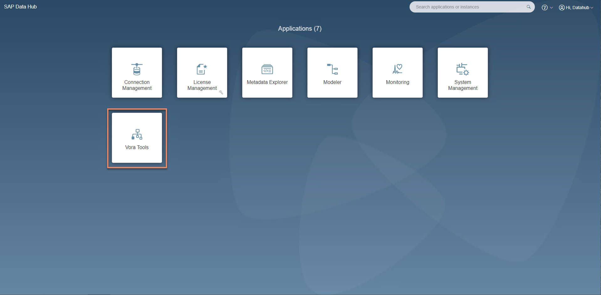
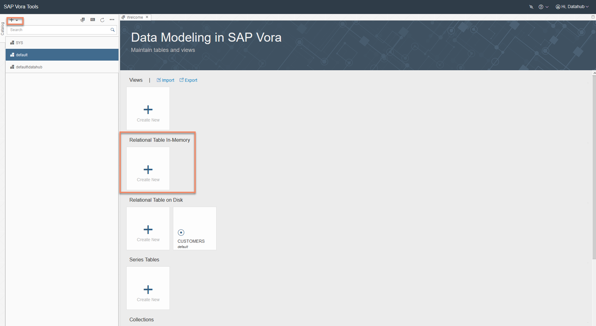
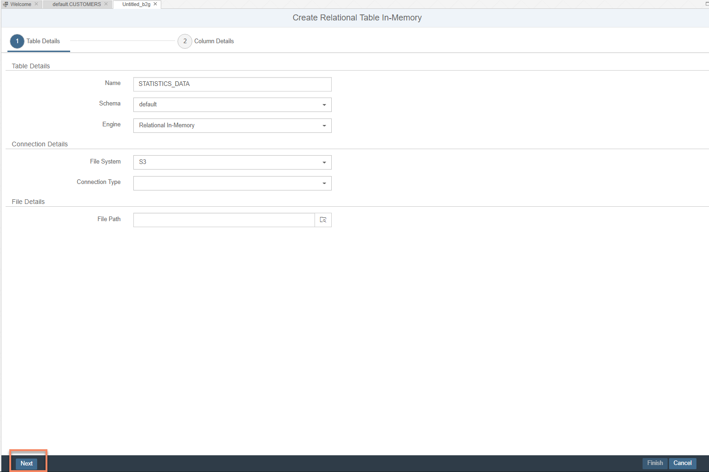
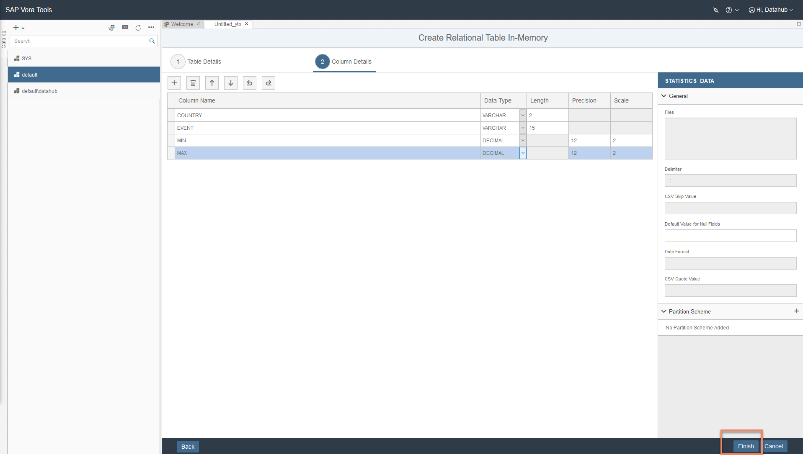
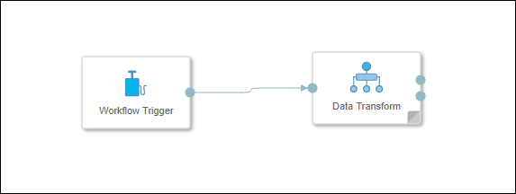
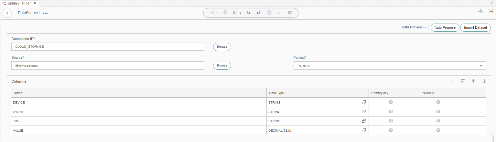
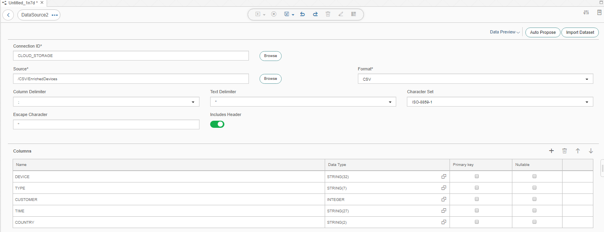
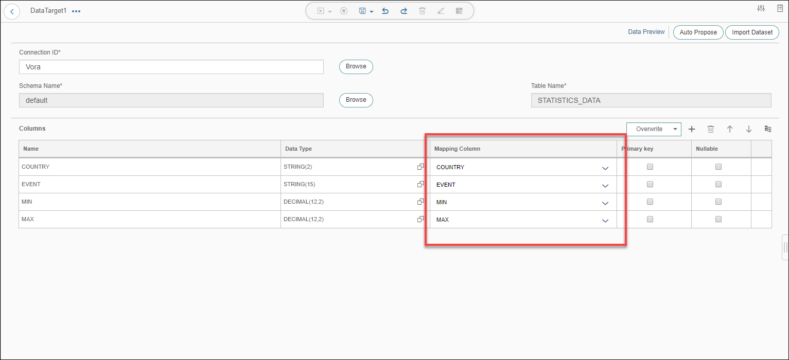
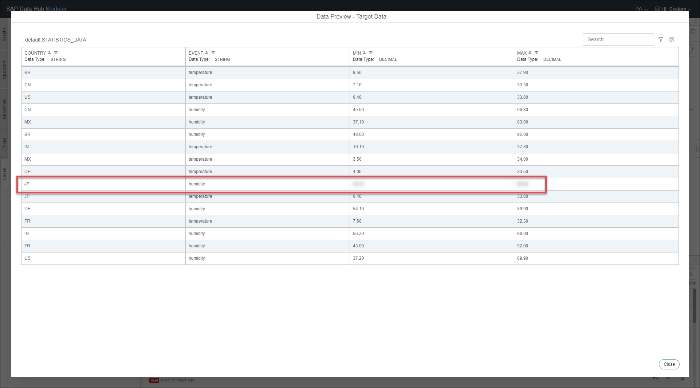

## Details
### You will learn  
During this tutorial, you will build on what you have learned during the previous tutorial about Data Transform. You will build a more complicated Data Transform now. This will aggregate the `Events.parquet` file per country. It will store the result of the aggregation in a table in SAP Vora:

- Minimum humidity per country
- Maximum humidity per country
- Minimum temperature per country
- Maximum temperature per country

Please note here in this tutorial GCP refers to Google Cloud platform and AWS refers to Amazon Web Services.

### Time to Complete
**30 Min**

---

[ACCORDION-BEGIN [Step 1: ](Create table in SAP Vora)]
To be able to store data in SAP Vora, you first need to create a table. Thereto open the SAP Data Application Launchpad via a web browser. To access the SAP Data Hub Launchpad in AWS or GCP you need go to the chapters 3.3 and 3.4 as described in the [**Getting Started with SAP Data Hub, trial edition**] (https://caldocs.hana.ondemand.com/caldocs/help/Getting_Started_Data_Hub24.pdf) guide.

Enter **DEFAULT** as the **Tenant**, `DATAHUB` as **Username** and the password which you have selected during system setup as **Password** to logon to the Launchpad. The system displays the **Application Launchpad** page.

  

Navigate to the **SAP Vora Tools** by clicking on the highlighted tile.

  

Create a new relational table by pressing the **Create New** button.

  

Enter the following information (and leave the remaining fields blank) to create the relational table and then click **Next** :

| Field                          | Value                                                         |
| ------------------------------ | ------------------------------------------------------------- |
| `Name`                         | `STATISTICS_DATA`                                             |
| `Schema`                       | `default`                                                     |
| `Engine`                       | `Relational In-Memory`                                        |
| `File System`                  | `S3 or GCS`                                                   |
| `Connection Type`              |                                                               |
| `File Path`                    |                                                               |


Create the following columns:

| Name              | Data Type | Length | Precision | Scale |
| ----------------- | --------- | ------ | --------- | ----- |
| `COUNTRY`         | `VARCHAR` | 2      |           |       |
| `EVENT`           | `VARCHAR` | 15     |           |       |
| `MIN`             | `DECIMAL` |        | 12        | 2     |
| `MAX`             | `DECIMAL` |        | 12        | 2     |

  

Finally click **Finish** to create the table.

[DONE]

[ACCORDION-END]

[ACCORDION-BEGIN [Step 2: ](Add Data Transform and Trigger)]

Open the modelling environment for building pipelines via SAP Data Hub Modeler. To access the SAP Data Hub Launchpad in AWS or GCP you need go to the chapters 3.3 and 3.4 as described in the [**Getting Started with SAP Data Hub, trial edition**] (https://caldocs.hana.ondemand.com/caldocs/help/Getting_Started_Data_Hub24.pdf) guide. From SAP Data Hub Launchpad you could access the SAP Data Hub Modeler.

>As the above URL is a local URL, it will be accessible only if you are doing the tutorials and have already configured the hosts file. If not, please refer to [Getting Started with SAP Data Hub, trial edition 2.4](https://caldocs.hana.ondemand.com/caldocs/help/Getting_Started_Data_Hub24.pdf) guide.

Enter `default` as **Tenant ID**, `DATAHUB` as **Username** and the password which you have selected during system setup as **Password**.

Create a new graph and add **`Workflow Trigger`** operator and **Data Transform** operator to the graph by drag and drop.



Now connect the `output` port of the **`Workflow Trigger`** to the `input` port of the **Data Transform** operator. Double click on the **Data Transform** operator and it will open the **Editor**. Here we have to model our workflow task by creating data sources and targets along with transformation operators.

[DONE]

[ACCORDION-END]

[ACCORDION-BEGIN [Step 3: ](Create Data Sources)]
From the **Nodes** menu on the left, drag and drop a **Data Source** to the editor. As this is a **Data Transform** task, only **Nodes** can be added to the task.


Double click on the **Data Source** and open the **Data Source Editor**. Here we have to configure the details for the particular data source. Using the **Browse** button, select **`CLOUD_STORAGE`** connection from the list.

>You will see the connection here only, if you have configured the same under **Connection Management**.

As **Source** choose the `Events.parquet` file. As soon as the file is selected, file configuration parameters will be auto-proposed.



Using the **Back** button at the left top corner, navigate back to the **Data Transform** editor page. Using drag and drop, add another **Data Source** to the task and double click on it to open the **Data Source** editor. Using the **Browse** button, select **`CLOUD_STORAGE`** connection from the list. Then using the **Browse** button for **Source**, select the folder **`/CSV/EnrichedDevices`** from your bucket. We have created this in the previous tutorial **Create Workflow (part 1), Enrich data with Data Transform**.



Navigate back to the **Data Transform** editor page.


[DONE]

[ACCORDION-END]

[ACCORDION-BEGIN [Step 4: ](Join and Aggregate Data Sources)]

In this step we are going to join and aggregate the two data sources we have created and then configure the operators. Add **Join** to the task from the **Nodes** tab in the left side menu through drag and drop.

Connect the **`DataSource1_Output1`** out port of the `DataSource1` to **`Join1_Input1`** in port of the **`Join1`** operator. Similarly, connect the **`DataSource2_Output1`** out port of the **`DataSource2`** to **`Join1_Input2`** in port of the **`Join1`** operator.


Double click on the **Join** operator and open its configuration. Both the **Data Sources** connected as inputs are displayed as Join inputs.


Click on **`Join1_Input1`** table. Now click on the **Join** button highlighted in **Step 1** of the above image. While holding the click, drag to the connecting point for the table **`Join1_Input2`** highlighted in **Step 2** of the above image and release the click once the second table turns green indicating successful connection. The resulting join will be similar to **Step 3** of the above image. As soon as the two tables are connected, a **Join Definition** dialog box will be displayed in the bottom part. Paste the following Join condition in the dialog box.

```sh
"Join1_Input1"."DEVICE" = "Join1_Input2"."DEVICE"
```


Now we select the output columns of the join condition. This can be done easily using the column selector shortcut on the same page. Make sure that you only select the following columns :

| Source      | Source Column  |
| ----------- | -------------- |
| `Join1_Input1 (Events)`   | `EVENT`       |
| `Join1_Input1 (Events)`   | `VALUE`         |
| `Join1_Input2 (EnrichedDevices)` | `COUNTRY`      |


Click on the **Column Selector** besides every column name to select or deselect it. Columns in **Grey** are excluded from the output whereas the ones in **Blue** are included. Once you have selected the desired columns, using the button at the top of the page (highlighted in the above screenshot), open the **Columns** page.

On this page, graphical representation of the selected columns is displayed. The output should look similar to the following screenshot :


Now using the **Edit** button highlighted in the above screenshot, rename the **VALUE** column to **MIN** and click **OK**. We also have to add another column **MAX** which is also to be derived from the source column **VALUE**. Drag and drop the **VALUE** column from **Source** to **Target**. It will create a new column named **VALUE** in the **Target** column list. Rename this newly created field to **MAX**.

>While editing the column name, after entering the new name if the **OK** button is greyed out, use the `Tab` button on your keyboard to shift the focus away from the text box. This will enable the **OK** button.

The output should look similar to the following screenshot :


Make sure that the name of the **Target** columns is similar to those in the above screenshot. If not, you can edit the target column names on this page.

Navigate back to the **Data Transform** editor page. From the **Nodes** tab on the left side menu, drag and drop an **Aggregation** node to the task. Connect the **`Join1_Output1`** out port of the **`Join1`** node to the **`Aggregation1_Input1`** in port of the **`Aggregation1`** node.


Double click on the **Aggregation** node and open its configuration. On the **Columns** page, drag and drop all the columns in the following order - **COUNTRY, EVENT, MIN, MAX** from the source columns list to the target columns list.


Click on the **Edit** button highlighted in the above screenshot for the columns **MIN, MAX** and set the **Aggregation Type** for the columns to **Min and Max** respectively as per their names.

Navigate back to the **Data Transform** editor page.

[DONE]

[ACCORDION-END]

[ACCORDION-BEGIN [Step 5: ](Create Data Target)]

We now have to provide a destination for the results of the **Aggregation** operation. This is achieved by specifying a target. From the **Nodes** tab in the left side menu, drag and drop a **Data Target** to the task. Connect the `Aggregation1_Output1` out port of the `Aggregation1` node to the `DataTarget1_Input1` in port of the `DataTarget1` node.


Double click on the newly added **Data Target** node and open the configuration page. As we have connected the **Join** and the **Data Target** nodes, Modeler will automatically detect the columns for the **Data Target**. Click on the **Browse** button for connection and select **Vora**. Using the **Browse** button for the **Schema**, select the table **`STATISTICS_DATA`** under the **default** schema that we have created in the first step of this tutorial. Press **OK** for the dialog box that warns about removal of existing changes.

We now have to map the input columns to Vora table columns. Using the dropdown lists under **Mapping Column**, select matching column names.



Navigate back twice and open the pipeline where we have a **Workflow Trigger** connected to a **Data Transform** .

[DONE]

[ACCORDION-END]

[ACCORDION-BEGIN [Step 6: ](Add a Terminator and execute Data Transform task)]

From the **Operators** tab in the left side menu, drag and drop a **Workflow Terminator** to the pipeline. Connect the `output` out port of the **Data Transform** to the `stop` in port of the **Workflow Terminator**.


Once done, save the graph **(1)** and execute **(2)** the graph using the buttons at the top of the page. The execution status is displayed in the bottom part of the screen and it changes from **Running** to **Completed** once the execution completes.

[DONE]

[ACCORDION-END]

[ACCORDION-BEGIN [Step 7: ](Check result)]
Now check the result of the Data Transform task. Thereto double click the **Data Transform** operator and then double click on the **Data Target** node which opens the configuration page. Navigate to the **DATA PREVIEW** using the button at the top right corner of the page.



You will notice that the table has records per country for events humidity and temperature with minimum as well as maximum values for both the events.

[VALIDATE_1]

[ACCORDION-END]


---
