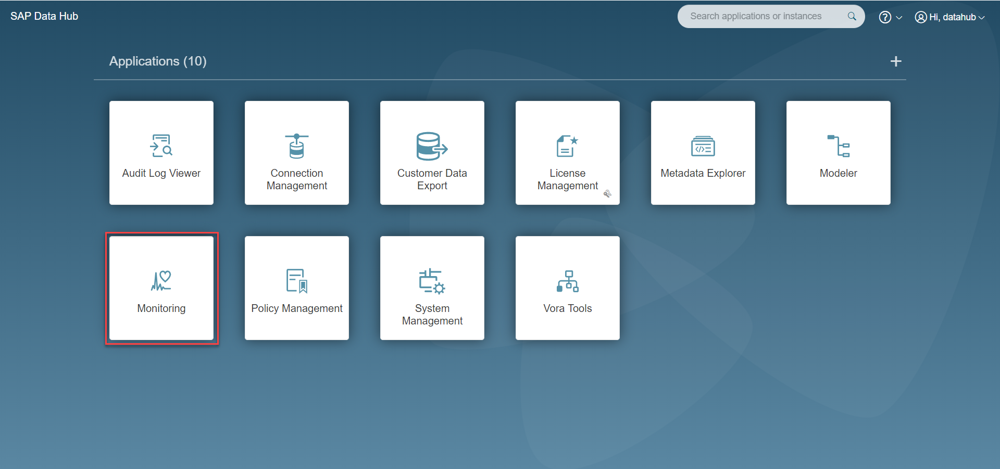
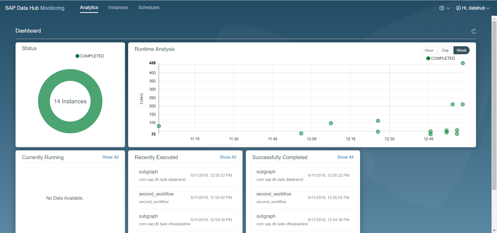
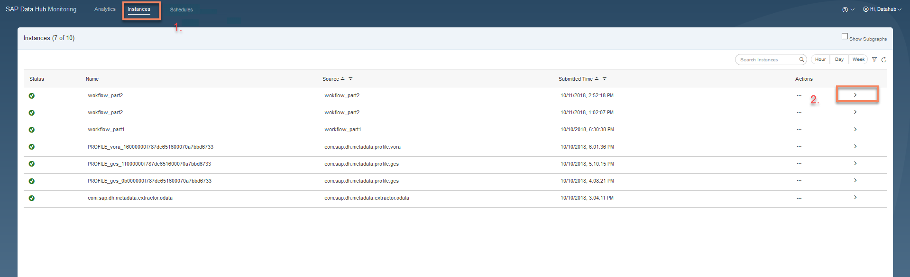
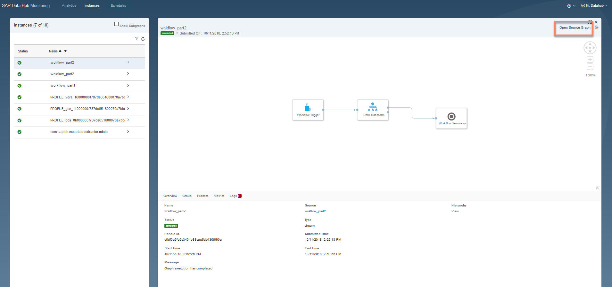

## Prerequisites  
 - **Proficiency:** Beginner
 - You have completed [Create Workflow (part 3): Build a task Workflow](https://developers.sap.com/germany/tutorials/datahub-trial-v2-workflow-part03.html)

## Details
### You will learn  
During this tutorial, you will build get to know how to monitor the execution of tasks.

### Time to Complete
**15 Min**

---

[ACCORDION-BEGIN [Step 1: ](Monitoring tasks)]

Open the SAP Data Hub App Launchpad (`https://sapdatahubtrial/`) via a web browser.

Enter **DEFAULT** as the **Tenant**, `DATAHUB` as **Username** and the password which you have selected during system setup as **Password** to logon to the Launchpad. The system displays the **Application Launchpad** page.

Navigate to **Monitoring** by clicking on the highlighted tile in the above screenshot.

The **Monitoring Dashboard** is displayed. From here you can see the status of executed tasks, data pipelines. This page gives you a consolidated view of the executions in the system.

[ACCORDION-END]

[ACCORDION-BEGIN [Step 2: ](Monitoring instances)]

Using the link at the top, navigate to the **Instances (1)** page.

Using the highlighted button **(2)**, you can fetch more information regarding a particular instance.

You can directly jump to the modeler and open the source graph for this instance. Graphs and processes can also be filtered using date and time range.

[ACCORDION-END]
---
