## Prerequisites  
 - **Proficiency:** Beginner

## Next Steps
 - [Create workflow (part 2): Aggregate data with flowgraph ](https://www.sap.com/developer/tutorials/datahub-trial-workflow-part02.html)

## Details
### You will learn  
During this tutorial, you will learn how to create a flowgraph. This will enrich the `Devices.csv` file, which you have taken a look at during one of the previous tutorials, with country information.

### Time to Complete
**30 Min**

---

[ACCORDION-BEGIN [Step 1: ](Create project)]
Open the SAP Data Hub Cockpit (`https://vhcalhxedb:51076/`) via a web browser.

Enter `DATAHUB` as **HANA Username** and the password which you have selected during system setup as **HANA Password** to logon to SAP Data Hub Cockpit. The system displays the **Overview** page.

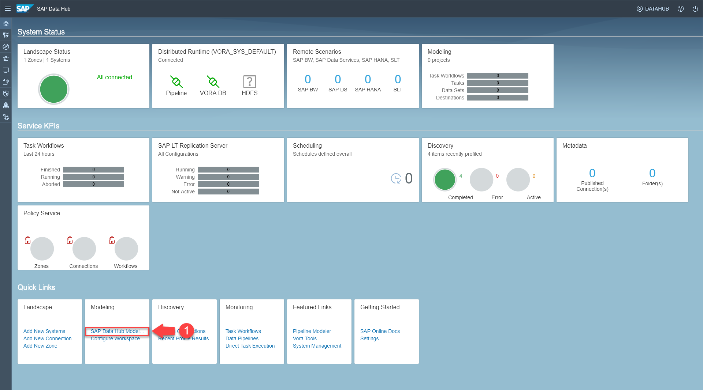  

Navigate to the **SAP Data Hub Modeling tools** by clicking **link (1)** on the bottom of the screen.

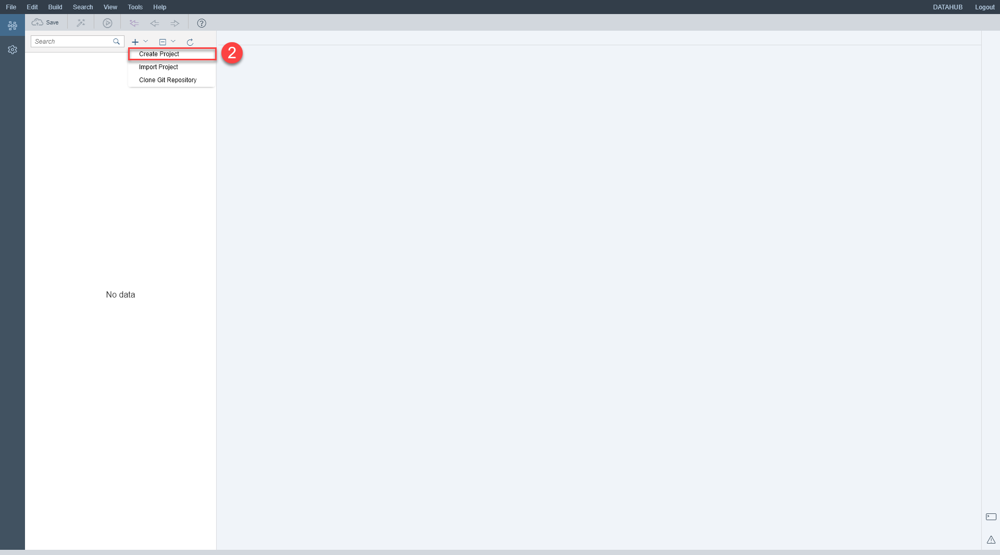  

Create a new project via the menu **Create Project (2)**. Enter `ProcessEventData` as **Project Name** and select the **Show more options** checkbox.

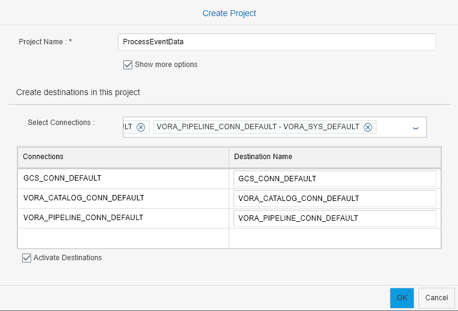  

Select all three connections and enter corresponding **Destination Names** (this ensures that you can use the connections in the `ProcessEventData` project):

| Connections                    | Destination Name                                              |
| ------------------------------ | ------------------------------------------------------------- |
| `GCS_CONN_DEFAULT`             | `GCS_CONN_DEFAULT`                                            |
| `VORA_CATALOG_CONN_DEFAULT`    | `VORA_CATALOG_CONN_DEFAULT`                                   |
| `VORA_PIPELINE_CONN_DEFAULT`   | `VORA_PIPELINE_CONN_DEFAULT`                                  |

Select the **Activate Destinations** checkbox. Then click **OK**.
[ACCORDION-END]

[ACCORDION-BEGIN [Step 2: ](Create data sets)]

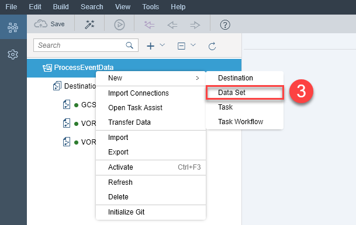  

Next create a data set for the `Devices.csv` files via the menu **New > Data Set (3)**. A data set is a pointer to a file or table (i.e. an abstraction of data residing in the systems connected to SAP Data Hub). Enter `Devices` as **Name** and `GCS_CONN_DEFAULT` as **Destination**. Then press **Create**.

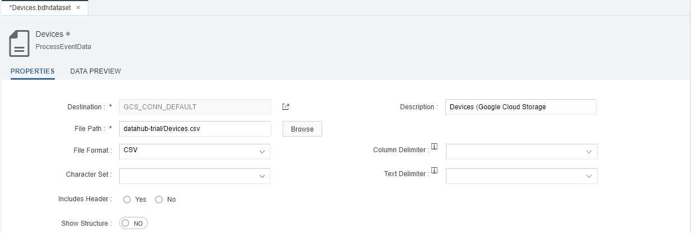  

Enter the following information:

| Field                          | Value                                                               |
| ------------------------------ | ------------------------------------------------------------------- |
| `Description`                  | `Devices (Google Cloud Storage)`                                    |
| `File Path`                    | file via **Browse** button, in our case `datahub-trial/Devices.csv` |
| `File Format`                  | `CSV`                                                               |

Click **Show Structure** followed by **Auto Propose**.

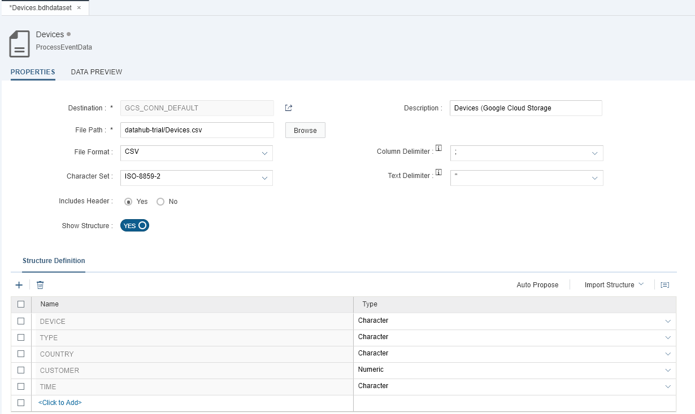  

Click **Activate** to activate the data set (second button in the toolbar in the upper left of the screen).

Create another data set for the `Customers` table via the menu **New > Data Set**. Enter `Customers` as **Name** and `VORA_CATALOG_CONN_DEFAULT` as **Destination**. Then press **Create**.

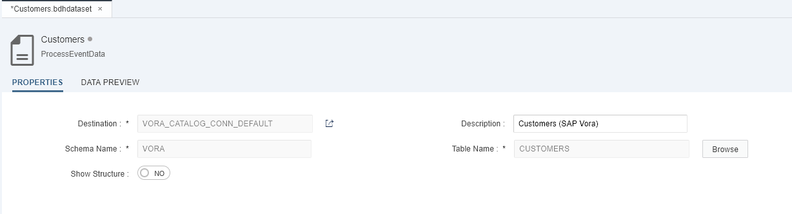  

Enter the following information:

| Field                          | Value                                                               |
| ------------------------------ | ------------------------------------------------------------------- |
| `Description`                  | `Customers (SAP Vora)`                                              |
| `Schema Name` and `Table Name` | table via **Browse** button, in our case `VORA.CUSTOMERS`           |

Click **Show Structure** followed by **Auto Propose**.

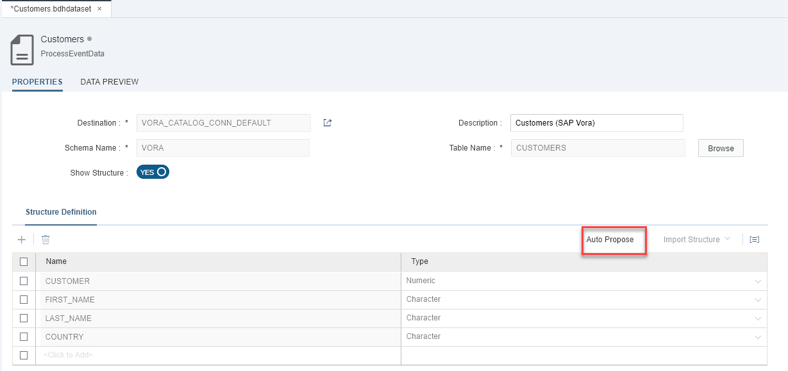

Click **Activate** to activate the data set.  

Finally, create a data set that will point to a file called `EnrichedDevices.csv` via the menu **New > Data Set**. This file stores the result of the flowgraph (which you will create in the next step).  Enter `EnrichedDevices` as **Name** and `GCS_CONN_DEFAULT` as **Destination**. Then press **Create**.

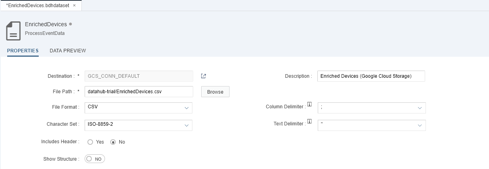

Enter the following information:

| Field                          | Value                                                               |
| ------------------------------ | ------------------------------------------------------------------- |
| `Description`                  | `Enriched Devices (Google Cloud Storage)`                           |
| `File Path`                    | a **new** file; **first** use the **Browse** button to select `datahub-trial/Devices.csv`, **then** change to `datahub-trial/EnrichedDevices.csv` |
| `File Format`                  | `CSV`                                                               |
| `Column Delimiter`             | `;`                                                                 |
| `Character Set`                | `ISO-8859-2`                                                        |
| `Text Delimiter`               | `"`                                                                 |
| `Includes Header`              | `No`                                                                |

>The flowgraph later will not create a single file, but a partitioned one. Consequently when you check HDFS later, you will find a complete folder `EnrichedDevices.csv`. This includes many files (partitions) with the data.

Click **Show Structure** followed by **Import Structure > From Data Set**. In the popup select `Devices` as data set to import the structure from.

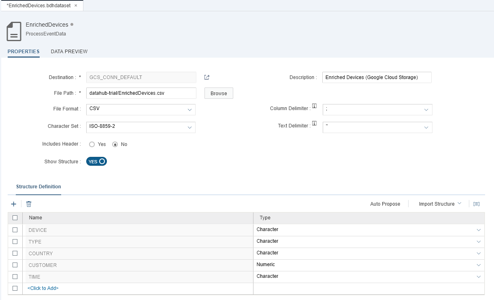

Click **Activate** to activate the data set.  
[ACCORDION-END]

[ACCORDION-BEGIN [Step 3: ](Create flowgraph task)]
Now you create a flowgraph task. Tasks and task workflows allow you to define, execute and schedule processes. SAP Data Hub supports different task types:

- **File Operation Task** to copy and delete files, e.g. on HDFS
- **Flowgraph** to transform data residing in HDFS or SAP Vora
- **Data Pipeline** to support a flow based programming paradigm
- **Notification** to send eMails, e.g. in case of problems during the execution of a task workflow
- **SAP HANA Flowgraph** to call a Flowgraph to transform data in SAP HANA
- **SAP BW Process Chain** to call a sequence of processes in SAP Business Warehouse
- **SAP Data Services** to call SAP Data Services to integrate and transform data

Your flowgraph task will copy the `Devices.csv` file and enrich the copy (more precisely speaking, the `COUNTRY` column) by looking up table `CUSTOMERS` in SAP Vora.

Create a flowgraph via the menu **New > Task**. Enter `EnrichDevices` as **Name** and `Flowgraph` as **Type**. Then click **Create**.

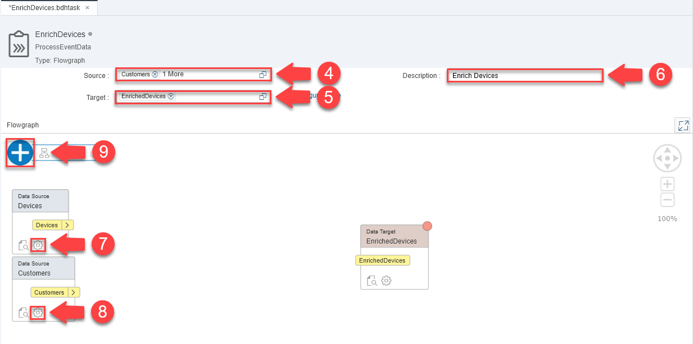

Select `Customers` and `Devices` as **Source (4)** and `EnrichedDevices` as **Target (5)** data set. Also enter `Enrich Devices` as **Description (6)**.
Then open the configuration of data set **Devices (7)** and change the **Data Type** of the `CUSTOMER` column to `BIGINT`. Repeat this step for the configuration of data set **Customer (8)** and also there change the **Data Type** of the `CUSTOMER` column to `BIGINT`.

Add a **Join** by clicking **Add Node (9)**. The flowgraph now looks like this:


Connect the `Devices` data set with the `JOIN_IN` port of the **Join** and connect the `Customers` data set with the `JOIN_IN_1` port of the **Join**.


Then click **configure (10)** of the **Join**. The following screen opens:

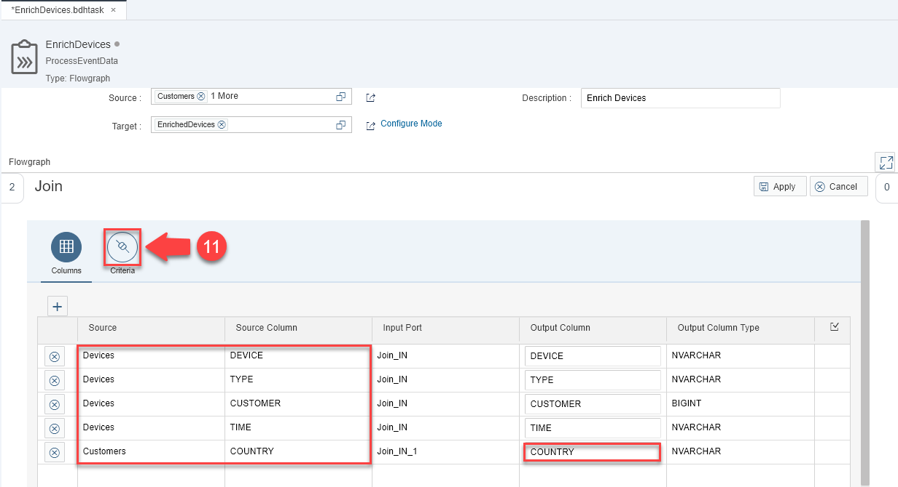

Here you select that the following columns are read from the two data sets. Ensure that the `COUNTRY` **Source Column** also uses `COUNTRY` as **Output Column**.

| Source      | Source Column  | Input Port  | Output Column |
| ----------- | -------------- | ----------- | ------------- |
| `Devices`   | `DEVICE`       | `JOIN_IN`   | `DEVICE`      |
| `Devices`   | `TYPE`         | `JOIN_IN`   | `TYPE`        |
| `Devices`   | `CUSTOMER`     | `JOIN_IN`   | `CUSTOMER`    |
| `Devices`   | `TIME`         | `JOIN_IN`   | `TIME`        |
| `Customers` | `COUNTRY`      | `JOIN_IN_1` | `COUNTRY`     |

Navigate to the **Criteria (11)** tab.

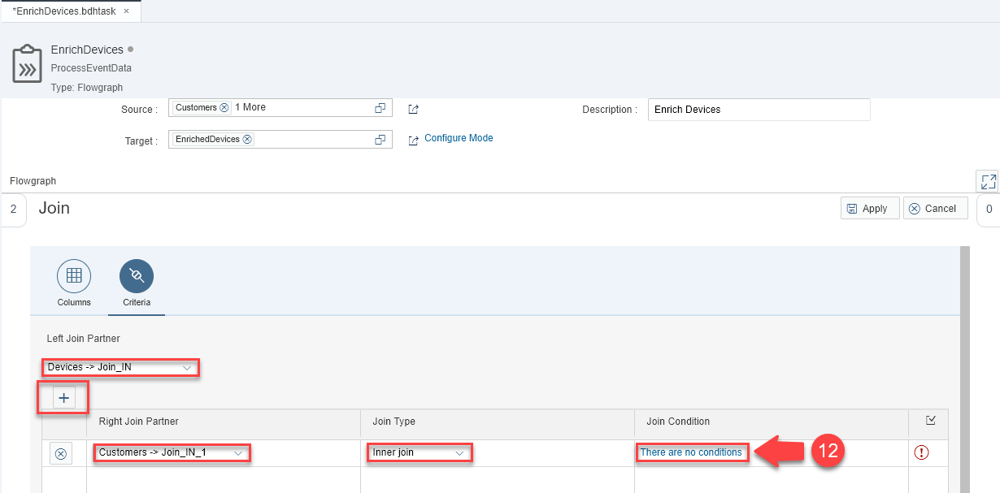

Here you maintain an **Inner join** between the `DEVICES` data set and the `CUSTOMERS` data set. Then click on the `There are no conditions` **link (12)**.

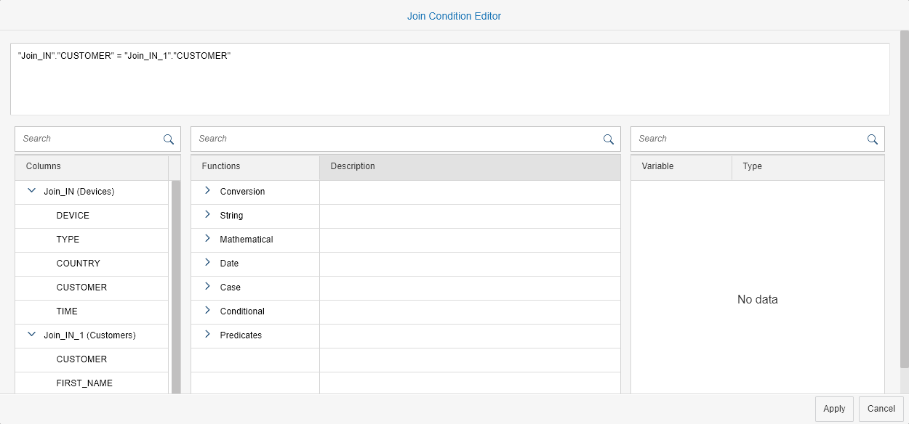

Enter the following the following join condition.

```sh
"Join_IN"."CUSTOMER" = "Join_IN_1"."CUSTOMER"
```

Click two times **Apply** and finally connect the **Join** with the `EnrichedDevices` data set.  The flowgraph now looks like this:

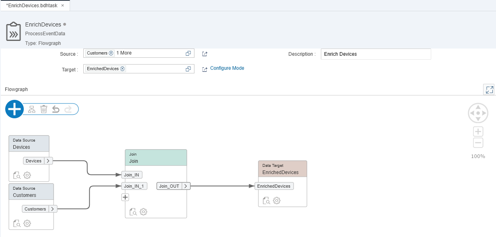

Activate the flowgraph.

[ACCORDION-END]

[ACCORDION-BEGIN [Step 4: ](Execute flowgraph task)]

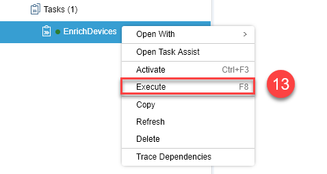

Now execute the flowgraph task. You can do this via the context menu **Execute (13)**.

You see the log view. Refresh the log view by clicking **Refresh (14)** until the status of the task is **OK**. The button is the right-most button in the toolbar in the upper right of the screen.


>Even though the data volume is comparatively low, it can take the flowgraph comparatively long to complete. The flowgraph uses Apache Spark and it takes time to spin up the Spark workers.

[ACCORDION-END]

[ACCORDION-BEGIN [Step 5: ](Check result)]
Now check the result of the flowgraph task. Thereto open the `EnrichedDevices` data set and navigate to the **DATA PREVIEW** tab.

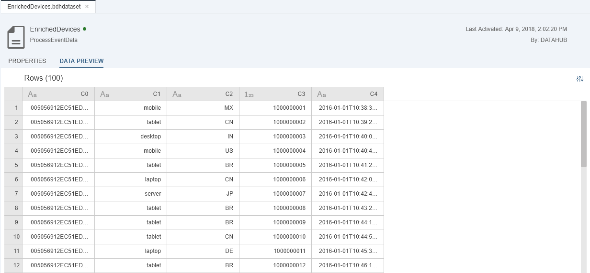

You see that (in contrast to the `Devices` data set) the `EnrichedDevices` data set does not include any null values. The original file has been enriched from the table in SAP Vora.

[ACCORDION-END]

---

## Next Steps
[Create workflow (part 2): Aggregate data with flowgraph ](https://www.sap.com/developer/tutorials/datahub-trial-workflow-part02.html)
