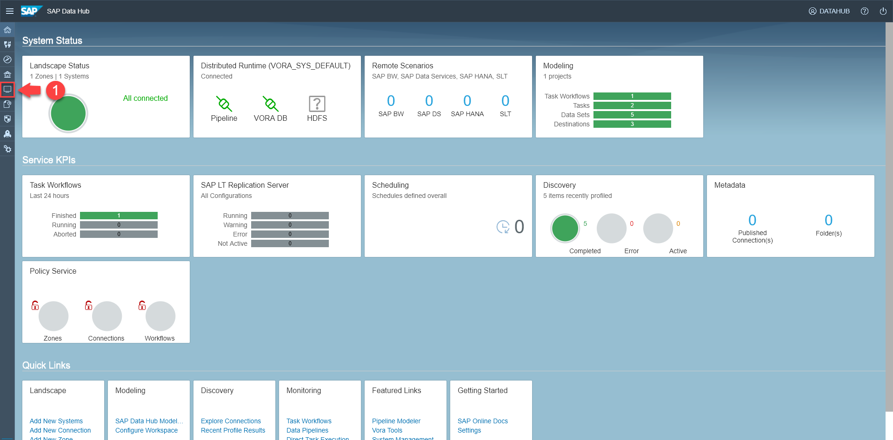
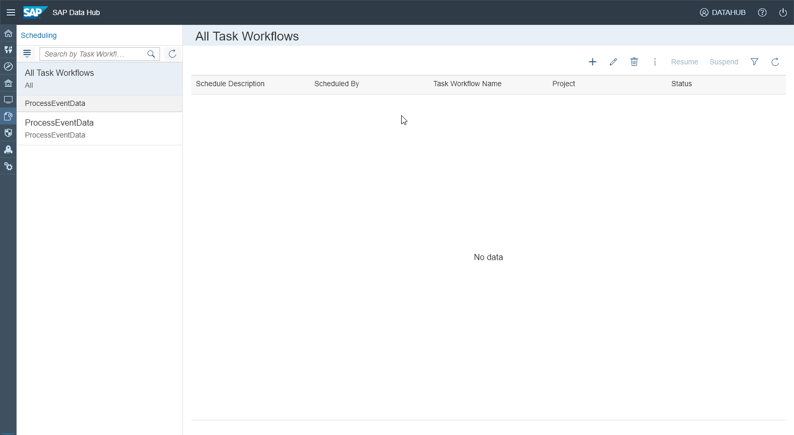

## Prerequisites  
 - **Proficiency:** Beginner
 - You have completed [Create workflow (part 3): Build a task workflow](https://www.sap.com/developer/tutorials/datahub-trial-workflow-part03.html)

## Details
### You will learn  
During this tutorial, you will build get to know how to monitor the execution of tasks and task workflows. You will also learn how to (regularly) schedule workflows.

### Time to Complete
**30 Min**

---

[ACCORDION-BEGIN [Step 1: ](Monitoring tasks and workflows)]
Open the SAP Data Hub Cockpit (`https://vhcalhxedb:51076/`) via a web browser.

Enter `DATAHUB` as **HANA Username** and the password which you have selected during system setup as **HANA Password** to logon to SAP Data Hub Cockpit. The system displays the **Overview** page.

  

Navigate to **Monitoring (1)** using the button on the left side of the screen.

  

The **Monitoring Dashboard** is displayed. From here you can see the status of executed tasks, task workflows as well as data pipelines.

[ACCORDION-END]

[ACCORDION-BEGIN [Step 2: ](Schedule workflows)]
Next navigate to **Scheduling (2)** using the button on the left side of the screen.

  

Here you can create and manage schedules (i.e. you can run a task workflow on a regular schedule).

[ACCORDION-END]

---
