## Details
### You will learn  
- How to create rules with Metadata Explorer in SAP Data Intelligence
- How to create a rulebook and associate rules
- How to evaluate the quality of the dataset

---

[ACCORDION-BEGIN [Step 1: ](Create new rules)]

In this section, you will use the Metadata Explorer to create validation rules to ensure that our data passes data quality standards and to determine whether the data complies with business constraints and requirements.

1. Navigate to the **Metadata Explorer** by clicking on the title in the launchpad.

    !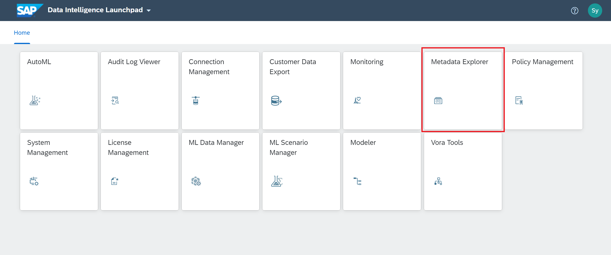

2. Go to **View Rules**.
    - Click **Data Intelligence Metadata Explorer**.
    - Click **Rules**.
    - Click **View Rules**.

    !

3. Rules are created within a rule category. You may use the predefined categories listed here or create your own rule category. In this exercise you will create an *Accuracy* rule and a *Conformity* rule.

    - Click on **more action icon** (at the most right) to the top rule category: Accuracy.

    - Select **Create New Rule**.

    !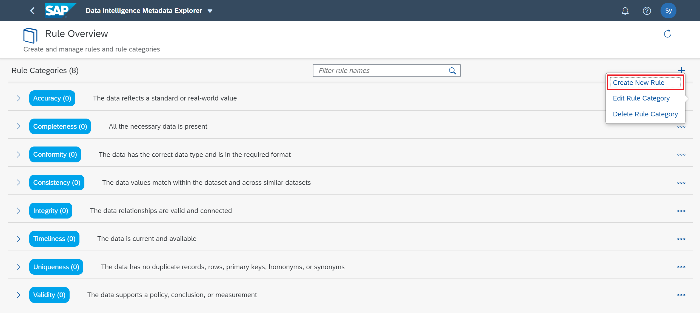  

4. Save the rule.

    - Set **Rule ID** as `CountryAccuracyRule` and then click **Save** in the lower right corner.

    !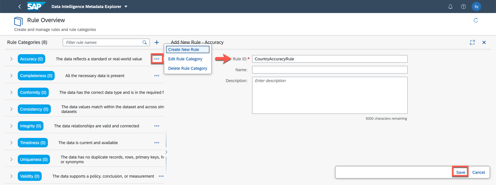  

5. Add Parameter as an input to the rule.

    - Click the + to add a parameter.

    - Set **Name** as Country.

    - Keep **Type** as String.

    - Click **Save**.

    !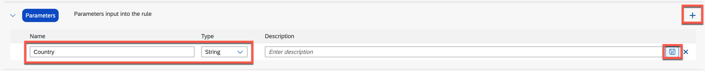

6. Add two conditions to the Country parameter:

    * `CountryNotNull`: The Country column must not contain a null value
    * `CountryInUS`: The Country column must match the value in our list which happens to only contain one entry: "US"

    !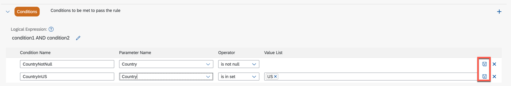

    Save each condition using the floppy disk icon on the right.

7. Use the back button in the upper left corner to go back to the Rule Overview and create a new rule under the rule category *Conformity* with the name **`ZipCodeConformityRule`**

    !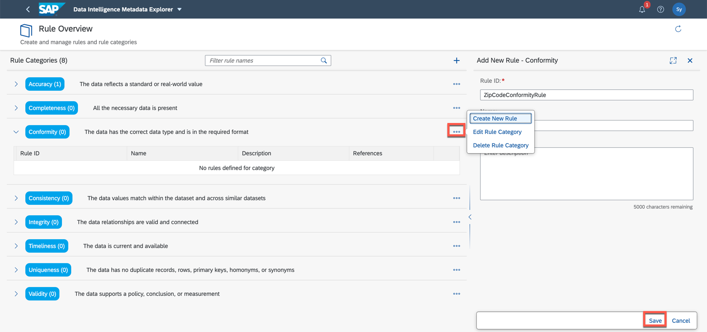

8. Using the **+** button, create a new parameter **`ZipCode`** and set the data type to be *Integer*. Be sure to save the parameter using the save icon on the right before proceeding to the next step.

    !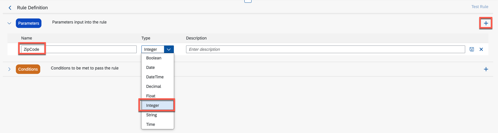

9. Add two conditions to the `ZipCode` parameter:

    * `ZipCodeNotNull`: The `ZipCode` column must not contain a null value

    * `ZipCodeInRange`: The `ZipCode` column must be less than or equal to 99999

    !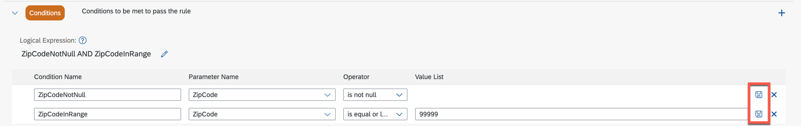

    Save each condition using the floppy disk icon on the right.

This concludes this exercise on creating validation rules. In the next section you will create a rulebook and bind these rules to a dataset for evaluation.

[DONE]

[ACCORDION-END]

[ACCORDION-BEGIN [Step 2: ](Create a rulebook)]
Navigate to **Metadata Explorer**.

In this section, you will create a rulebook and associate our previously created rules to evaluate the quality of our dataset.

Rather than running a validation on a dataset using a single rule, you will run a rulebook that can contain many rules. These rules can come from one or more rule categories and the rules may be bound to one or more datasets.

1. Begin by selecting **View Rulebooks** from the Metadata Explorer dropdown menu.

    !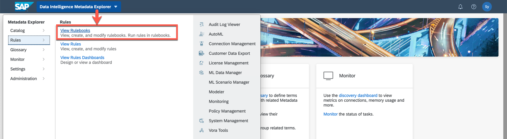

2. Create a new rulebook with the name *`CustomerDataQuality`* using the **+** icon and then Save.

    !

3. Click on the the **Import Rules** button

    !

4. Import the two rules that you created *`CountryAccuracyRule`* and *`ZipCodeConformityRule`* and then Save.

    !

5. Create a rule binding for *`CountryAccuracyRule`*  which maps to the column `Country` and create a rule binding for *`ZipCodeConformityRule`* to which maps to the column `Zipcode`.

    - Click on either of the two **+** icons to create a new rule binding.

    - Click on *Select a dataset* under **Qualified Name**.

    - Click **Browse**.

    - Select `CLOUD_STORAGE`.

    - Select `Contacts_USA.csv`.

    - Click **OK**.

    - Click **Save**.

    !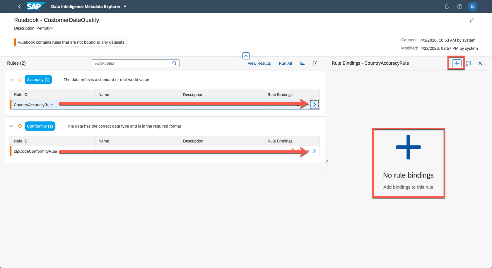

6. Because the Country parameter is identical to the Country column name it is automatically mapped

    !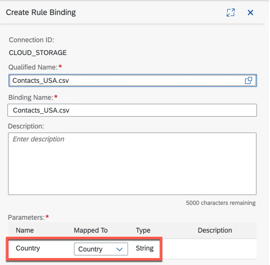

7. Since the `ZipCode` parameter is spelled with a capital C, but the column is spelled with a lower case c you have to manually choose to map it each other

    !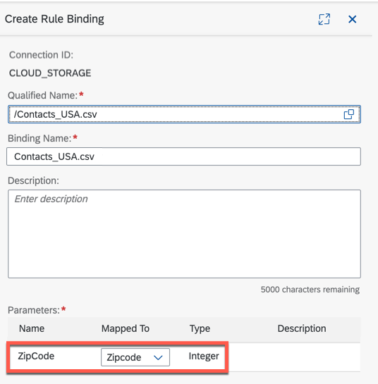

Congratulations, you've completed creating the rulebook and assigned it to your dataset. In the next section you will use it to evaluate and validate the quality of our dataset.

[DONE]

[ACCORDION-END]

[ACCORDION-BEGIN [Step 3: ](Execute and evaluate rules results)]

Now that the rule bindings have been assigned you can evaluate our data.

1. Run  rules.

    - Click the **Run All**.

    - A spinning wheel will appear to show that this activity is pending. Once complete, you may click on the **View Results** button.

    - Click on the **View Result**.

    !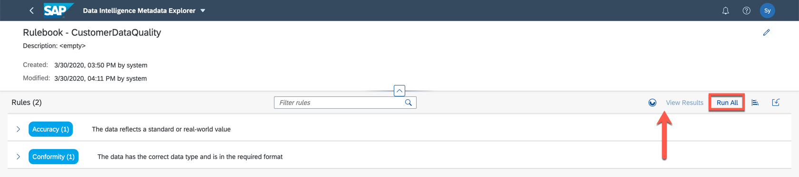

2. The results reveal that only 74.39% of the data passes the two rules that you have defined. For each rule you may drill down view a sample of the rows that do not pass validation.

    !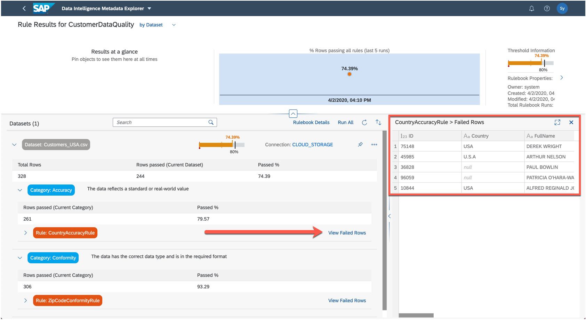

This concludes this exercise on using SAP Data Intelligence to create a rulebook and bind rules to evaluate the quality of our dataset. In the next section you can enhance the dataset by creating a data preparation task.

[VALIDATE_1]

[ACCORDION-END]

---
