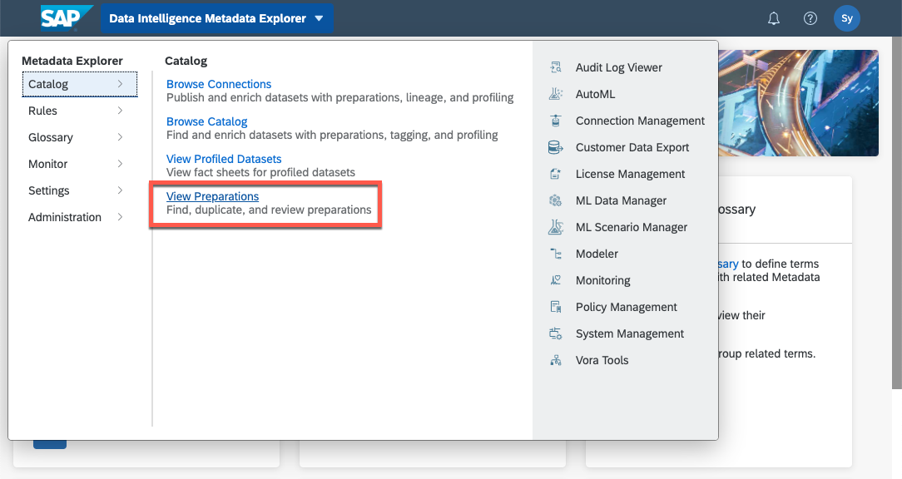
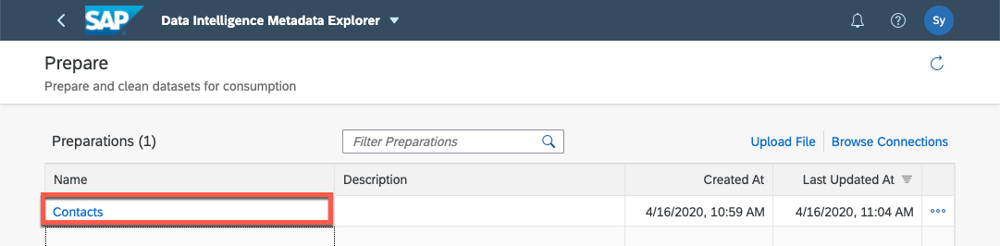
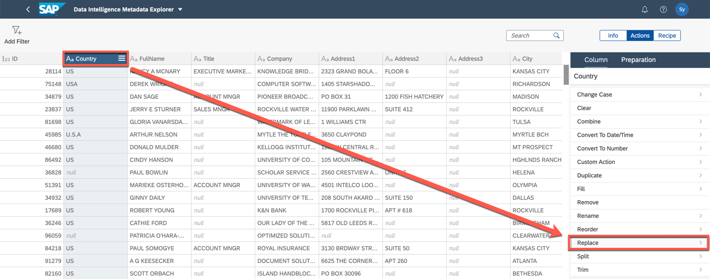
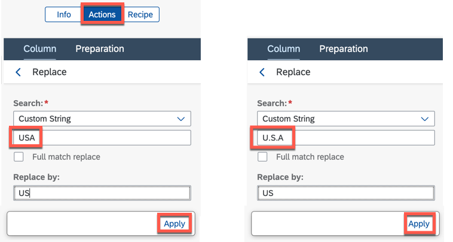
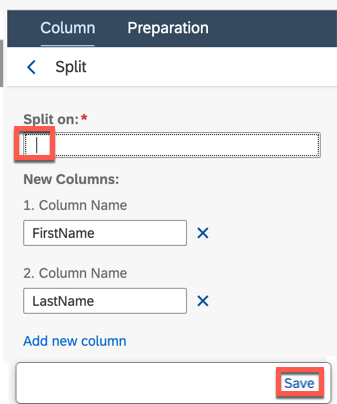
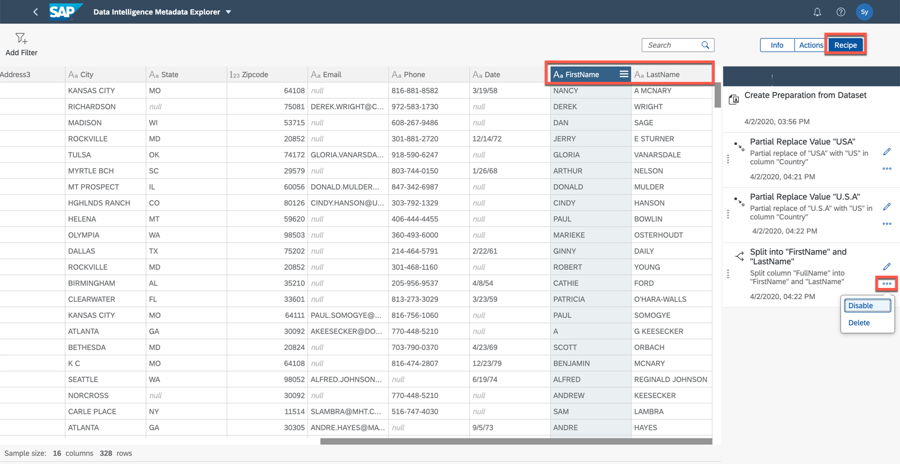
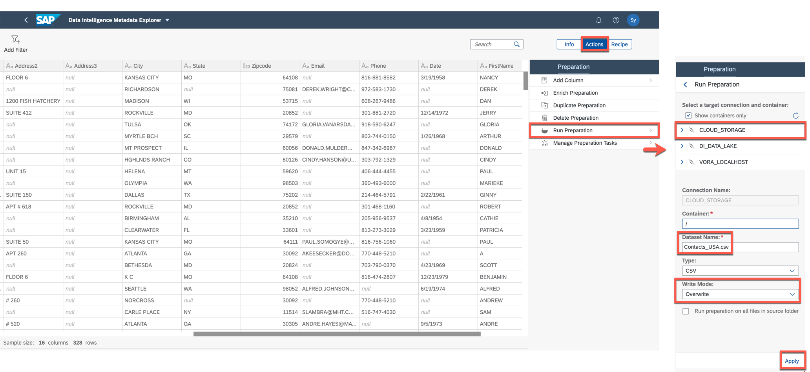
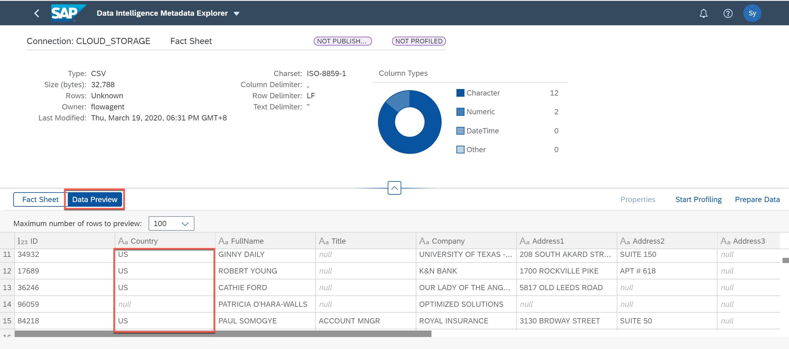
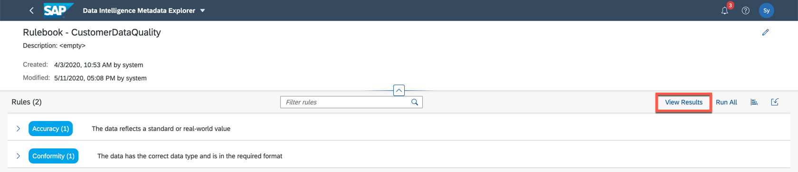

## Details
### You will learn
- How to use data preparation

Business users and data scientists can access, transform, and enrich datasets using a spreadsheet-like user interface in Metadata Explorer. Use data preparation to find data quality issues, correct and standardize data, and then output the data for analysis. This process improves efficiency and gains better business insights.

In this tutorial, we will return to the self-service data preparation tool to correct and standardize the data quality issues that we discovered in the previous section and then save this new dataset for further analysis.

---

[ACCORDION-BEGIN [Step 1: ](Improve data quality)]

1. Begin by going to the Metadata Explorer dropdown menu, and under the **Catalog** section and select **View Preparations**.

    

2. Select the preparation `Contacts`, which was created in Part 1 of this tutorial.

    !

3. Select the **Country** column header and choose the **Replace** action.

    

4. Replace all strings that read **`USA`** and **`U.S.A`** to instead read **`US`**.

    - You will have to perform each replacement as a separate action

    - Afterwards apply your changes

    !

5. Select the column **`FullName`** and choose the **Split** action.

    !

6. Use a white space (space bar) in the **Split On** field to separate the column into **`FirstName`** and **`LastName`** and then click **Save**

    

Scroll through the dataset to the right and observe that this split action has added two new columns to the dataset. You can use the **Recipe** tab to track, modify and disable/enable each of these actions.

!

[DONE]

[ACCORDION-END]

[ACCORDION-BEGIN [Step 2: ](Run preparation and check result)]

Now that we've corrected our data, we want to overwrite the `Contacts_USA.csv` dataset with the prepared dataset.

1. Run preparation to save the changes.

    - Click **Actions**

    - Click **Preparation**

    - Click **Run Preparation**.   

2. Select target.

    - Select `CLOUD_STORAGE`.

    - In this context a container is a directory inside a cloud storage connection such as S3 bucket. To write to the root directory of the `CLOUD_STORAGE` connection set the **Container** to `/`

    - Dataset Name type `Contacts_USA`.

    - Set **Type** to `CSV`.

    - Set **Write Mode** is `Overwrite`.

    - Click **Apply**.

    - Since we are adding two new columns to the dataset, click **Yes** when prompted to overwrite the target schema.

        !

        !

    - A preparation task will be started in the background. During this process the dataset **`Contacts_USA.csv`** in **`CLOUD_STORAGE`** will be overwritten with the newly prepared data.

3. Review preparation result

    - Go back to **Browse Connection**.

    - Select **`CLOUD_STORAGE`**.

    - Find the updated `Contacts_USA.csv` file. Note it can take several minutes for the data preparation to complete.

    - Click **View Fact Sheet**.

    - Switch to **Data Preview**. You will see only `US` and `null` values are listed in the data preview for the **Country** column.

    !

4.  These changes should improve the quality of the dataset.

    - Return to the **`CustomerDataQuality`** rulebook via rulebook overview.

    !

    - Click on **View Results**

    !

    - Run the rulebook validation again by clicking on the **Run all** button.

    - The task will take a minute or less to complete. Afterwards click the **Refresh** button to see the new results.

    - Expand each category to view detailed information by how much the quality of the dataset was improved.

    !

[VALIDATE_1]

[ACCORDION-END]

---
