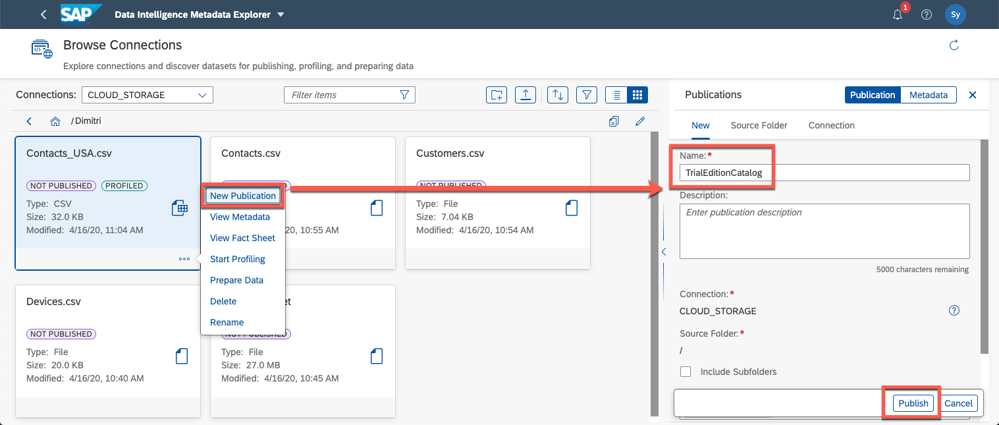
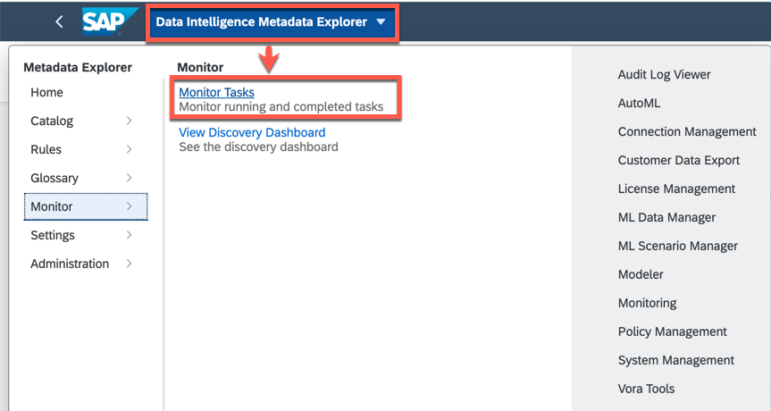
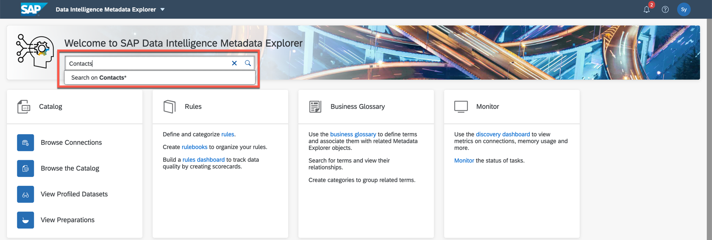
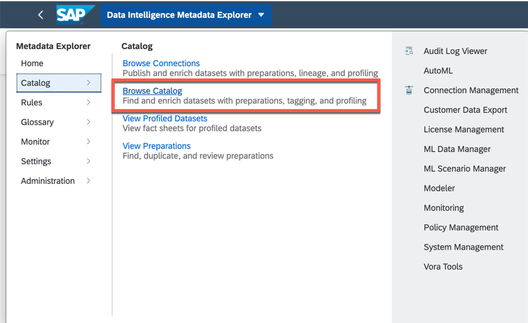
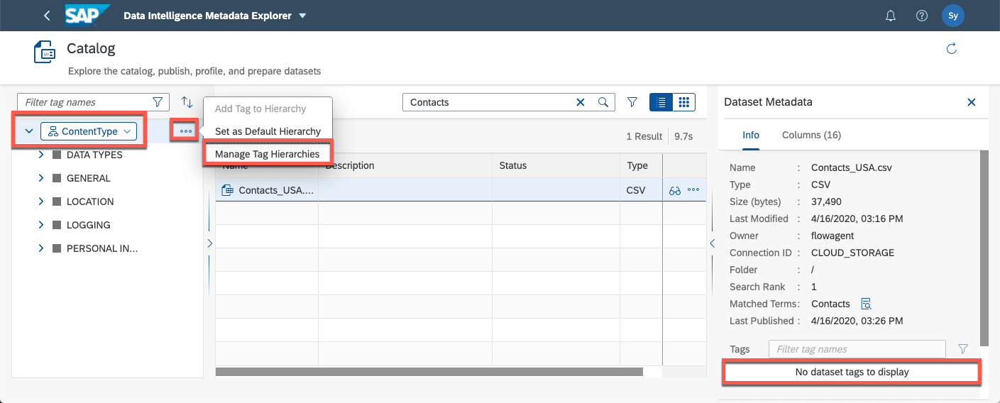
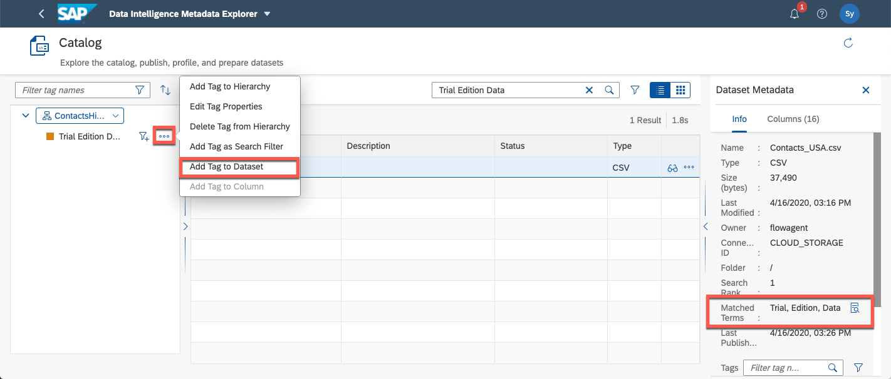

## Details
### You will learn
- How to use publish a dataset
- How to tag a dataset
- How to search a dataset

Publish a dataset which allows others to view or use the contents of the dataset. When a publication is created, all datasets that match the filter have their metadata extracted and stored in the Catalog. Then colleagues with the correct permissions can view fact sheets, tags, and metadata about the datasets.

---

[ACCORDION-BEGIN [Step 1: ](New publication of a dataset)]

Now that our dataset is complete we can publish and tag it to allow others users to view and search the data.

When a publication is created, all datasets that match the filter have their metadata extracted and stored in the Catalog. Then other users with the correct permissions can view fact sheets, tags, and metadata about the datasets.

1. Go to the **Browse Connection** and navigate to the `Contacts_USA.csv` file in the `CLOUD_STORAGE`  connection

2. Create a new publication.
    - Click on **More actions** for the `Contacts_USA.csv` file
    - Click **New Publication**.
    - Use the name **`TrialEditionCatalog`**
    - Click the **Publish**.

    

4. From the monitoring tasks menu you can check the status of the publication

In the next section we will add tags to our publication to make it easier for other users to find

[DONE]

[ACCORDION-END]

[ACCORDION-BEGIN [Step 2: ](Check published dataset and tag it)]

After a dataset has been published to the Catalog other users can search for it using the keyword **Contacts** from the landing page of the Metadata Explorer. The search results will take you directly the catalog.

1. You can also get to the Catalog from the Metadata Explorer dropdown menu
    !

2. The metadata of the `Contacts_USA.csv` can be viewed on the right. You can see that it is currently not associated with any tags.

    !

3. Create a tag hierarchy
    - In the dropdown menu on the left, choose **`ContentType`**
    - From **More options** go to the **Manage Tag Hierarchies** menu.
    - Click on the **+** icon in the upper right corner
    - Set the name of hierarchy to **`ContactsHierarchy`**
    - Save and close

4. Add a tag to the hierarchy
    - From the dropdown menu on the left make sure to choose the **`ContactsHierarchy`**
    - Using the **More actions** button select **Add Tag to Hierarchy**
    - Choose a name for your tag, for example **Trial Edition Data**. You can also choose a color of this tag which can be helpful to quickly distinguish groups of tabs.
    - Select Save

    !

3. Add tag to dataset
    - Select the **`Contacts_USA.csv`** file
    - Under **`Trial Edition Data`** tag click on **More actions**
    - Select **Add a tag Dataset.**
    - The tag is now listed in the dataset's metadata

    !

4. The dataset can now be found using this search term from the Catalog search.

    !

[VALIDATE_1]

[ACCORDION-END]

[ACCORDION-BEGIN [Step 5: ](Discovery dashboard)]
The discovery dashboard shows a summary of all the tasks that were executed, a comprehensive overview of the memory usage, and an access to the different objects such as the catalogs, the rules, and the tags.

1. To access the Discovery Dashboard go to the Metadata Explorer dropdown menu.
    - Go to **Monitor** menu
    - Select **View Discovery Dashboard**

3. Here you will find all the tasks you have performed so far in this tutorial and a quick way to access recently used rules, pipeline tasks, etc.

  !

This concludes this tutorial on metadata exploration and self-service data preparation with SAP Data Intelligence.

[DONE]

[ACCORDION-END]
---
