## Details
### You will learn  
  - How to find your way around SAP Data Intelligence, Trial Edition
  - How to troubleshoot problems

Please note here in this tutorial GCP refers to Google Cloud platform, AWS refers to Amazon Web Services and Azure refers to Microsoft Azure.

---

[ACCORDION-BEGIN [Step 1: ](Access UIs via a web browser)]
The SAP Data Intelligence 3.0 Trial Edition comes with predefined `system` user in the `default` tenant. Upon logging in you are redirected to the **Application Launchpad** page.

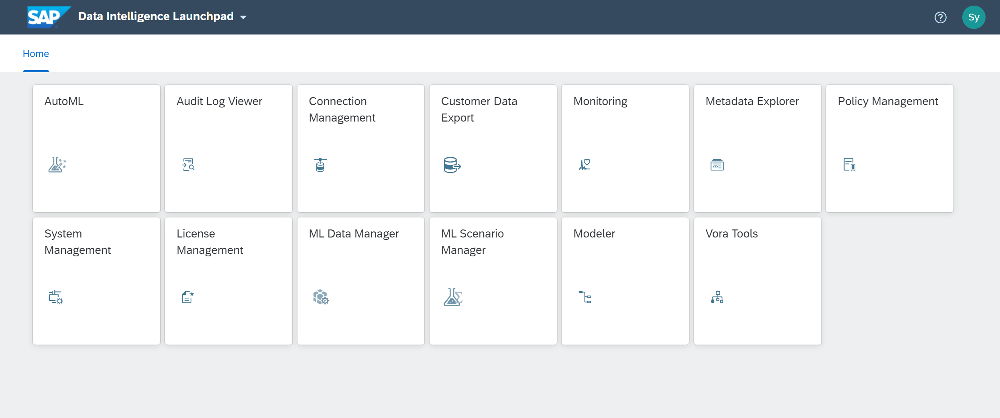  

From the SAP Data Intelligence Application Launchpad, you can navigate to:

 - SAP Data Intelligence Modeler
 - SAP Data Intelligence Metadata Explorer
 - SAP Data Intelligence System Management

In the subsequent sections we will describe each of the applications.

>In a production environment you would, of course, access the applications using a fully-qualified domain name with a signed certificate by a trusted Certificate Authority. In SAP Data Intelligence, Trial Edition however we use dynamically generated host names with self-signed certificates which are created during deployments.

[DONE]

[ACCORDION-END]

[ACCORDION-BEGIN [Step 2: ](SAP Data Intelligence Modeler)]
The SAP Data Intelligence Modeler allows you to create data-driven applications, so-called data pipelines, as well as data workflows.

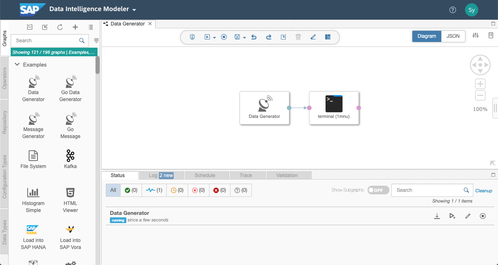  

Check the below screenshot and answer the question based on the same screenshot:

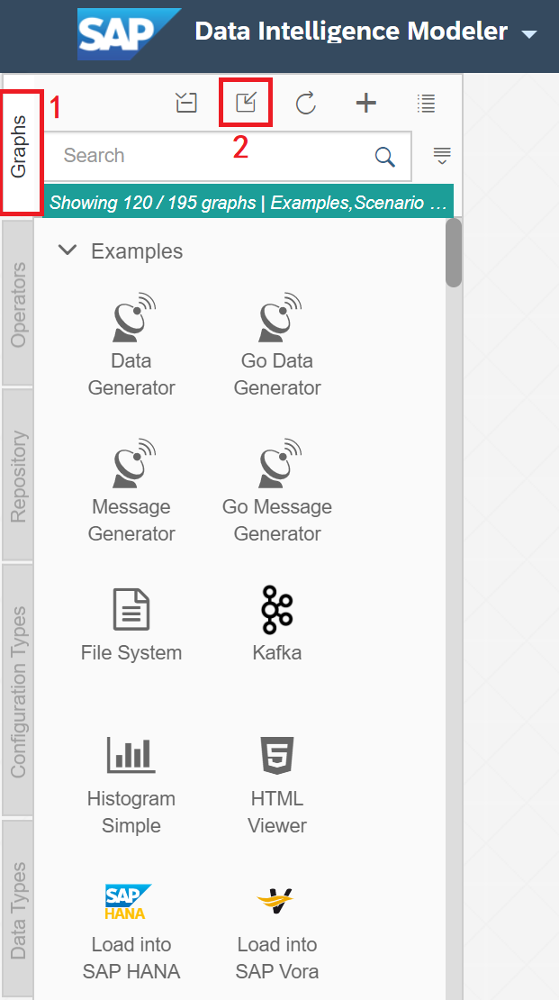

>**Hint:** You can hover over the operator icon to open up a documentation page to learn more about it.

[VALIDATE_1]

[ACCORDION-END]

[ACCORDION-BEGIN [Step 3: ](SAP Data Intelligence Metadata Explorer)]
The SAP Data Intelligence Metadata Explorer gathers information about the location, attributes, quality, and sensitivity of data. With this information, you can make informed decisions about which datasets to publish and determine who has access to use or view information about the datasets. Metadata Explorer can be accessed by going to SAP Data Intelligence App Launchpad as mentioned in Step 1.

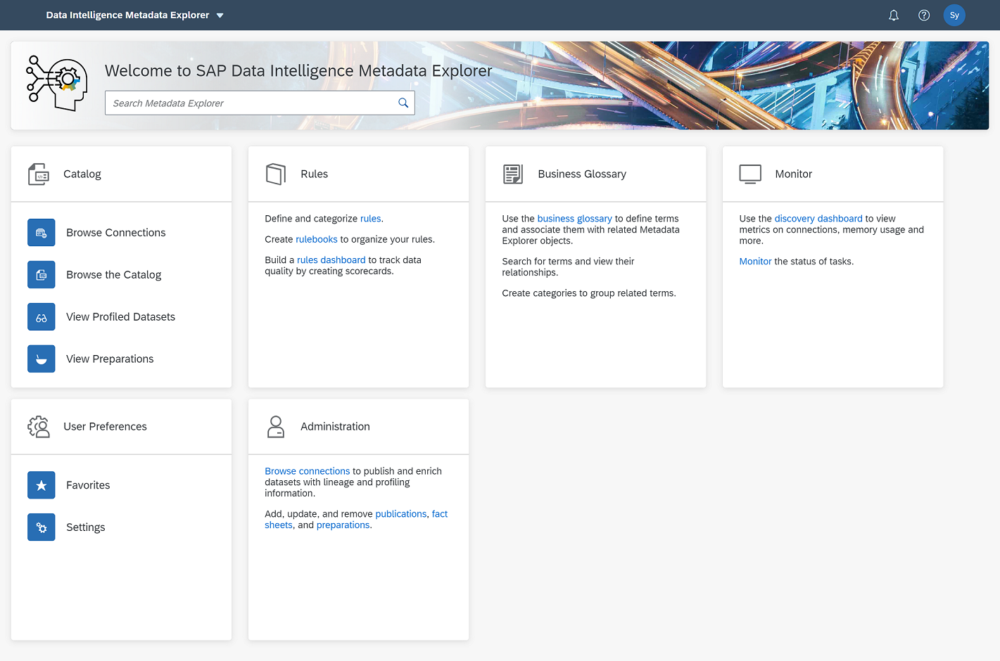  

[DONE]

[ACCORDION-END]

[ACCORDION-BEGIN [Step 4: ](SAP Data Intelligence System Management)]
The SAP Data Intelligence System Management allows you to manage SAP Data Intelligence, including tenants, users and applications and can be accessed by going to SAP Data Intelligence App Launchpad as mentioned in Step 1.

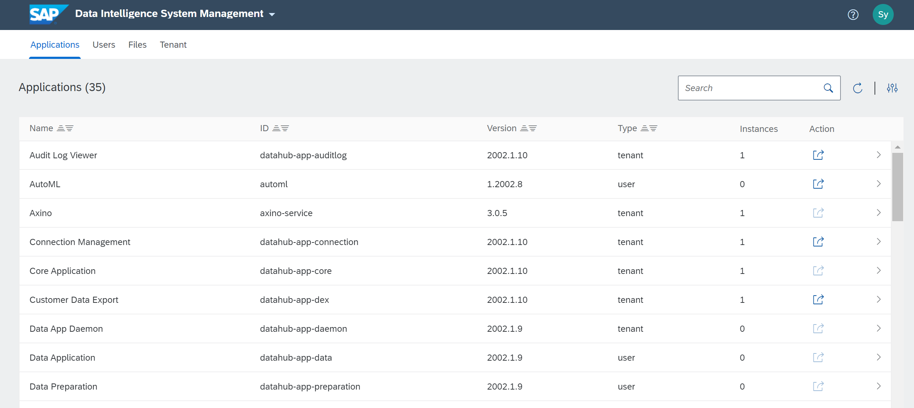

[DONE]

[ACCORDION-END]

[ACCORDION-BEGIN [Step 5: ](SAP Data Intelligence Connection Management)]
A connection in SAP Data Intelligence represents an access point to a remote system or a remote data source. Each connection is identified by a unique alphanumerical ID and has a type that specifies the nature of the access point. In addition to the mandatory ID attribute, every connection can have an optional description. After creating a connection, you can use the connection in the Pipeline Modeler to access an external data resource.

Your SAP Data Intelligence 3.0 Trial Instance comes pre-configured with the following connections:

 * An S3, Google Cloud Storage or Azure Data Lake storage connection (Depending on your chosen cloud platform)
 * Semantic Data Lake (SDL) connection for use with Machine Learning scenarios
 * A local HANA database connection *
 * A local Vora database connection

You can validate each of these connections by clicking on the **Check Status** action under the **Action** column.

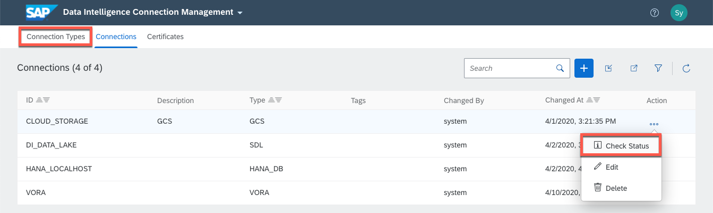

To view a list of other supported connection types click on the **Connection Types** tab in the upper left corner. A complete and up to date list can also be found in the [SAP Data Intelligence Administration Guide](https://help.sap.com/viewer/b13b5722c8ff4bf9bb097251310031d0/3.0.latest/en-US/c68bcf2d960547879d7fcc6ab7a2bfa5.html).

>**DISCLAIMER:** The SAP Data Intelligence 3.0 Trial Edition comes included with a pre-defined connection to a local containerized SAP HANA database for training purposes only. The licensed edition of SAP Data Intelligence does not come with SAP HANA and must be installed separately if required.

[DONE]

[ACCORDION-END]

[ACCORDION-BEGIN [Step 6: ](The system tenant)]
Throughout the tutorials you will be primarily using the `default` tenant which contains the standard SAP Data Intelligence applications. However, all SAP Data Intelligence instances also come with a `system` tenant and a corresponding `system` user which has the **cluster administrator** role. As a cluster administrator, you can create new users and tenants, manage and deploy individual applications, and access to  **`Grafana`** and **`Kibana`** web users interfaces.

These two applications can only be accessed via the `system` tenant is used for monitoring resource utilization, access to aggregated system logs and used for general troubleshooting. For details on how to use `Kibana` see the [the official SAP Data Intelligence 3.0 Administration Guide](https://help.sap.com/viewer/b13b5722c8ff4bf9bb097251310031d0/3.0.latest/en-US/6c54d7c683f84e6b9d1eb9a1507e7e46.html).

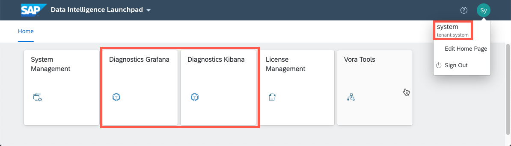

[DONE]

[ACCORDION-END]

[ACCORDION-BEGIN [Step 7: ](Troubleshoot problems and show logs)]
When running tasks in the **Metadata Explorer** or **Machine Learning applications** a background job will be executed in the Pipeline Modeler. If a task has failed then it may be worthwhile checking for a detailed error message in the Pipeline Modeler. Unless the graph failed to start in the first place the overview tab will typically also show in which operator the error was thrown.

In the **Pipeline Modeler** application you may view the error message of all **dead** graphs by clicking on the title of the graph which open an overview tab. Alternatively you may download a Diagnostic Information of the dead graph as a `.tar.gz` archive file by clicking on the download button on the far right.

!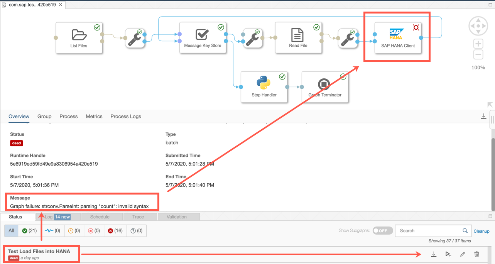

By default only `INFO` level logs will be logged. This can be changed via the **Trace** tab.
!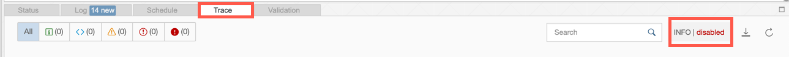

Turning on **Trace streaming** in the **Trace** tab allows you to display the logs directly via the Pipeline Modeler web interface.

!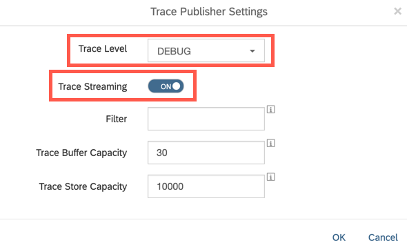

Use the **Refresh** button in the **Trace** tab to fetch the latest logs.

!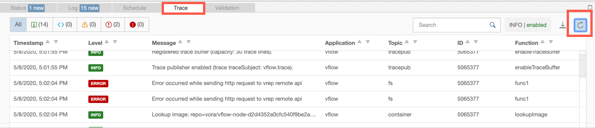

In rare cases you may want to access to the Kubernetes layer to troubleshoot a more technical issue. Please refer to the **Troubleshooting** chapter of the [Getting Started with SAP Data Intelligence, Trial edition] (https://caldocs.hana.ondemand.com/caldocs/help/a318f6b5-aa5a-4dfb-893e-1aac356ca5f8_Getting_Started_Guide_v37.pdf) guide.

[DONE]

[ACCORDION-END]

---
