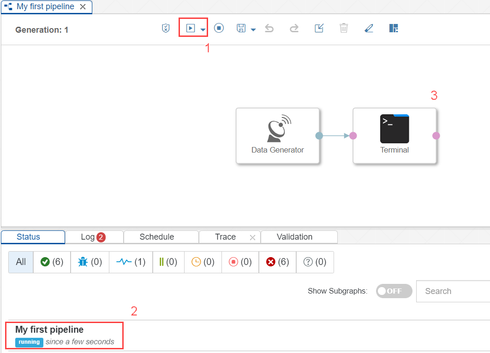

## Details
### You will learn  
- How to use a **Data Generator** to generate random sample data
- How to visualize the generated data via a **Terminal**

Please note in this tutorial GCP refers to Google Cloud platform and AWS refers to Amazon Web Services and Azure refers to Microsoft Azure.

---

[ACCORDION-BEGIN [Step 1: ](Create a data pipeline)]

Open the modeling environment for building pipelines via SAP Data Intelligence Modeler. To access the SAP Data Intelligence Launchpad in AWS or GCP or Azure you need go to the chapters 3.3 and 3.4 as described in the [Getting Started with SAP Data Intelligence, Trial Edition] (https://caldocs.hana.ondemand.com/caldocs/help/8772c957-0de5-459b-b98a-27180932f0da_Getting_Started_Guide_v28.pdf) guide. From SAP Data Intelligence Launchpad you could access the SAP Data Intelligence Modeler.

As a result of the previous tutorial, you are logged as a `system` user to a `default` tenant and are at the **Application Launchpad** page.

1. Open Modeler UI.

    !

2. While being in the **Graphs** tab in the **Navigation** on the left, click **Create Graph** to create a new pipeline. The pipeline opens in the **editor**.

    !

3. Save graph.

    - Click **Save**.

    - Enter **Name** as `test.myFirstPipeline`.

    - Enter **Description** as `My first pipeline` in the **pop-up window**.

    - Click **OK**.

    

[DONE]
[ACCORDION-END]

[ACCORDION-BEGIN [Step 2: ](Add and configure Data Generator)]

1. Find Data Generator Operator.

    - Open the **Operators** tab in the navigation pane on the left.

    - Search for **Data Generator**.

    !

    >**IMPORTANT:** The SAP Data Intelligence, Trial Edition comes with a Example Graph as well as with an operator called **Data Generator**. If you miss to open the **Operators** tab, you might end up opening the graph called **Data Generator** instead of adding the operator.

2. Add the **Data Generator** operator to the pipeline by drag & drop.

    

3. Click **Script** to display the JavaScript snippet which is executed by the **Data Generator**.

    The JavaScript snippet opens in a new tab of the editor. You see that the **Data Generator** creates a new random sample record every 500 milliseconds and sends it via the output port of the operator. The sample data represents sensors for humidity, temperature etc.

    !

Close the tab for the JavaScript snippet.

[DONE]

[ACCORDION-END]

[ACCORDION-BEGIN [Step 3: ](Add and configure Terminal)]

Add a **Terminal** operator to the pipeline by drag & drop (you find this also in the **Operators** tab). Then connect the `output` port of the **Data Generator** operator to the `in1` port of the **Terminal** operator. **You need to place the connection exactly on the `green circle`**.

!

Afterward, click **Save**.

[DONE]

[ACCORDION-END]

[ACCORDION-BEGIN [Step 4: ](Execute the data pipeline)]

Click **Run** to execute the pipeline.

!

When the **Status** tab indicates that the pipeline is running, use the context menu **Open UI** of the **Terminal** operator to see the generated sensor data.

Stop the pipeline by clicking **Stop** (you find it next to the **Run** button).

[DONE]

[ACCORDION-END]

---
