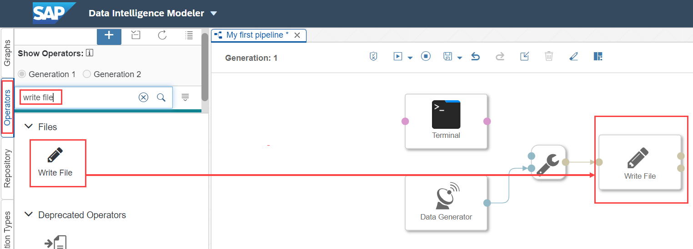
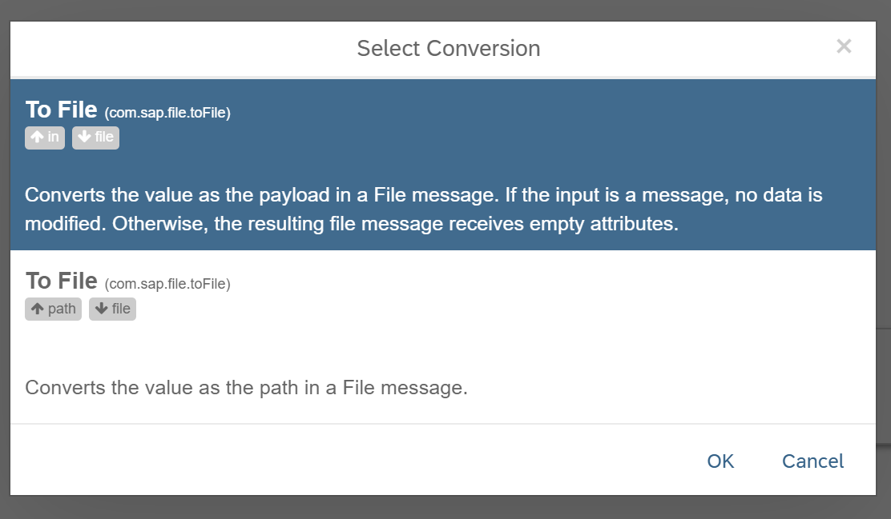
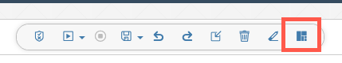
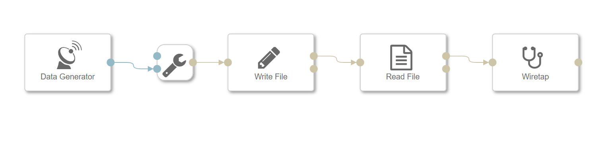
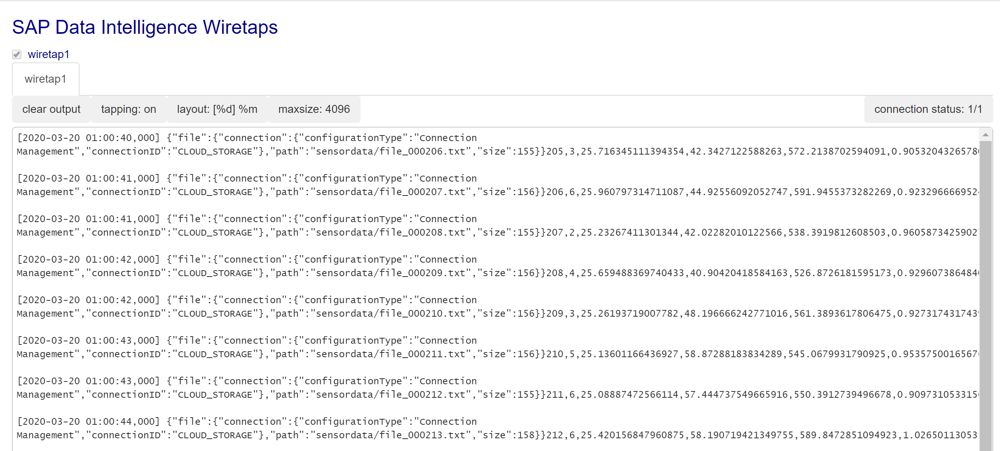
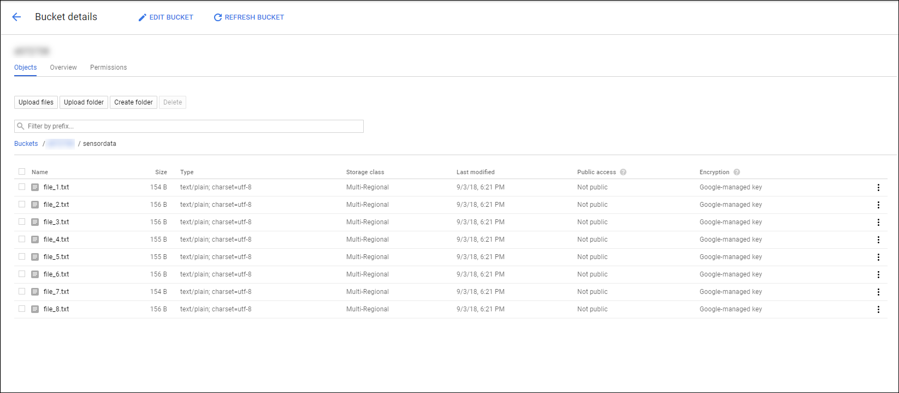
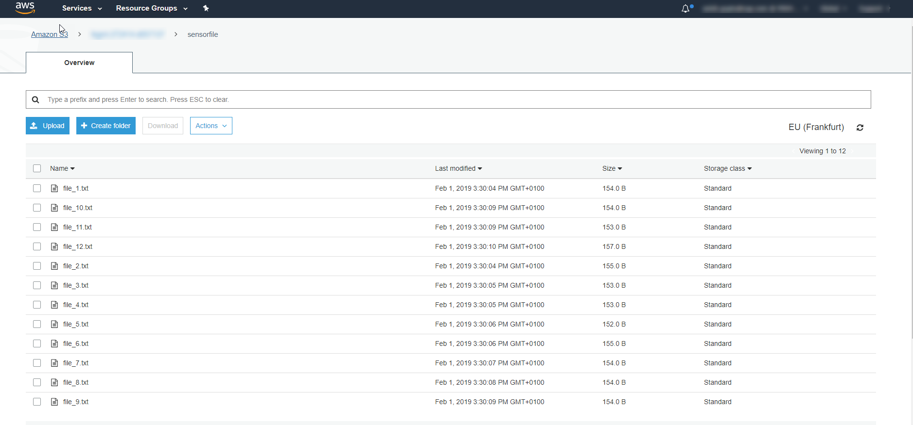
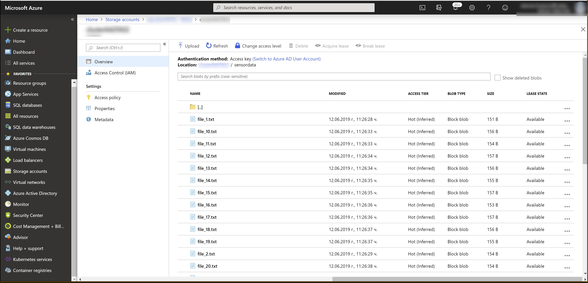

## Details
### You will learn  
- How to store sensor data in **`CLOUD_STORAGE`**
- How to use the **Write File** and **Read File** operators

Please note in this tutorial GCP refers to Google Cloud platform, AWS refers to Amazon Web Services, and Azure refers to Microsoft Azure.

---

[ACCORDION-BEGIN [Step 1: ](Collect GCS or AWS S3 or Azure WASB details)]
The SAP Data Intelligence, Trial Edition is deployed on AWS EKS, Google Cloud Platform or Microsoft Azure platform. Therefore you will use AWS S3 or Google Cloud Storage or Windows Azure Storage Blob for storing sensor data.

You can note down the name of the bucket or container by going to the Connection Management in SAP Data Intelligence, clicking **`CLOUD_STORAGE`** on the **Edit** button under **Action** and looking at the `Root Path`. Bucket or container name is required when you use the operators **Write File** and **Read File**.

>A bucket is a container for objects stored in Amazon S3. Every object is contained in a bucket. In Microsoft Azure, it is called container.

[DONE]

[ACCORDION-END]

[ACCORDION-BEGIN [Step 2: ](Add and configure Write File operator)]

Open the pipeline which you have created in the [previous tutorial](dataintelligence-trial-v2-pipelines-part01) `(test.myFirstPipeline)`, in the modeling environment.

 1. From the operator tab, enter the keyword *write*
    - Add **Write File** operator.
    - Drag and drop **Write File** operator to the existing graph.
    - Remove the connection between Data Generator and Terminal.
    - Connect output port of the Data Generator to the `inFile` input port of the **Write File**.

    

    - The output data type of the Data Generator operator is of type `string` but the Write File operator expects an input of type `message` for that reason you have to select the option to **convert the value as the payload in a File message**

    

    >**Hint** there is an Auto layout button just at the very right bar of the save button.

    !

2. Configure the **Write File** operator by maintaining the following properties :

    |  Field Name&nbsp;&nbsp;&nbsp;&nbsp;&nbsp;&nbsp;&nbsp;&nbsp;&nbsp;&nbsp;&nbsp;&nbsp;&nbsp;     | Value
    |  :------------- | :-------------
    | Connection | Connection Management -> GCS or S3 or WASB. Check the connection specific details after this table
    | path mode | Static with `placeholders`
    | path  | `sensordata/file_<counter>.txt`
    | mode | Overwrite

    To specify connection details you can utilize the connections established in the Configuration Manager.

    Click on the **Connection** input field and select **Configuration Type** as **Configuration Manager** and select the desired connection from the **Connection ID** dropdown box. Suggest to use `CLOUD_STORAGE`.

    The **Write File** operator will write the received data to file in the `/sensordata` directory in the specified GCS or AWS S3 bucket or Azure container.

[DONE]

[ACCORDION-END]

[ACCORDION-BEGIN [Step 3: ](Add and configure Read File operator)]

1. Add **Read File** operator to the graph.
    - Now drag and drop **Read File** operator to the existing graph `(test.myFirstPipeline)`.
    - Connect the **file** output to input of **Read File** operator.
    - Instead of the previous Terminal operator, find the **Wiretap** operator, connect its input to the Read File operator output.
    - Delete the Terminal operator.

    !

    >**Hint** Wiretap Operator is a powerful operator, aimed to provide data monitor and debugging.

2. Configure the **Read File** operator by maintaining the following properties :

    |  Field Name&nbsp;&nbsp;&nbsp;&nbsp;&nbsp;&nbsp;&nbsp;&nbsp;&nbsp;&nbsp;&nbsp;&nbsp;&nbsp;&nbsp;&nbsp;&nbsp;&nbsp;&nbsp;&nbsp;&nbsp;&nbsp;&nbsp;&nbsp;&nbsp;&nbsp;&nbsp;&nbsp;     | Value
    |  :------------- | :-------------
    | Read  | `On Input`
    | connection | From input
    |  Output in batches  | `false`

3. Afterwards click **Save**. Ignore the warning message by click OK.

[DONE]

[ACCORDION-END]

[ACCORDION-BEGIN [Step 4: ](Execute the data pipeline)]

1. Click **Run** to execute the pipeline.

2. View Data.
    - When the **Status** tab indicates that the pipeline is running.
    - Use the context menu **Open UI** of the **Wiretap** operator to see the generated sensor data.

    !

    >**Hint** In contrast to the previous tutorial, this time the generated sensor data is not sent from the **Data Generator** operator to the **Terminal** operator directly, but via **GCS or AWS S3 or WASB**. Hence the **Wiretap** also shows you information about the created files.

For GCP open [https://console.cloud.google.com](https://console.cloud.google.com) and navigate to **GCP Left menu** > **Storage** > **Browser** > **Your Bucket name** > `sensordata folder`. The longer the pipeline runs, the more files you will find there.

!

For AWS open [https://s3.console.aws.amazon.com](https://s3.console.aws.amazon.com) and navigate to **Search for Buckets** > **Your Bucket name** > `sensordata folder`. The longer the pipeline runs, the more files you will find there.

!

For Azure open [https://portal.azure.com/](https://portal.azure.com/) and navigate to **Storage accounts** > **filter your Storage account** > **Blob service** > **click Blob** > **Your Container name** > `sensordata folder`. The longer the pipeline runs, the more files you will find there.

Open the output **Wiretap**. Copy any row from the output and paste it in the frame below and click on **Submit Answer**.

[VALIDATE_1]

Stop the pipeline by clicking **Stop**.

[ACCORDION-END]

---
