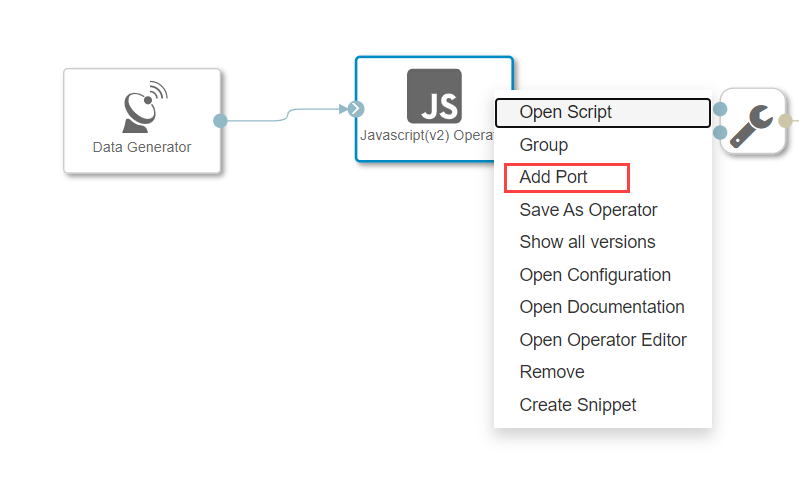
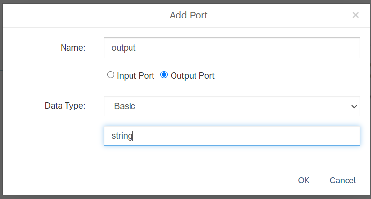
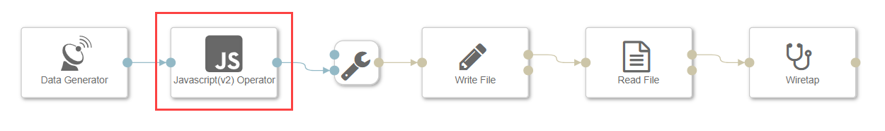
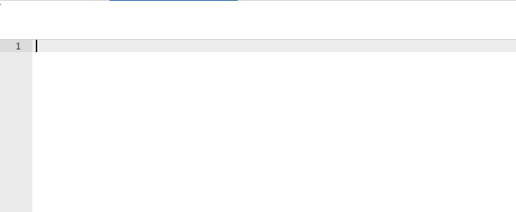
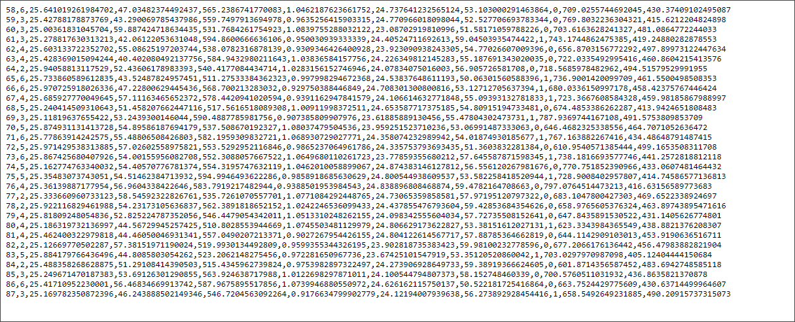

# Bundle Sensor Data in SAP Data Intelligence, Trial Edition
<!-- description --> Bundle sensor data by JavaScript before storing it in Cloud Storage by using SAP Data Intelligence, Trial Edition.

## You will learn  
- How to bundle the sensor data before storing in AWS S3 or Google Cloud Storage or Azure WASB
- How to use a **JavaScript(v2) Operator**

## Intro
Please note in this tutorial GCP refers to Google Cloud platform and AWS refers to Amazon Web Services and Azure refers to Microsoft Azure.

---

### Add JavaScript(v2) operator


Open the pipeline which you have created in the [previous tutorial](dataintelligence-trial-v2-pipelines-part02) `(test.myFirstPipeline)`, in the modeling environment.

1. Remove the connection between the **Data Generator** operator and the **To File** operator.

2. Add a **JavaScript(v2) Operator** to the pipeline by drag & drop.

3. Connect the `output` port of the **Data Generator** operator to **JavaScript(v2) Operator** which will automatically create `input` port called `input1` of type `string`.

4. Add the `output` port for   **JavaScript(v2) Operator** by right clicking and selecting `Add Port` .  

    <!-- border -->

5. Name Output port as `Output` and data Type as `string`.

    <!-- border -->

6. Connect the `output` port of  **JavaScript(v2) Operator**  to the `in` port of the **To File** operator.

    <!-- border -->

7. Right click **Write File** operator, open the configuration panel and change the following property:

    |  Field Name&nbsp;&nbsp;&nbsp;&nbsp;&nbsp;&nbsp;&nbsp;&nbsp;&nbsp;&nbsp;&nbsp;&nbsp;&nbsp;     | Value
    |  :------------- | :-------------
    | path  | `sensordata/JS_file_<counter>.txt`

The **Write File** operator will write the received data to files in the `/sensordata` directory in the specified GCS or AWS S3 bucket or Azure container. The files follow the scheme `JS_file_<counter>.txt` (where counter is an incremental integer).


### Create JavaScript extension


1. Right click the JavaScript(v2) Operator.

2. Click on **Open Script** and blank JavaScript snippet opens in a new tab.

    <!-- border -->

3. Add the following code, which creates an incremental **counter** every time it receives data via the input port and sends the `bundles` of  30 sensor records to the output port.

    ```javascript

    var counter = 0;
    var bundle = "";

    $.setPortCallback("input1",onInput);  //Hint: input1 is name of the input port, so you can rename the input port if you like  

    function onInput(ctx,s) {
        counter++;
        bundle = bundle + s;

        if(counter==30) {
          $.output(bundle);    //Hint: Output is the name of the output port, so you can rename the output port if you like
          counter = 0;
          bundle = "";
        }
    }
    ```
4. Navigate back to the pipeline tab.

5. Click **Save** to save the pipeline including the modified script.


### Execute the data pipeline


1. Click **Run** to execute the pipeline.

2. When the **Status** tab indicates that the pipeline is running. Use the context menu **Open UI** of the **Wiretap** operator to see the generated sensor data. You can notice that this time the output is grouped in a chunk of 30 records.

    For GCP open [http://console.cloud.google.com](http://console.cloud.google.com) and navigate to the `/sensordata/` directory.
    For AWS open [https://s3.console.aws.amazon.com](https://s3.console.aws.amazon.com) and navigate to **Search for Buckets** > **Your Bucket name** > `sensordata` folder.
    For Azure open [https://portal.azure.com/](https://portal.azure.com/) and navigate to **Storage accounts** > **filter your Storage account** > **Blob service** > **click Blob** > **Your Container name** > `sensordata folder`.

    You see that the system does not create a file for each single sensor record, but only for each 30 sensor records.

4. Stop the pipeline by clicking **Stop**.


### Check the created files in GCS or AWS S3 or Azure WASB


Login to Google Cloud Platform - [http://console.cloud.google.com](http://console.cloud.google.com) and navigate to **GCP Left menu** > **Cloud Storage** > **Browser** > **Your Bucket name** > `sensordata` folder.

For AWS open [https://s3.console.aws.amazon.com](https://s3.console.aws.amazon.com) and navigate to **Search for Buckets** > **Your Bucket name** > `sensordata` folder.

For Azure open [https://portal.azure.com/](https://portal.azure.com/) and navigate to **Storage accounts** > **filter your Storage account** > **Blob service** > **click Blob** > **Your Container name** > `sensordata folder`.

<!-- border -->

You can download the file to view the contents of the file.


---
