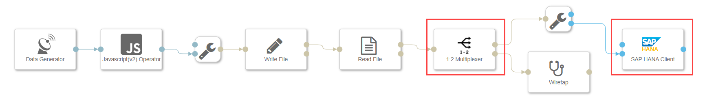
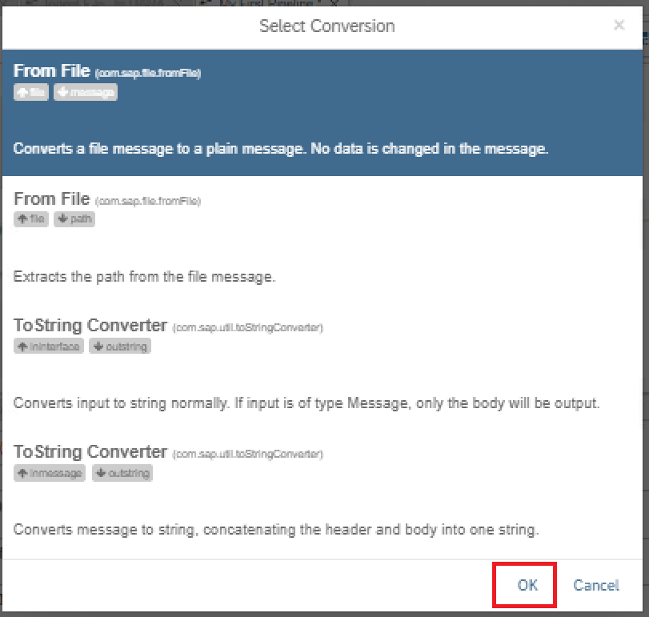
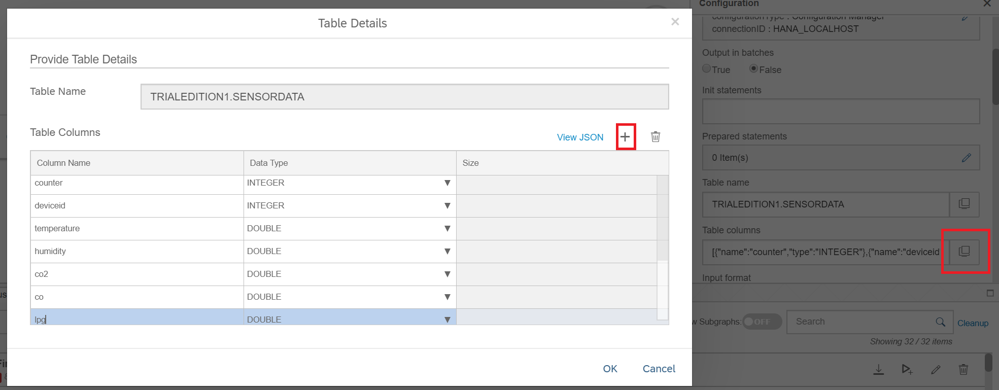
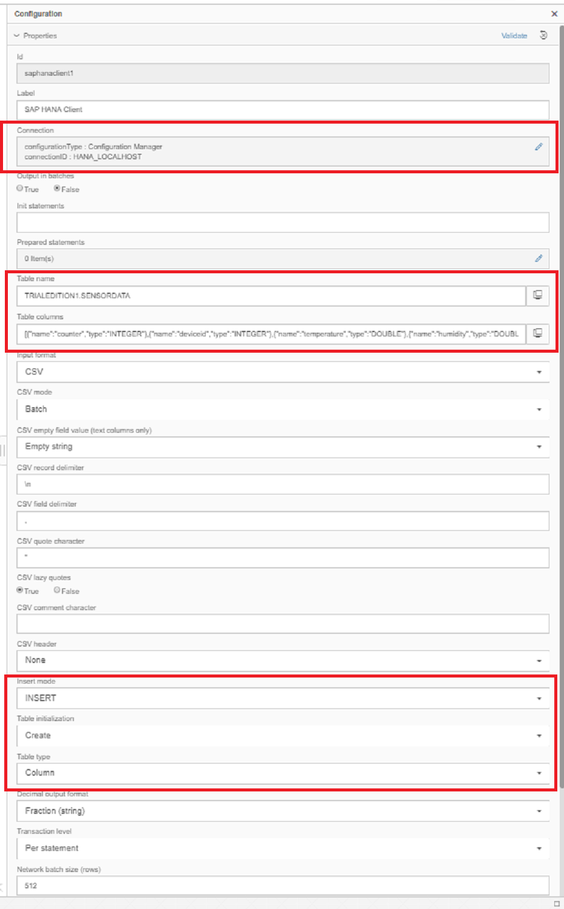
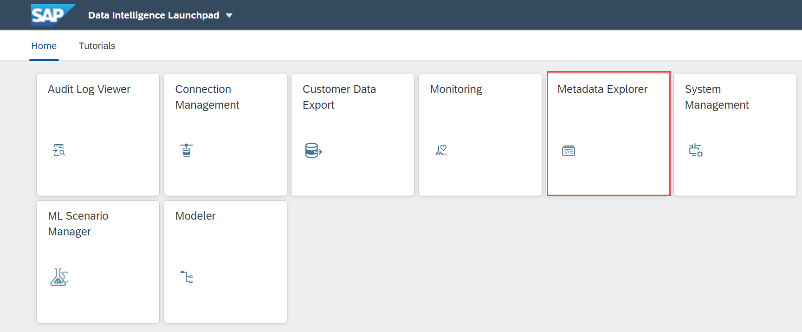
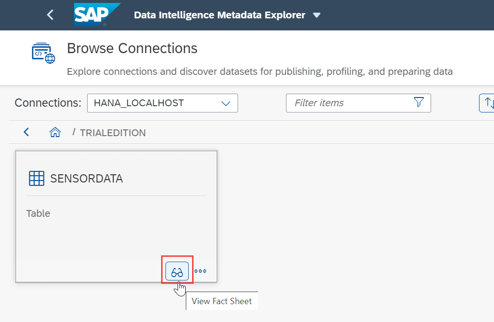
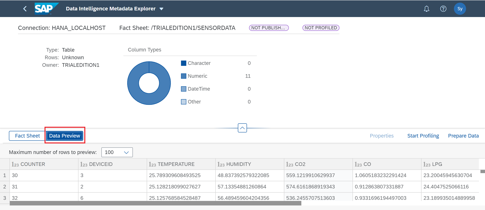

## Details
### You will learn  
- How to store the data in SAP HANA from Google Cloud Storage or AWS S3 or Microsoft WASB
- How to use a **SAP HANA Client Operator**

Please note here in this tutorial GCP refers to Google Cloud platform and AWS refers to Amazon Web Services and Azure refers to Microsoft Azure.

---

[ACCORDION-BEGIN [Step 1: ](Add SAP HANA Client operator)]

The  **SAP HANA Client Operator** works as a client for the SAP HANA. This operator executes SQL statements and inserts CSV or JSON data into an SAP HANA instance. It supports three fundamental operations:
    - Executing arbitrary SQL code.
    - Executing prepared statements.
    - Inserting data into a predefined table.
You can use a single HANA Client operator to perform all three operations, since the input ports work independently from one another.

>You can get more details of operator by clicking the **Documentation** icon.

Open the pipeline which you have created in the previous tutorial `(test.myFirstPipeline)`, in the modelling environment.

1. Add a **SAP HANA Client** operator and a **1:2 Multiplexer** operator.
    - Add a **SAP HANA Client** operator.
    - Add a **1:2 Multiplexer** operator.
    - Remove the connection between **Read File** and **Wiretap**.
    - Connect the file out port of the **Read File** (this is an unused port in the Read File operator) to the **1:2 Multiplexer** operator.
    - Connect one of the out port of **1:2 Multiplexer** operator to **Wiretap** in port.
    - Connect the other out port of the **1:2 Multiplexer** to the `filename` in port of the **SAP HANA Client** data input.

    !

2. In the popup dialog, select the **From File**, click **OK**.

    

3. Right click **Write File** operator, open the configuration panel and change the following property:

    |  Field Name&nbsp;&nbsp;&nbsp;&nbsp;&nbsp;&nbsp;&nbsp;&nbsp;&nbsp;&nbsp;&nbsp;&nbsp;&nbsp;     | Value
    |  :------------- | :-------------
    | path  | `sensordata/HANA_file<counter>.txt`

The **Write File** operator will write the received data to files in the `/sensordata` directory in the specified GCS or AWS S3 bucket or Azure container. The files follow the scheme `HANA_file<counter>.txt` (where counter is an incremental integer).

[DONE]

[ACCORDION-END]

[ACCORDION-BEGIN [Step 2: ](Configure the SAP HANA Client operator)]

You need to provide the HANA Connection, Table name along with its Schema, to the **SAP HANA Client**. The **SAP HANA Client** gets the data from data input port then inserts into table.

Now you would be configuring the second operator that you have added - **SAP HANA Client**. Open the configuration window for the operator.

Provide the configuration Parameter values as follows:

| Parameter &nbsp;&nbsp;&nbsp;&nbsp;&nbsp;&nbsp;&nbsp;&nbsp;&nbsp;&nbsp;&nbsp;&nbsp;&nbsp;&nbsp;&nbsp;&nbsp;&nbsp;&nbsp;&nbsp;&nbsp;&nbsp;&nbsp;&nbsp;&nbsp;&nbsp;&nbsp;&nbsp;&nbsp;&nbsp;&nbsp;&nbsp;&nbsp;&nbsp;&nbsp;&nbsp;&nbsp;&nbsp;&nbsp;&nbsp;&nbsp;&nbsp;&nbsp;&nbsp;&nbsp;                          | Value                                                                                       |
| :------------------------------ | :------------------------------------------------------------------------------------------- |
| `Connection` | use `Configuration Manager` as `Configuration type` and select `HANA_LOCALHOST` as `Connection ID`|
| `Table name`| `"TRIALEDITION"."SENSORDATA"`|
| `Table columns`| `[{"name":"counter","type":"INTEGER"},{"name":"deviceid","type":"INTEGER"},{"name":"temperature","type":"DOUBLE"},{"name":"humidity","type":"DOUBLE"},{"name":"co2","type":"DOUBLE"},{"name":"co","type":"DOUBLE"},{"name":"lpg","type":"DOUBLE"},{"name":"smoke","type":"DOUBLE"},{"name":"presence","type":"INTEGER"},{"name":"light","type":"DOUBLE"},{"name":"sound","type":"DOUBLE"}]`
| `Insert mode` | `INSERT`|
| `Table initialization` | `Create`|
| `Table type` | `Column`|
| `Terminate on error` | `False`|

>Please note columns also can be added manually. You can use icon besides Table columns.

!

To specify connection details you can utilize the connections established in the Configuration Manager.

To re-use the Configuration Manager connections, click on the **Connection** input field and select **Configuration Type** as **Configuration Manager** and select the desired connection from the **Connection ID** dropdown box which here should be **`HANA_LOCALHOST`**.

!

 **Save** the graph.

[DONE]

[ACCORDION-END]

[ACCORDION-BEGIN [Step 3: ](Execute the data pipeline)]

Go to the SAP Data Intelligence Modeler and click **Run** to execute the pipeline. When the **Status** tab indicates that the pipeline is running, use the context menu **Open UI** of the **Wiretap** operator to see the generated sensor data.

The longer the pipeline runs, the more files and rows are generated. Therefore, after a while **stop** the pipeline execution.

[DONE]

[ACCORDION-END]

[ACCORDION-BEGIN [Step 4: ](Check the output in HANA from Browse Connections)]

For GCS open [http://console.cloud.google.com](http://console.cloud.google.com) and navigate to the `/sensordata/` directory.

For AWS open [https://s3.console.aws.amazon.com](https://s3.console.aws.amazon.com) and navigate to **Search for Buckets** > **Your Bucket name** > `sensordata` folder.

For Azure open [https://portal.azure.com/](https://portal.azure.com/) and navigate to **Storage accounts** > **filter your Storage account** > **Blob service** > **click Blob** > **Your Container name** > `sensordata folder`.

You can notice that the output files are generated similar to the earlier tutorial in the above mentioned storage buckets.

1. Now login to the **SAP Data Intelligence Launchpad** and click on the **Metadata Explorer**.

    

2. Preview Sensor Data
    - Once Metadata Explorer open up, double click on the `Browse Connections` from the left panel.
    - Select `HANA_LOCALHOST`.
    - Click on `TRIALEDITION`.
    - Once you see the table `SENSORDATA`, click More Actions.
    - Select **View Fact Sheets**.

    

3. Click the **Data Preview**, this will display all the sensor data that you have loaded into the HANA table.

    !

[VALIDATE_1]
[ACCORDION-END]

---
