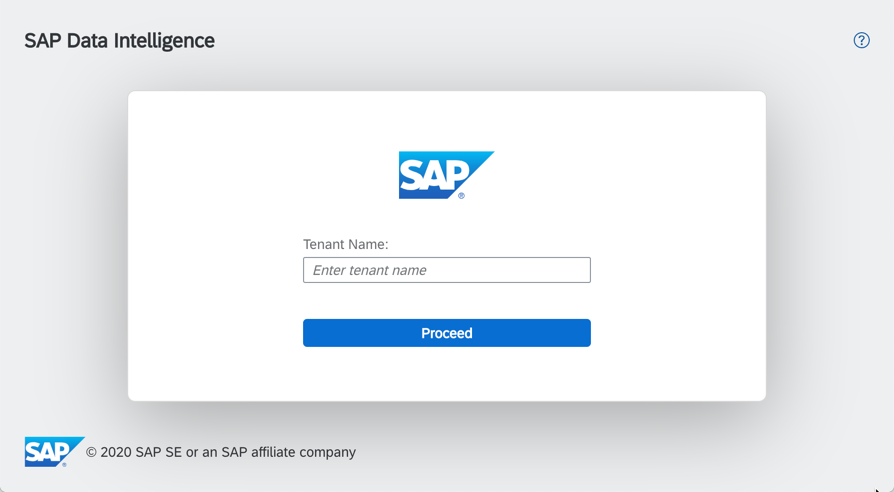
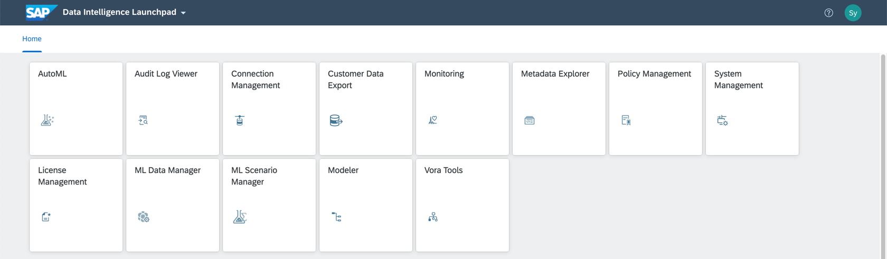

## Details
### You will learn  
- How to create a solution instance of SAP Data Intelligence, Trial Edition

SAP Data Intelligence, Trial Edition is provisioned via SAP Cloud Appliance Library. It runs in your account on Cloud Providers that you choose from Google Cloud platform (GCP), Amazon Web Services (AWS) or Microsoft Azure (or simply Azure).

---

[ACCORDION-BEGIN [Step 1: ](Configure your cloud account)]
Running SAP Data Intelligence, Trial Edition requires you to have your own administrator access to one of the following (alphabetically):

* an Amazon Web Services account,
* an Azure Subscription, or
* a Google Cloud Platform project.

If you do not yet have one of the above, then create it first.

The necessary prerequisites for each cloud provider accounts are described in the [Getting Started with SAP Data Intelligence, Trial Edition] (https://caldocs.hana.ondemand.com/caldocs/help/a318f6b5-aa5a-4dfb-893e-1aac356ca5f8_Getting_Started_Guide_v37.pdf) guide (chapter 2.1).

[OPTION BEGIN [Amazon Web Services]]

For  Amazon Web Services you need to get access to AWS Management Console for the Amazon Web Services account under certain ID. After getting access you need to also have Access Key and Secret Key as a basis to connect from CAL to AWS backend and spin up the SAP Data Intelligence 3.0 instance

* Amazon Web Services Account : <https://aws.amazon.com/premiumsupport/knowledge-center/create-and-activate-aws-account/>
* Amazon Web Services Understanding and Getting Your Security Credentials : <https://docs.aws.amazon.com/general/latest/gr/aws-sec-cred-types.html#access-keys-and-secret-access-keys>

[OPTION END]

[OPTION BEGIN [Microsoft Azure]]

For Microsoft Azure you need to create a corresponding Azure subscription using your Microsoft Azure account. And then using the Subscription ID provided to connect CAL from Azure.

* Getting your Microsoft Azure account and unique subscription ID : <https://wiki.scn.sap.com/wiki/display/SAPCAL/FAQ+-+Specific+questions+for+Microsoft+Azure>

[OPTION END]

[OPTION BEGIN [Google Cloud Platform]]

For Google Cloud Platform create a corresponding Google Cloud Platform project. Moreover you also need a so-called service account which is used by SAP Cloud Appliance Library while accessing Google Cloud Platform. You find more information about projects and service accounts in the Google Cloud Platform documentation.

* Google Cloud Platform Projects: <https://cloud.google.com/storage/docs/projects>
* Google Cloud Platform Service Accounts: <https://cloud.google.com/iam/docs/service-accounts>

[OPTION END]

[DONE]
[ACCORDION-END]

[ACCORDION-BEGIN [Step 2: ](Link project to SAP Cloud Appliance Library)]
Link your cloud providers to SAP Cloud Appliance Library. This step is described in the SAP Cloud Appliance Library [documentation](https://calstatic.hana.ondemand.com/res/docEN/042bb15ad2324c3c9b7974dbde389640.html).

Open the SAP Cloud Appliance Library in your web browser using the following link: <https://cal.sap.com>.

If you are a first-time user of SAP Cloud Appliance Library, familiarize yourself with its basic concepts and how to work with the user interface by reading the [documentation](https://lkgstatic.hana.ondemand.com/res/~1522937040047~/docEN/6381cffb595143db8d4d7314afa0ae65.html).

[DONE]

[ACCORDION-END]

[ACCORDION-BEGIN [Step 3: ](Create solution instance)]
Next, you can create a solution instance of SAP Data Intelligence, Trial Edition in SAP Cloud Appliance Library.

The necessary steps to do so are described in the [Getting Started with SAP Data Intelligence, Trial Edition] (https://caldocs.hana.ondemand.com/caldocs/help/a318f6b5-aa5a-4dfb-893e-1aac356ca5f8_Getting_Started_Guide_v37.pdf) guide (chapter 2.3).

The creation of the solution instance can take up to **between 3 to 4 hours** and depends on a cloud provider and a region.

[DONE]

[ACCORDION-END]

[ACCORDION-BEGIN [Step 4: ](Connect to SAP Data Intelligence Launchpad)]
After the solution instance is up and running, you can connect to it.

To access the SAP Data Intelligence Launchpad follow the corresponding chapter from [Getting Started with SAP Data Intelligence, Trial Edition] (https://caldocs.hana.ondemand.com/caldocs/help/a318f6b5-aa5a-4dfb-893e-1aac356ca5f8_Getting_Started_Guide_v37.pdf) guide:

* chapter 3.3 for Amazon Web Services
* chapter 3.4 for Microsoft Azure
* chapter 3.5 for Google Cloud Platform

> If you see an error message that the web browser is not able to verify the security certificate, you need to confirm this error message (because the appliance uses self-signed certificates).

Once the logon screen is displayed enter corresponding values and press **Login**.

!

|-|-|
|Tenant|`default`|
|Username|`system`|
|Password|the password which you have selected during system setup|

The **Application Launchpad** page is displayed.

In the SAP Data Intelligence Launchpad, find and open the link **Modeler**. Copy the URL from the webpage address bar and paste it in the frame below, then click on **Validate**.

[VALIDATE_1]

[ACCORDION-END]

---
