## Details
### You will learn
- How to create Data Transform
- How to enrich dataset

Please note here in this tutorial GCP refers to Google Cloud platform and AWS refers to Amazon Web Services, Azure refers to Microsoft Azure.

---

[ACCORDION-BEGIN [Step 1: ](Add data transform and trigger)]
You are logged as a `system` user to a `default` tenant and are at the **Application Launchpad** page.

Open the modelling environment for building pipelines via SAP Data Intelligence Modeler.

1. Click **Modeler** to open a Modeler UI.

    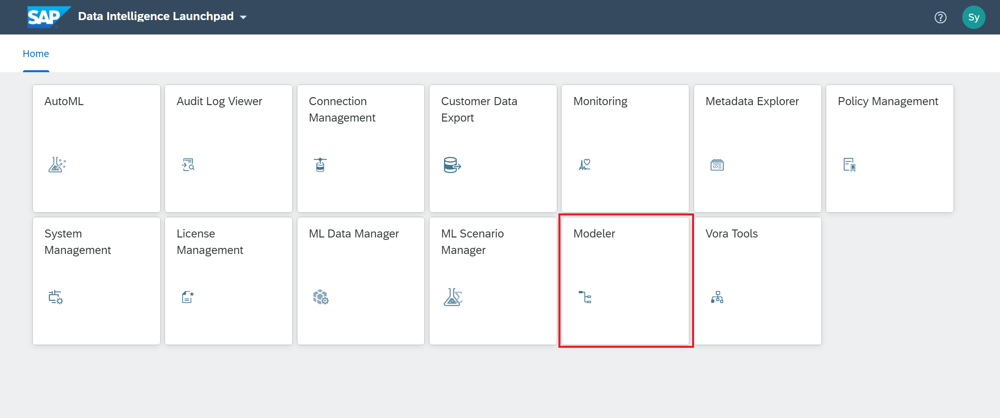

2. Create a new graph.
    - Go to the navigation pane.
    - Select the Graphs tab navigation pane toolbar.
    - Choose + (Create Graph). The tool opens an empty graph editor in the same window, where you can define your graph.
    - Add **`Workflow Trigger`** operator to the graph by drag and drop.
    - Add **Spark Data Transform** operator to the graph by drag and drop.
    - Connect the **output** port of the **Workflow Trigger** to the **input** port of the **Spark Data Transform** operator.

    !

[DONE]

[ACCORDION-END]

[ACCORDION-BEGIN [Step 2: ](Create data sources)]

1. Double click on the **Spark Data Transform** operator and it will open the **Editor**. Here you have to model your Data Workflow by creating data sources and targets along with transformation operators.

2. From the **Nodes** menu on the left, drag and drop a **Data Source** to the editor.

    !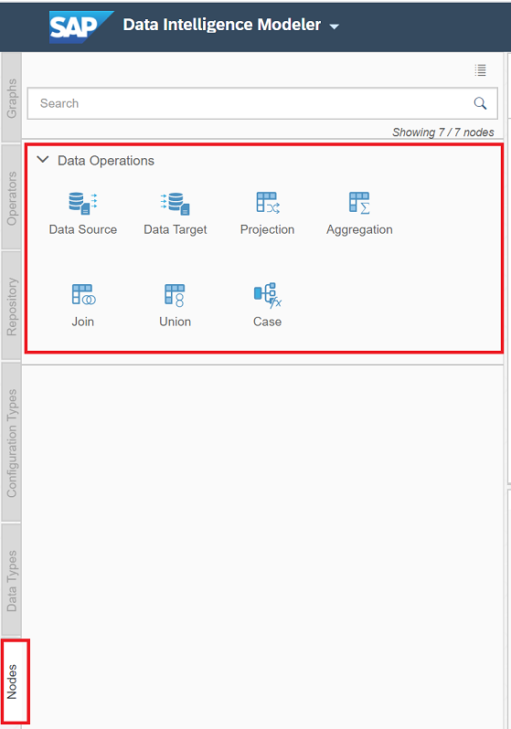

    >**Hint** As this is a **Spark Data Transform** task, only **Nodes** can be added to the task.

    !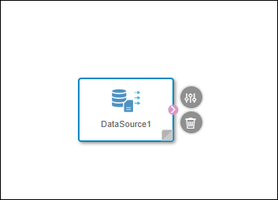  

3. Double click on the **Data Source** to open the **Data Source Editor**.

4. Configure the details for the particular data source.
    - Click the **Browse**.
    - Select **`CLOUD_STORAGE`** connection from the list.
    >**Hint** You will see the connection here only, if you have configured the same under **Connection Management**.

    - As **Source**, browse the AWS S3 or Google Cloud Storage or Windows Azure Storage Blob and choose `Devices.csv` file. As soon as the file is selected, file configuration parameters will be Auto-proposed.

    !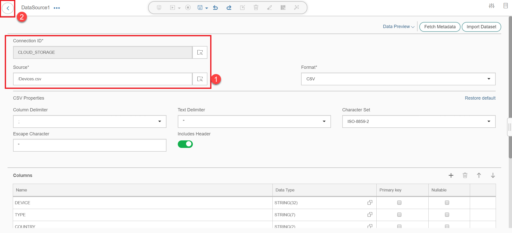  

5. Click the **Back** at the left top corner, navigate back to the **Spark Data Transform** editor page.

6. Add another **Data Source**.
    - Using drag and drop, add another **Data Source** to the task.
    - Double click on it to open the **Data Source** editor.
    - Click the **Browse**.
    - Select **`CLOUD_STORAGE`** connection from the list.
    - As **Source**, choose `Customers.csv` file.

    !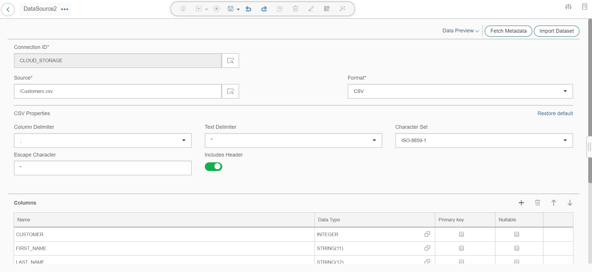

7. Navigate back to the **Spark Data Transform** editor page.

    !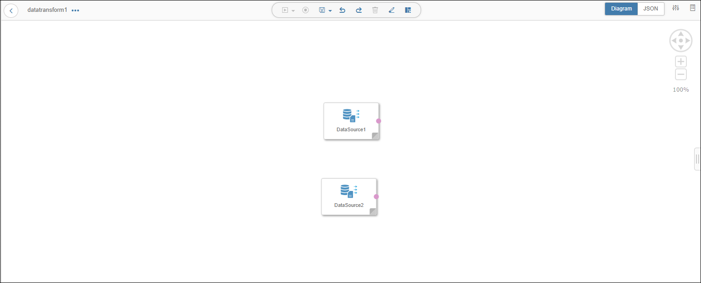

[DONE]

[ACCORDION-END]

[ACCORDION-BEGIN [Step 3: ](Join data sources)]

In this step you are going to join the two data sources you have created and then to configure the join operator.

1. Add **Join** to the task from the **Nodes** tab in the left side menu on the left through drag and drop.

2. Connect the **`DataSource1_Output1`** output port of the **`DataSource1`** to **`Join1_Input1`** input port of the **`Join1`** operator.

3. Similarly, connect the **`DataSource2_Output1`** output port of the **`DataSource2`** to **`Join1_Input2`** input port of the **`Join1`** operator.

    !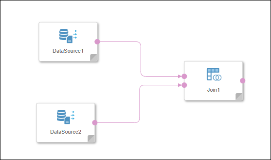

4. Double click on the **Join** operator and open its configuration. Both the **Data Sources** connected as inputs are displayed as Join inputs.

5. Configure join.
    - Click on **`Join1_Input1`** table.
    - Click on the **Join** highlighted in **Step 1** of the below image.
    - Holding the click, drag to the connecting point for the table **`Join1_Input2`** highlighted in **Step 2** of the below image and release the click once the second table turns green indicating successful connection.
    The resulting join will be similar to **Step 3** of the above image.

    !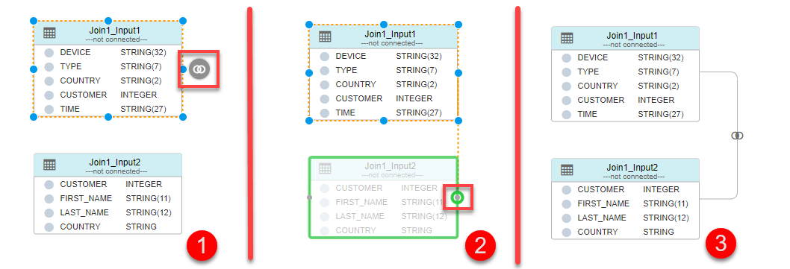

6. As soon as the two tables are connected, a **Join Definition** dialog box will be displayed in the bottom part. Paste the following Join condition in the dialog box.

    ```SQL
    "Join1_Input1"."CUSTOMER" = "Join1_Input2"."CUSTOMER"
    ```

    !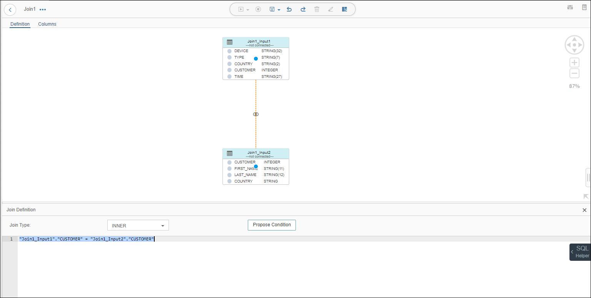

7. Open the **Columns** page. On this page, graphical representation of the selected columns is displayed. You can select the output columns of the join condition.

8. Drag & drop the column from source to target. Make sure that you only select the following columns:

    | Source | Source Column  |
    | ----------------- | -------------- |
    | `Join1_Input1 (Devices)`   | `DEVICE`       |
    |`Join1_Input1 (Devices)`   | `TYPE`         |
    | `Join1_Input1 (Devices)`   | `CUSTOMER`     |
    | `Join1_Input1 (Devices)`   | `TIME`         |
    | `Join1_Input2 (Customers)` | `COUNTRY`      |

    !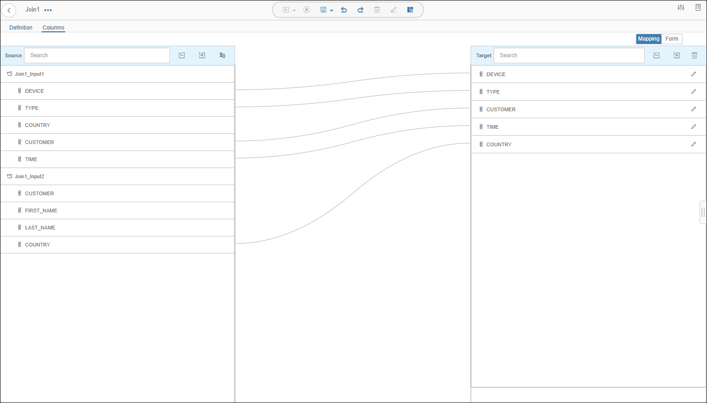

9. Make sure the output should look similar to the above screenshot. Make sure that the name of the **Target** columns is similar to those in the below screenshot. If not, you can edit the target column names on this page.

10. Navigate back to the **Spark Data Transform** editor page.

[DONE]

[ACCORDION-END]

[ACCORDION-BEGIN [Step 4: ](Create data target)]

You now have to provide a destination for the results of the **Join** operation. This is achieved by specifying a target.

1. From the **Nodes** tab in the left side menu, drag and drop a **Data Target** to the task.

2. Connect the **`Join1_Output1`** output port of the **`Join1`** node to the **`DataTarget1_Input1`** input port of the **`DataTarget1`** node.

    !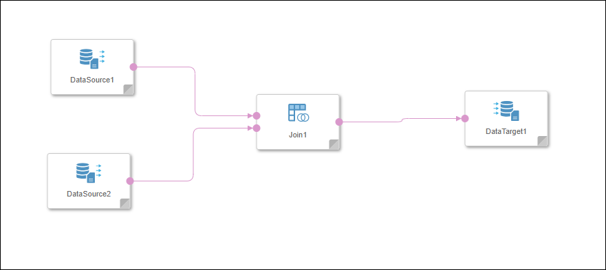

3. Double click on the newly added **Data Target** node and open the configuration page. As you have connected the **Join** and the **Data Target** nodes, Modeler will automatically detect the columns for the **Data Target**.

4. Click on the **Browse** button for connection and select **`CLOUD_STORAGE`**. Later maintain the following configuration for the target :

    | Field &nbsp;&nbsp;&nbsp;&nbsp;&nbsp;&nbsp;&nbsp;&nbsp;&nbsp;&nbsp;&nbsp;&nbsp;&nbsp;&nbsp;&nbsp;&nbsp;&nbsp;&nbsp;&nbsp;&nbsp;&nbsp;&nbsp;&nbsp;&nbsp;&nbsp;&nbsp;&nbsp;&nbsp;&nbsp;&nbsp;&nbsp;&nbsp;&nbsp;&nbsp;&nbsp;&nbsp;&nbsp;&nbsp;&nbsp;                          | Value                                                               |
    | ------------------------------ | ------------------------------------------------------------------- |
    | `Target`                       | Directory under which the new `.csv` file would be created. Type in the path manually if you want to create a new directory e.g. `/CSV/EnrichedDevices` |
    | `File Format`                  | `CSV`                                                               |
    | `Column Delimiter`             | `;`                                                                 |
    | `Character Set`                | `ISO-8859-2`                                                        |
    | `Text Delimiter`               | `"`                                                                 |
    | `Escape Character`               | `"`                                                                 |
    | `Includes Header`              | `Yes`                                                                |

    !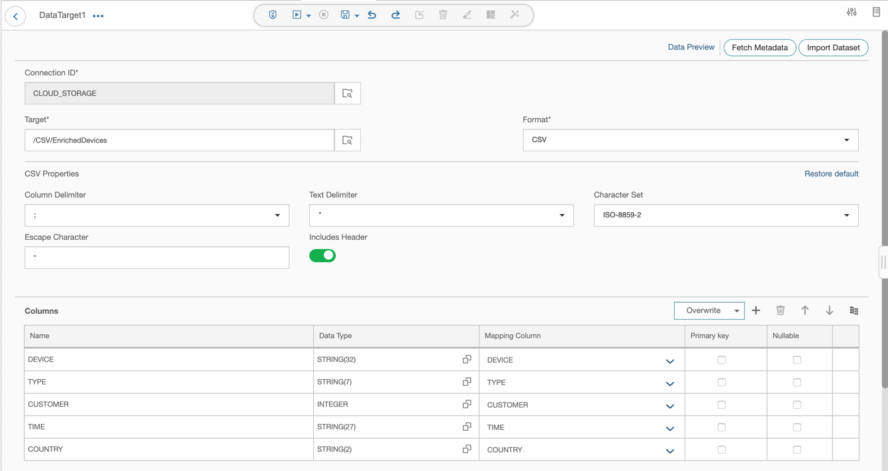

5. Using the back button at the top left, navigate back to the pipeline where you have a **Workflow Trigger** connected to a **Spark Data Transform** .

[DONE]

[ACCORDION-END]

[ACCORDION-BEGIN [Step 5: ](Add a terminator and execute data transform task)]

1. From the **Operators** tab in the left side menu, drag and drop a **Workflow Terminator** to the graph.

2. Connect the `output` out port of the **Spark Data Transform** to the `stop` in port of the **Workflow Terminator**.

3. **Save** the graph as name is `mytest.workflow1` and description is `Workflow 1`.

4. **Execute** the graph using the buttons at the top of the page. The execution status is displayed in the bottom part of the screen and it changes from **Running** to **Completed** once the execution completes. It will take a few minutes to complete.

    !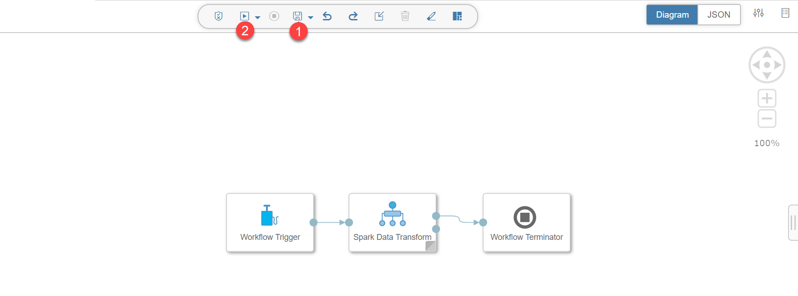

[DONE]

[ACCORDION-END]

[ACCORDION-BEGIN [Step 6: ](Check result)]
Now check the result of the Data Transform task. You can check the results from the Modeler itself.

1. Open the pipeline you have created.

2. Double click the **Spark Data Transform** operator.

3. Double click on the **Data Target** node which opens the configuration page.

4. Navigate to the **DATA PREVIEW** by using the button at the top right corner of the page.

5. You may need to increase the total fetched row count to 300 or more in order to see the entire dataset using the funnel icon in the upper right corner

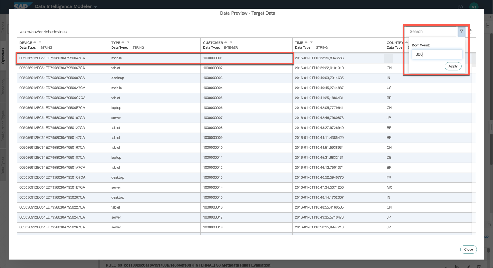

You see that in contrast to the `Devices` data set, the `EnrichedDevices` data set does not include any null values. The original file has been enriched. Using the above screenshot and your generated `EnrichedDevices` data set, answer the below question.

[VALIDATE_1]

[ACCORDION-END]
