## Details
### You will learn  
- Build more complicated Data Transform
- Aggregate file on certain condition
- Minimum/Maximum data on certain condition
- Store the result of the aggregation in a cloud file

Please note here in this tutorial GCP refers to Google Cloud platform and AWS refers to Amazon Web Services and Azure refers to Microsoft Azure.

---

[ACCORDION-BEGIN [Step 1: ](Add data transform and trigger)]

You are logged as a `system` user to a `default` tenant and are at the **Application Launchpad** page.

1. Go to **Modeler**.

    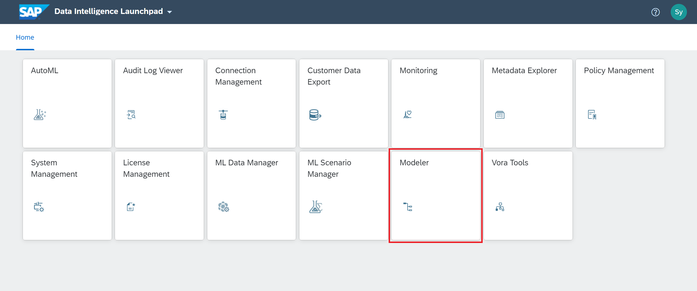

2. Create a new graph.

3. Add **Workflow Trigger** operator and **Spark Data Transform** operator to the graph by drag and drop.

4. Now connect the `output` port of the **`Workflow Trigger`** to the `input` port of the **Spark Data Transform** operator.

    !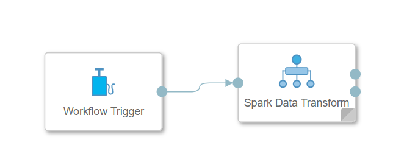

5. Double click on the **Spark Data Transform** operator and it will open the **Editor**. Here you have to model your workflow task by creating data sources and targets along with transformation operators.

[DONE]

[ACCORDION-END]

[ACCORDION-BEGIN [Step 2: ](Create data sources)]
1. From the **Nodes** menu on the left, drag and drop a **Data Source** to the editor. As this is a **Spark Data Transform** task, only **Nodes** can be added to the task.

    !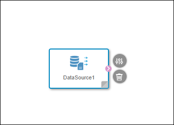

2. Double click on the **Data Source** and open the **Data Source Editor**. Here you have to configure the details for the particular data source.

3. Using the **Browse** button, select **`CLOUD_STORAGE`** connection from the list.

    >**Hint** You will see the connection here only, if you have configured the same under **Connection Management**.

4. As **Source** choose the `Events.parquet` file. As soon as the file is selected, file configuration parameters will be auto-proposed.

    !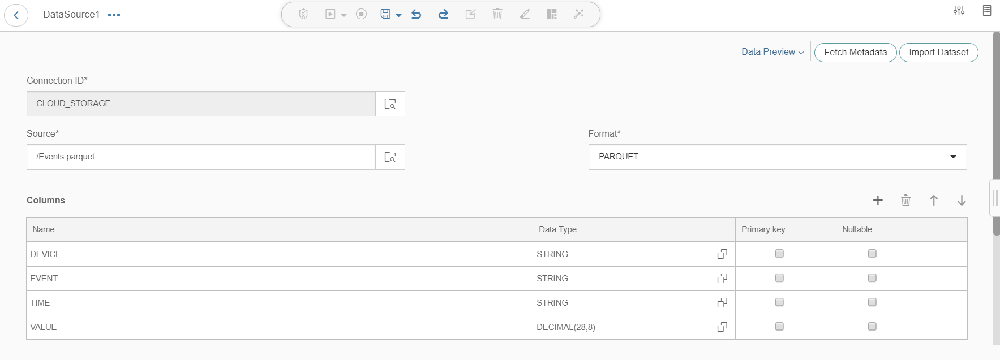

5. Using the **Back** button at the left top corner, navigate back to the **Spark Data Transform** editor page.

6. Using drag and drop, add another **Data Source** to the task.

7. Double click on it to open the **Data Source** editor.

8. Using the **Browse** button, select **`CLOUD_STORAGE`** connection from the list.

9. Using the **Browse** button for **Source**, select the folder **`/CSV/EnrichedDevices`** from your bucket, select the `csv` file (file name will be different as the screenshot).

    You have created this in the previous tutorial **Create Workflow (part 1), Enrich data with Data Transform**.

    !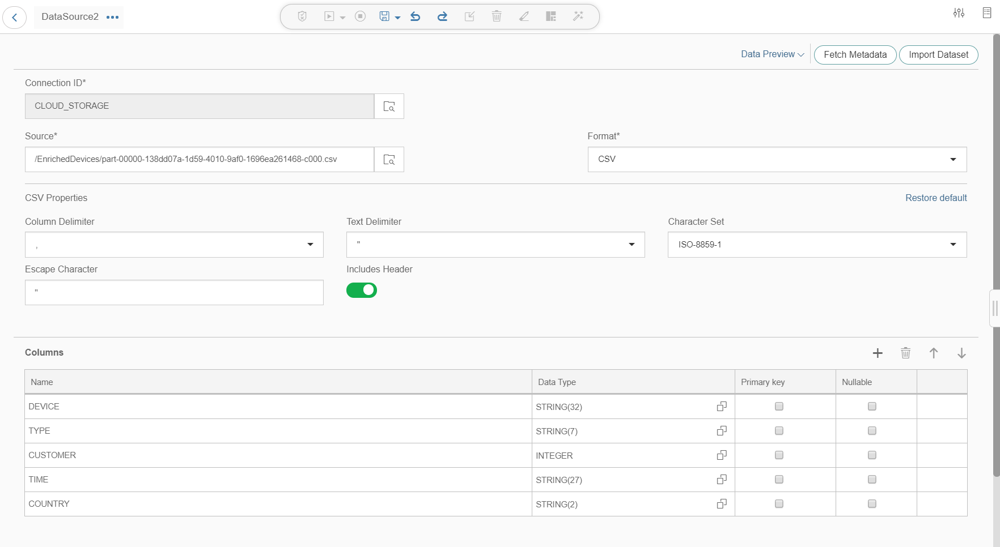

10. Change **Source** to **`/CSV/EnrichedDevices/part*.csv`** and keep others unchanged.

    !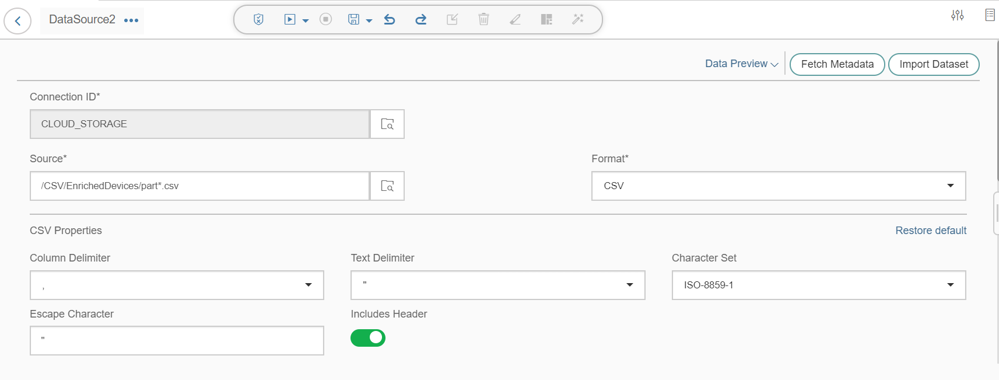

    >Since every time the workflow 1 will generate a new file, you can use wildcard to match file name.

11. Navigate back to the **Spark Data Transform** editor page.

    !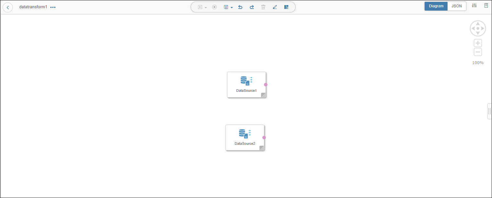

[DONE]

[ACCORDION-END]

[ACCORDION-BEGIN [Step 3: ](Join and aggregate data sources)]

In this step you are going to join and aggregate the two data sources you have created and then configure the operators.

1. Add **Join** to the task from the **Nodes** tab in the left side menu through drag and drop.

2. Connect the **`DataSource1_Output1`** out port of the `DataSource1` to **`Join1_Input1`** in port of the **`Join1`** operator.

3. Similarly, connect the **`DataSource2_Output1`** out port of the **`DataSource2`** to **`Join1_Input2`** in port of the **`Join1`** operator.

    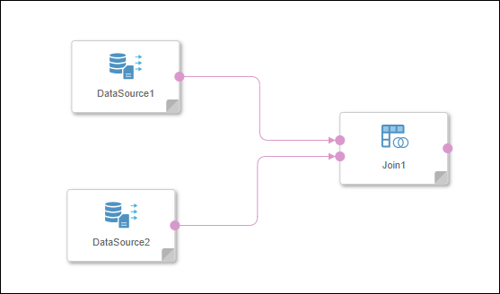

4. Double click on the **Join** operator and open its configuration. Both the **Data Sources** connected as inputs are displayed as Join inputs.

5. Click on **`Join1_Input1`** table.

6. Click on the **Join** button highlighted in **Step 1** of the below image. While holding the click, drag to the connecting point for the table **`Join1_Input2`** highlighted in **Step 2** of the above image and release the click once the second table turns green indicating successful connection.

    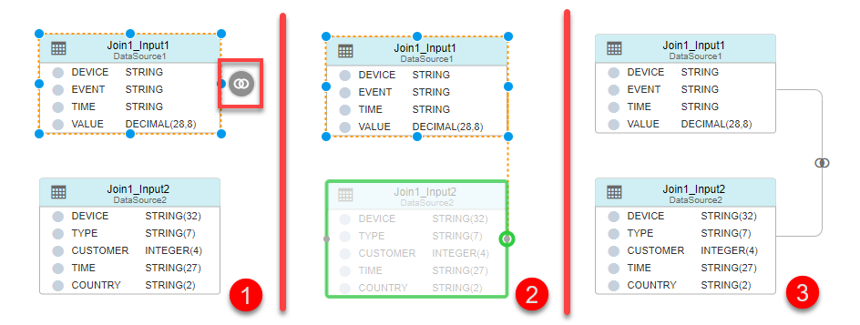

7. Now The resulting join will be similar to **Step 3** of the above image. As soon as the two tables are connected, a **Join Definition** dialog box will be displayed in the bottom part. Paste the following Join condition in the dialog box.

    ```SQL
    "Join1_Input1"."DEVICE" = "Join1_Input2"."DEVICE"
    ```

    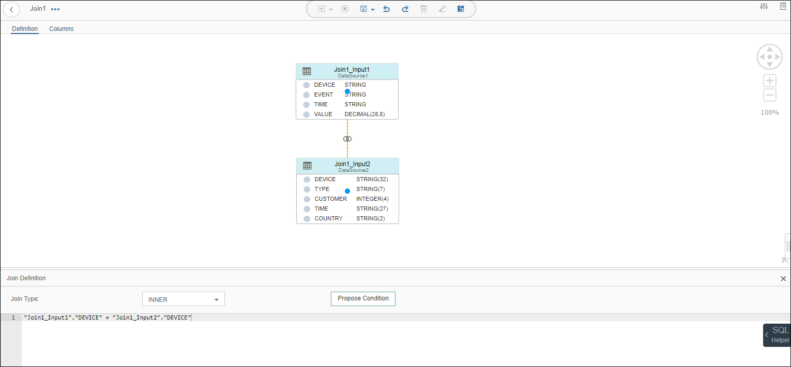

8. Now you select the output columns of the join condition. This can be done easily using the column selector shortcut on the same page. Make sure that you only select the following columns :

    | Source      | Source Column  |
    | ----------- | -------------- |
    | `Join1_Input1 (Events)`   | `EVENT`       |
    | `Join1_Input1 (Events)`   | `VALUE`         |
    | `Join1_Input2 (EnrichedDevices)` | `COUNTRY`      |

    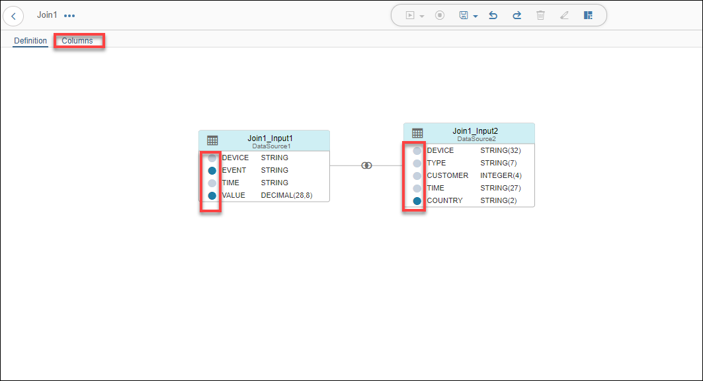

9. Click on the **Column Selector** besides every column name to select or deselect it. Columns in **Grey** are excluded from the output whereas the ones in **Blue** are included.

10. Once you have selected the desired columns, using the button at the top of the page (highlighted in the above screenshot), open the **Columns** page.

11.  Update and add fields.
    - Using the **Edit** button highlighted in the below screenshot.
    - Rename the **VALUE** column to **MIN** and click **OK**.
    - Also add another column **MAX** which is also to be derived from the source column **VALUE**. Drag and drop the **VALUE** column from **Source** to **Target**. It will create a new column named **VALUE** in the **Target** column list.
    - Rename this newly created field to **MAX**.

    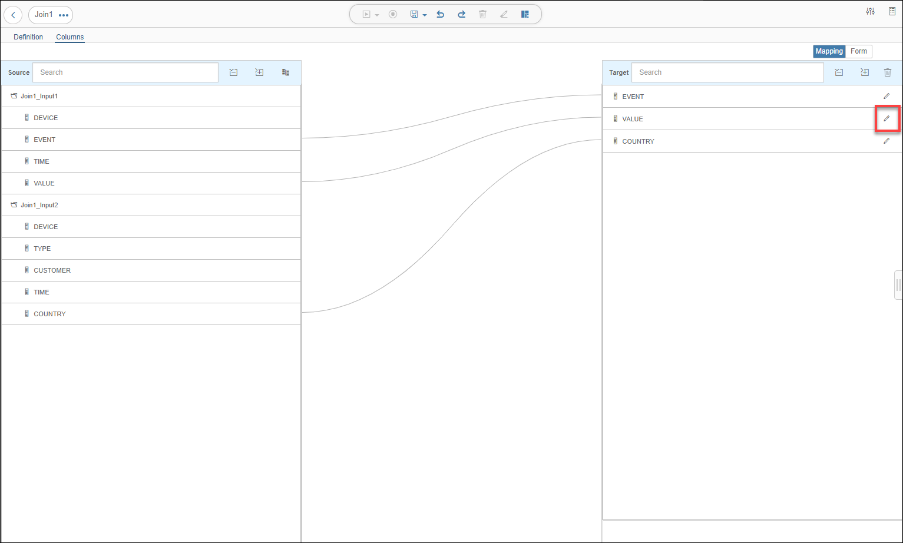

    >While editing the column name, after entering the new name if the **OK** button is greyed out, use the `Tab` button on your keyboard to shift the focus away from the text box. This will enable the **OK** button.

    The output should look similar to the following screenshot :

    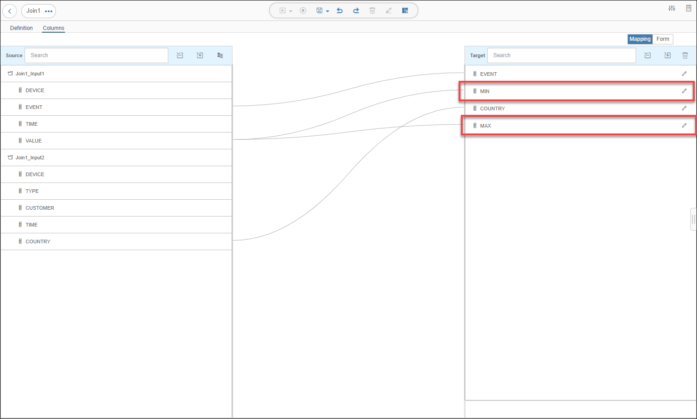

    Make sure that the name of the **Target** columns is similar to those in the above screenshot. If not, you can edit the target column names on this page.

12. Add aggregation.
    - Navigate back to the **Spark Data Transform** editor page.
    - From the **Nodes** tab on the left side menu, drag and drop an **Aggregation** node to the task.
    - Connect the **`Join1_Output1`** out port of the **`Join1`** node to the **`Aggregation1_Input1`** in port of the **`Aggregation1`** node.

    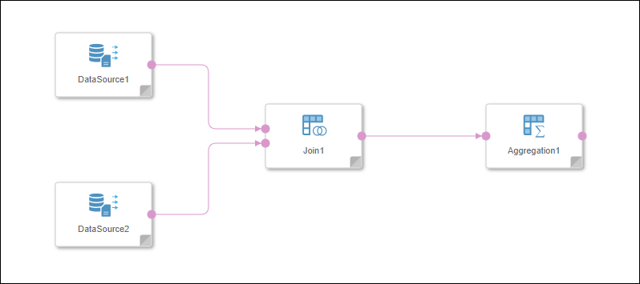

13. Configure aggregation.
    - Double click on the **Aggregation** node and open its configuration.
    - On the **Columns** page, drag and drop all the columns in the following order - **COUNTRY, EVENT, MIN, MAX** from the source columns list to the target columns list.

    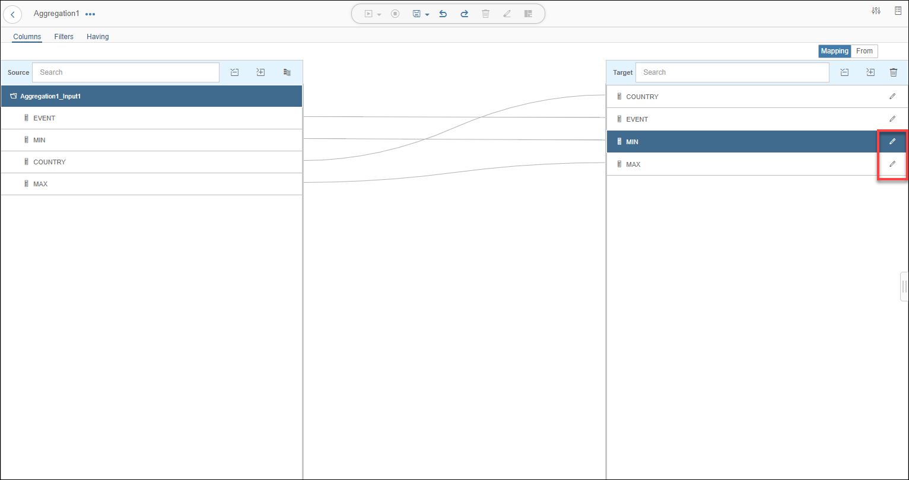

14. Click on the **Edit** highlighted in the above screenshot for the columns **MIN, MAX** and set the **Aggregation Type** for the columns to **Min and Max** respectively as per their names.

    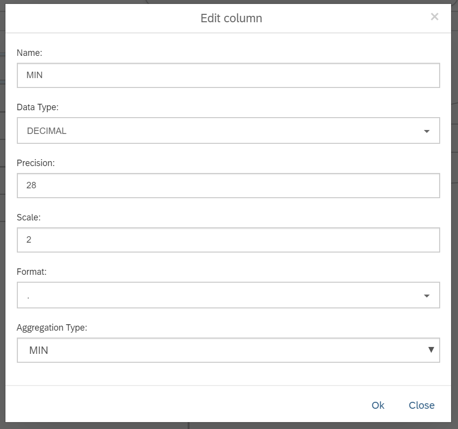

15. Navigate back to the **Spark Data Transform** editor page.

[DONE]

[ACCORDION-END]

[ACCORDION-BEGIN [Step 4: ](Create data target)]

You now have to provide a destination for the results of the **Aggregation** operation. This is achieved by specifying a target.

1. Add data target.
    - From the **Nodes** tab in the left side menu, drag and drop a **Data Target** to the task.
    - Connect the `Aggregation1_Output1` out port of the `Aggregation1` node to the `DataTarget1_Input1` in port of the `DataTarget1` node.

    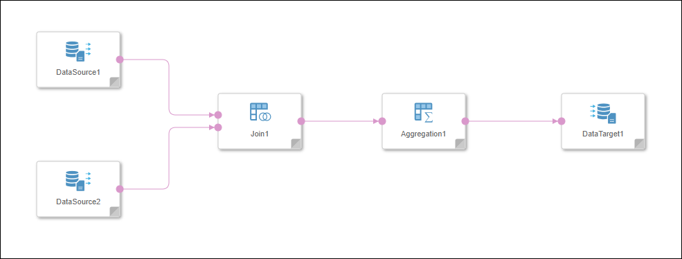

2. Configure data target.
    - Click on the **Browse** button for connection and select **`CLOUD_STORAGE`**.
    - Maintain the following configuration for the target :

    | Field &nbsp;&nbsp;&nbsp;&nbsp;&nbsp;&nbsp;&nbsp;&nbsp;&nbsp;&nbsp;&nbsp;&nbsp;&nbsp;&nbsp;&nbsp;&nbsp;&nbsp;&nbsp;&nbsp;&nbsp;&nbsp;&nbsp;&nbsp;&nbsp;&nbsp;&nbsp;&nbsp;&nbsp;&nbsp;&nbsp;&nbsp;&nbsp;&nbsp;&nbsp;&nbsp;&nbsp;&nbsp;&nbsp;&nbsp;                          | Value                                                               |
    | ------------------------------ | ------------------------------------------------------------------- |
    | `Target`                       | `/CSV/Aggregation`  |
    | `File Format`                  | `CSV`                                                               |
    | `Column Delimiter`             | `;`                                                                 |
    | `Character Set`                | `ISO-8859-2`                                                        |
    | `Text Delimiter`               | `"`                                                                 |
    | `Escape Character`               | `"`                                                                 |
    | `Includes Header`              | `Yes`                                                                |

    !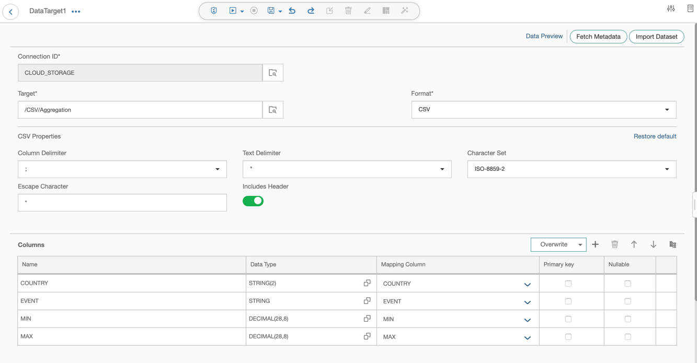

3. Navigate back twice and open the pipeline where you have a **Workflow Trigger** connected to a **Spark Data Transform**.

[DONE]

[ACCORDION-END]

[ACCORDION-BEGIN [Step 5: ](Add a terminator and execute data transform task)]

1. From the **Operators** tab in the left side menu, drag and drop a **Workflow Terminator** to the pipeline.

2. Connect the `output` out port of the **Spark Data Transform** to the `stop` in port of the **Workflow Terminator**.

3. Once done, **Save** the graph as name `mytest.workflow2` and description `Workflow 2`.

4.  **Execute** the graph using the buttons at the top of the page.

    The execution status is displayed in the bottom part of the screen and it changes from **Running** to **Completed** once the execution completes.

    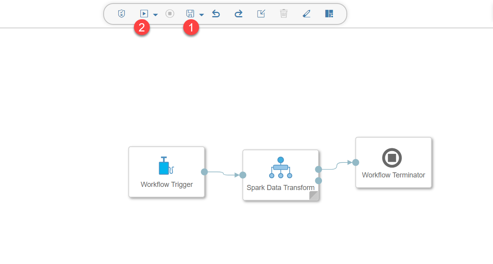

[DONE]

[ACCORDION-END]

[ACCORDION-BEGIN [Step 6: ](Check result)]
Now check the result of the Data Transform task.

1. Double click the **Spark Data Transform** operator.

2. Double click on the **Data Target** node which opens the configuration page.

3. Navigate to the **DATA PREVIEW** using the button at the top right corner of the page.

    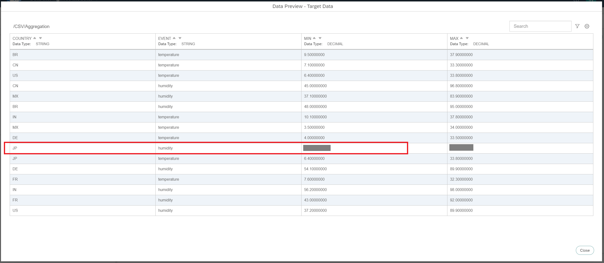

You will notice that the table has records per country for events humidity and temperature with minimum as well as maximum values for both the events.

[VALIDATE_1]

[ACCORDION-END]


---
