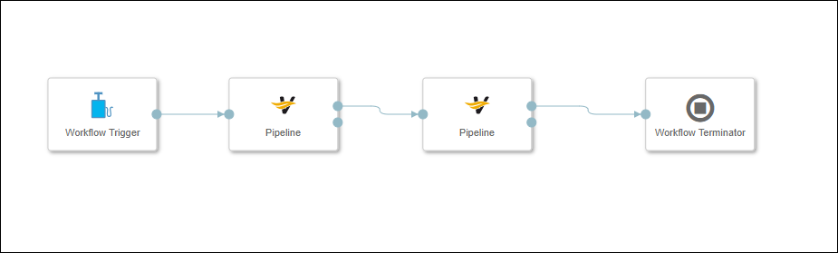
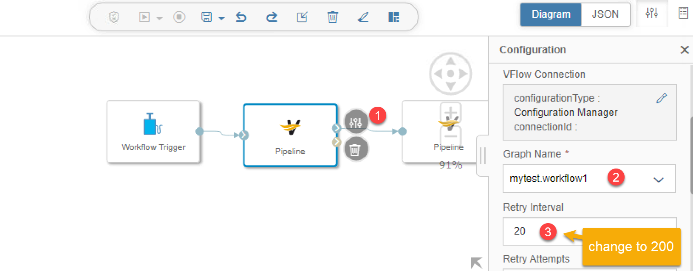
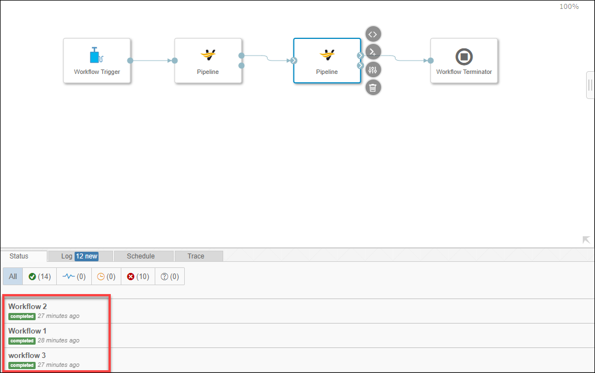
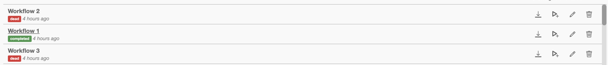

## Details
### You will learn  
  - How to build a task workflow to combine graph using the **Pipeline** operator

Please note here in this tutorial GCP refers to Google Cloud platform and AWS refers to Amazon Web Services and Azure refers to Microsoft Azure.

---

[ACCORDION-BEGIN [Step 1: ](Create workflow)]

1. Log on as the `system` user in the `default` tenant

2. In the **Application Launchpad** page open **Modeler**.

3. Create a new graph.

4. Add **`Workflow Trigger`** operator, 2 X **Pipeline** operators and a **Workflow Terminator** to the graph by drag and drop.

5. Connect operators.
    - Connect the `output` out port of the **Workflow Trigger** to the `input` in port of the first **Pipeline** operator.
    - Connect the `output` out port of the first **Pipeline** operator to the `input` in port of the second **Pipeline** operator.
    - Connect the `output` out port of the second **Pipeline** operator to the `stop` in port of the **Workflow Terminator** operator.

    !

6. Configure operator.  
    - Right click on the first **Pipeline** operator and go to **Open Configuration**.
    - Under the parameter **Graph name** select the graph that you have created in the tutorial **Create Workflow (part 1), Enrich data with Data Transform**. In this case, you have named it as  `mytest.workflow1`.
u
    !

7. Similarly, for the second **Pipeline** operator, select the graph that you have created in the tutorial **Create Workflow (part 2), Aggregate data with Data Transform** under the parameter **Graph Name**. In this case, you have named it as `mytest.workflow2`. Also increase the parameter Retry interval from 20 to 200 for both the **Pipelines**.

[DONE]

[ACCORDION-END]

[ACCORDION-BEGIN [Step 2: ](Execute workflow)]

1. Once done, save the graph. In this case, you have named it as as name `mytest.workflow3` and description `Workflow 3`.

2. Now execute the graph using the button at the top of the page.

3. The execution status is displayed in the bottom part of the screen and it changes from **Running** to **Completed** once the execution completes.

    !

You have now executed the **Workflow 3** but you will notice in the above screenshot that, **Workflow 3** calls the linked pipeline, **Workflow 1**. Once the execution of **Workflow 1** completes, it starts the execution of **Workflow 2**.

**Remark**: When you look at the `EnrichDevices` or `STATISTICS_DATA` data set, you will not see any changes compared to the previous two tutorials.

**What to do if Workflow 2 and 3 are in status Dead**

  - `Workflow 1` generates a randomly generated filename for each execution. For that reason any subsequent attempt to run the graphs in this tutorial will fail because `Workflow 2` has not been updated to use the new filename. To fix this issue refer to Part 2 of this tutorial -> Step 2 -> Point 10.
  

[VALIDATE_1]

[ACCORDION-END]
