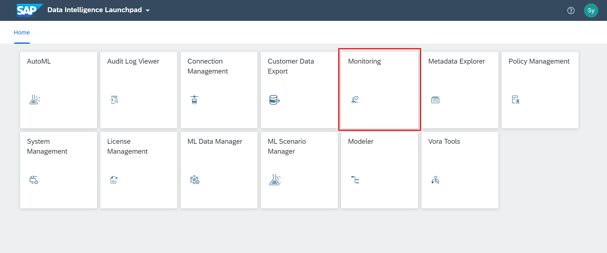
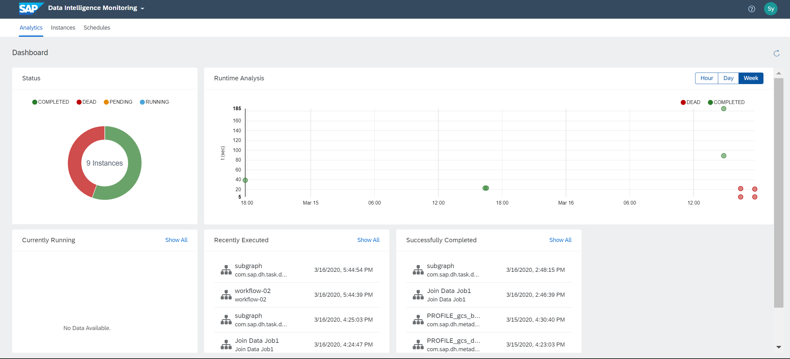
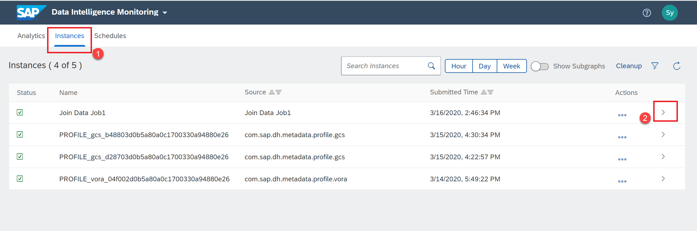
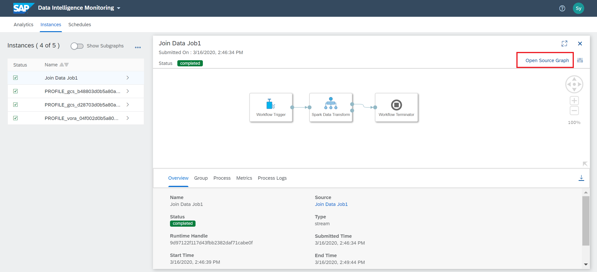

## Details
### You will learn  
  - How to monitor the execution of tasks
  - How to monitor the instances

Please note here in this tutorial GCP refers to Google Cloud platform and AWS refers to Amazon Web Services and Azure refers to Microsoft Azure.

---

[ACCORDION-BEGIN [Step 1: ](Monitoring tasks)]

Log on as the `system` user in the `default` tenant

From the **Application Launchpad** page navigate to **Monitoring** by clicking on the highlighted tile in the above screenshot.

The **Monitoring Dashboard** is displayed. From here you can see the status of executed tasks, graphs. This page gives you a consolidated view of the executions in the system.

!

[DONE]

[ACCORDION-END]

[ACCORDION-BEGIN [Step 2: ](Monitoring instances)]

Using the link at the top, navigate to the **Instances** page.

!

Using the highlighted **Show Execution Details**, you can fetch more information regarding a particular instance.

!

You can directly jump to the modeler and open the source graph for this instance. Graphs and processes can also be filtered using date and time range.

[VALIDATE_1]

[ACCORDION-END]
---
