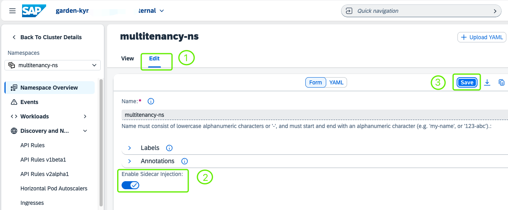

# Deploy a Multitenant Application to a Provider subaccount, Kyma Runtime
<!-- description --> Build a Node.js application into OCI image and push it into Docker registry. Based on that, deploy the application into SAP BTP, Kyma runtime.

## Prerequisites
- You have a Kyma runtime environment on SAP Business Technology Platform (BTP) and the relevant command line tools. If not, please follow the tutorials [Enable SAP BTP, Kyma runtime](cp-kyma-getting-started) and [Install the Kubernetes Command Line Tool](cp-kyma-download-cli).
- You have installed [Docker](https://docs.docker.com/get-started/#download-and-install-docker).
- You have [Docker Hub](https://hub.docker.com/) account.
- You have finished the tutorial [Register a Multitenant Application to the SAP SaaS Provisioning Service](register-multitenant-app-saas-provisioning-service).


## You will learn
- How to build Application to OCI Image
- How to push OCI image to Docker Hub
- How to deploy applications into Kyma runtime


---

### Determine SAP BTP Subaccount Subdomain

Open your subaccount in SAP BTP cockpit. Make sure you've already enabled SAP BTP, Kyma runtime on your cluster.


### Build Application to OCI Image


1. Install tool
<p> </p>
    In order to run your code on Kyma runtime (or on any Kubernetes-based platform), you need to provide an OCI image (aka Docker image) for your application. While you are in principle free to choose your image building tool, we recommend using [Cloud Native Buildpacks (CNB)](https://buildpacks.io/).  
<p> </p>
    The command-line tool `pack` supports providing a buildpack and your local source code and creating an OCI image from it. We are working on a process to provide recommended and supported buildpacks. In the meantime, you can use the community-supported [Paketo Buildpacks](https://paketo.io/).
<p> </p>
    If you followed the tutorials [Create a Basic Node.js Application with Express Generator](basic-nodejs-application-create) and [Deploy a Node.js Application in SAP BTP, Kyma runtime](deploy-nodejs-application-kyma), you have installed the command-line tool `pack`. If not, please follow this official guide: [Install Pack](https://buildpacks.io/docs/tools/pack/).

    For example (macOS):  
```Shell / Bash
brew install buildpacks/tap/pack
```

2. Build image for applications
<p> </p>
    When we speak about repository name, we mean the combination of account and repo name that is usual with Docker Hub: `<docker-hub-account>/<repo-name>`. An example would be `tiaxu/multitenant-kyma-backend`.
<p> </p>
    As you can only create one private repository in a free Docker hub account, Docker images stored in Docker hub will have different tag names so that they can be stored in one repository. Thus, addressing an image will include the tag name:`<docker-hub-account>/<repo-name>:<tag-name>`. An example would be `tiaxu/multitenant-kyma-backend:v2`.
<p> </p>
    In the directory `kyma-multitenant-approuter`, build the image for the approuter app from source, for example:  

    ```Shell / Bash
    pack build <docker-hub-account>/multitenant-approuter:v1 --builder paketobuildpacks/builder-jammy-full
    ```
<p> </p>
    In the directory `kyma-multitenant-node`, build the image for the multitenant backend app from source, for example:

    ```Shell / Bash
    pack build <docker-hub-account>/multitenant-kyma-backend:v2 --builder paketobuildpacks/builder-jammy-full
    ```


### Push OCI Image to Docker Hub


**1.** Log in to Docker using this command:

```Shell / Bash
docker login -u <docker-id> -p <password>
```

**2.** Push the local images into the Docker Hub:

```Shell / Bash
docker push <docker-hub-account>/multitenant-approuter:v1
docker push <docker-hub-account>/multitenant-kyma-backend:v2
```

>  For more details, see the [Kubernetes documentation](https://kubernetes.io/docs/tasks/configure-pod-container/pull-image-private-registry/).


### Create Namespace


Then you are ready to deploy it into the Kubernetes cluster with Kyma runtime.

**1.** Select the `Link to dashboard` to open the Kyma dashboard.

<!-- border -->

**2.** Create a new namespace through the Kyma dashboard or `kubectl` CLI, for example, called `multitenancy-ns`:

<!-- border -->


**3.** Enable Istio Sidecar Proxy Injection  
Enabling Istio sidecar proxy injection for a namespace allows istiod to watch all Pod creation operations in this namespace and automatically inject newly created Pods with an Istio sidecar proxy. Access the Kyma dashboard, switch the toggle to enable Istio sidecar proxy injection.

 3.1 Select the namespace where you want to enable sidecar proxy injection.  
 
 3.2 Click Edit.  

 3.3 In the UI Form section, switch the toggle to enable Istio sidecar proxy injection.  

 3.4 Click Save.

 <!-- border -->

> For more details, refer to the [Enable Istio Sidecar Proxy Injection](https://kyma-project.io/#/istio/user/tutorials/01-40-enable-sidecar-injection?id=enable-sidecar-injection-for-a-namespace)


### Deploy Secret for Docker Hub


Since the OCI image is stored in your Docker hub, you need to provide the access information to your Kyma cluster that you can pull the images from those repositories.

If you followed the tutorials [Create a Basic Node.js Application with Express Generator](basic-nodejs-application-create) and [Deploy a Node.js Application in SAP BTP, Kyma runtime](deploy-nodejs-application-kyma), you have configured the credential of your Docker Hub as a Secret. If not, create a new Secret with the following command, replace the placeholder values according to your account:

```Shell / Bash
kubectl -n multitenancy-ns create secret docker-registry registry-secret --docker-server=https://index.docker.io/v1/  --docker-username=<docker-id> --docker-password=<password> --docker-email=<email>
```


Therefore, all deployment files contain an `imagePullSecret` entry, which should be set to `registry-secret`.

```YAML
imagePullSecrets:
        - name: registry-secret # replace with your own registry secret
```


### Deploy Application into SAP BTP, Kyma runtime


**1.** Deploy consumed services by executing this command:

```Shell / Bash
kubectl -n multitenancy-ns apply -f k8s-deployment-services.yaml
```

**2.** Deploy the approuter applications by executing this command:

```Shell / Bash
kubectl -n multitenancy-ns apply -f k8s-deployment-approuter.yaml
```

**3.** Deploy the backend applications by executing this command:

```Shell / Bash
kubectl -n multitenancy-ns apply -f k8s-deployment-backend.yaml
```


---
