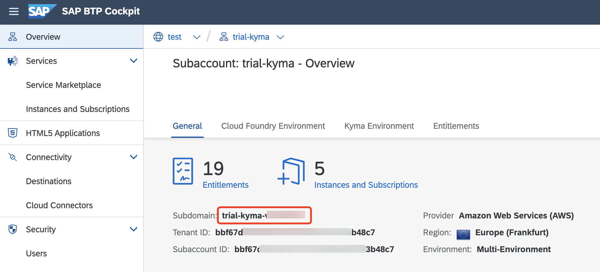
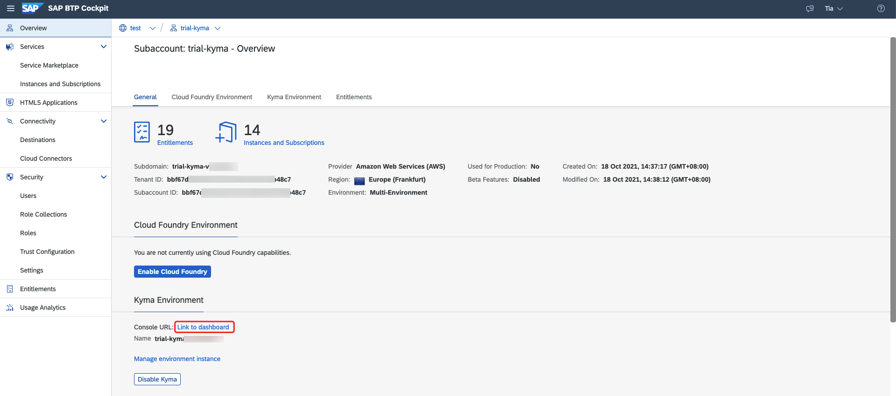
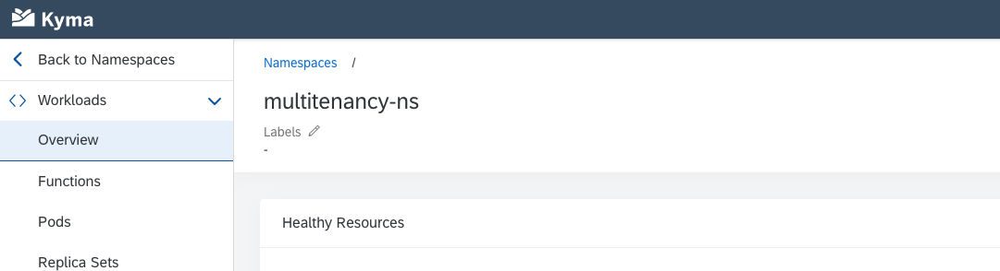
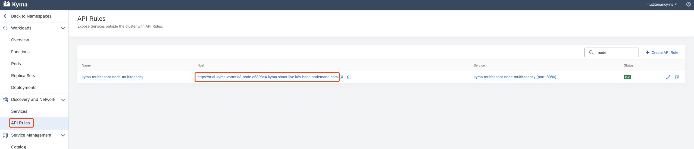

# Deploy a Node.js Application in the Kyma Runtime
<!-- description --> Build a basic Node.js application into OCI image and push it into Docker registry. Besides, describe the corresponding Kubernetes objects for the application. Based on the above, deploy the application into the Kyma runtime.

## Prerequisites
- You have a Kyma runtime environment on SAP Business Technology Platform (BTP) and the relevant command line tools. If not, please follow the tutorials [Enable SAP BTP, Kyma Runtime](cp-kyma-getting-started) and [Install the Kubernetes Command Line Tool](cp-kyma-download-cli).
- You have installed [Docker](https://docs.docker.com/get-started/#download-and-install-docker).
- You have [Docker Hub](https://hub.docker.com/) account.
- You have finished the tutorial [Create a Basic Node.js Application with Express Generator](basic-nodejs-application-create).

## You will learn
- How to build Application to OCI Image
- How to push OCI image to Docker Hub
- How to describe Kubernetes objects for web application
- How to deploy application into Kyma runtime

---

### Determine SAP BTP Subaccount Subdomain

Open your subaccount in the Cockpit. In the overview page, find the subdomain for your deployment.

For example:




### Determine Kyma Cluster Domain

Find the full Kyma cluster domain in the downloaded `kubeconfig.yml` file. For example: `e6803e4.kyma.shoot.live.k8s-hana.ondemand.com`.


### Build Application to OCI Image


In order to run your code on the Kyma Runtime (or on any Kubernetes-based platform), you need to provide an OCI image (aka Docker image) for your application. While you are in principle free to choose your image building tool, we recommend using [Cloud Native Buildpacks (CNB)](https://buildpacks.io/).

The command-line tool `pack` supports providing a buildpack and your local source code and creating an OCI image from it. We are working on a process to provide recommended and supported buildpacks. In the meantime, you can use the community-supported [Paketo Buildpacks](https://paketo.io/).

**1.** Install command-line tool `pack`: [Install Pack](https://buildpacks.io/docs/tools/pack/)

For example (macOS):

```Shell / Bash
brew install buildpacks/tap/pack
```

When we speak about repository name, we mean the combination of account and repo name that is usual with Docker Hub: `<docker-hub-account>/<repo-name>`. An example would be `tiaxu/multitenant-kyma-backend`.

As you can only create one private repository in a free Docker hub account, Docker images stored in Docker hub will have different tag names so that they can be stored under one repository. Thus, addressing an image will include the tag name:`<docker-hub-account>/<repo-name>:<tag-name>`. An example would be `tiaxu/multitenant-kyma-backend:v1`.

**2.** In the directory `kyma-multitenant-node`, build the image for the approuter app from source, for example:

```Shell / Bash
pack build <docker-hub-account>/multitenant-kyma-backend:v1 --builder paketobuildpacks/builder-jammy-base
```


### Push OCI Image to Docker Hub


**1.** Log in to Docker using this command:

```Shell / Bash
docker login -u <docker-id> -p <password>
```

**2.** Push the local image into the Docker Hub:

```Shell / Bash
docker push <docker-hub-account>/multitenant-kyma-backend:v1
```

>  For more details, see the [Kubernetes documentation](https://kubernetes.io/docs/tasks/configure-pod-container/pull-image-private-registry/).


### Create Namespace


Then you are ready to deploy it into the Kubernetes cluster with Kyma runtime.

**1.** Select the `Link to dashboard` to open the Kyma dashboard.



**2.** Create a new namespace through the Kyma dashboard or `kubectl` CLI, for example, called `multitenancy-ns`:




### Deploy Secret for Docker Hub


Since the OCI image is stored in your Docker hub, you need to provide the access information to your Kyma cluster that you can pull the images from those repositories, replace the placeholder values according to your account:

```Shell / Bash
kubectl -n multitenancy-ns create secret docker-registry registry-secret --docker-server=https://index.docker.io/v1/  --docker-username=<docker-id> --docker-password=<password> --docker-email=<email>
```


Therefore, all deployment files contain an `imagePullSecret` entry, which should be set to `registry-secret`.

```yaml
imagePullSecrets:
        - name: registry-secret # replace with your own registry secret
```


### Prepare Deployment Description File


Based on the previous preparation steps, you can define the description file for deployment.

In the root directory `multitenancy-kyma-tutorial`, create a new YAML file called `k8s-deployment-backend.yaml` with the following content:

```yaml

---
apiVersion: gateway.kyma-project.io/v1beta1
kind: APIRule
metadata:
  labels:
    app: kyma-multitenant-node-multitenancy
    release: multitenancy
  name: kyma-multitenant-node-multitenancy
spec:
  gateway: kyma-gateway.kyma-system.svc.cluster.local
  host: kyma-multitenant-node-multitenancy
  rules:
  - accessStrategies:
    - handler: allow
    methods:
    - GET
    - POST
    - PUT
    - PATCH
    - DELETE
    - HEAD
    path: /.*
  service:
    name: kyma-multitenant-node-multitenancy
    port: 8080

---
apiVersion: apps/v1
kind: Deployment
metadata:
  labels:
    app: kyma-multitenant-node-multitenancy
    release: multitenancy
  name: kyma-multitenant-node-multitenancy
spec:
  replicas: 1
  selector:
    matchLabels:
      app: kyma-multitenant-node-multitenancy
      release: multitenancy
  template:
    metadata:
      labels:
        app: kyma-multitenant-node-multitenancy
        release: multitenancy
    spec:
      imagePullSecrets:
        - name: registry-secret # replace with your own registry secret
      containers:
      - env:
        - name: PORT
          value: "8080"
        - name: TMPDIR
          value: /tmp
        image: <docker-hub-account>/multitenant-kyma-backend:v1  # replace with your Docker Hub account name
        name: kyma-multitenant-node-multitenancy
        ports:
        - name: http
          containerPort: 8080
          protocol: TCP
        livenessProbe:
          httpGet:
            path: /
            port: http
        readinessProbe:
          httpGet:
            path: /
            port: http
        startupProbe:
          httpGet:
            path: /
            port: http
          failureThreshold: 15
          periodSeconds: 2
        resources:
          limits:
            cpu: 100m
            memory: 256M
          requests:
            cpu: 100m
            memory: 256M
        securityContext:
          allowPrivilegeEscalation: false
          capabilities:
            drop:
            - ALL
          privileged: false
          runAsNonRoot: true
          readOnlyRootFilesystem: false
        volumeMounts:
        - mountPath: /tmp
          name: tmp
      volumes:
      - emptyDir: {}
        name: tmp

---
apiVersion: v1
kind: Service
metadata:
  creationTimestamp: null
  labels:
    app: kyma-multitenant-node-multitenancy
    release: multitenancy
  name: kyma-multitenant-node-multitenancy
spec:
  ports:
  - port: 8080
    protocol: TCP
    targetPort: 8080
  selector:
    app: kyma-multitenant-node-multitenancy
    release: multitenancy
status:
  loadBalancer: {}

---
apiVersion: networking.k8s.io/v1
kind: NetworkPolicy
metadata:
  creationTimestamp: null
  labels:
    release: multitenancy
  name: multitenancy
spec:
  ingress:
  - from:
    - namespaceSelector:
        matchLabels:
          name: istio-system
      podSelector:
        matchLabels:
          app: istio-ingressgateway
  podSelector:
    matchLabels:
      release: multitenancy
  policyTypes:
  - Ingress
```

> Replace the placeholders with the values that you got in the previous steps.


### Deploy Application into Kyma Runtime


Deploy the Node.js application by executing this command under the root directory `multitenancy-kyma-tutorial`:

```Shell / Bash
kubectl -n multitenancy-ns apply -f k8s-deployment-backend.yaml
```


### Access Application in Browser


**1.** Find the URL address of your application in the Kyma dashboard:



**2.** Access it in the browser, then the application will return the message that you defined before.


### Project Repository


You can find the final Node.js project from repository: [here](https://github.com/SAP-samples/btp-kyma-runtime-multitenancy-tutorial/tree/main/Mission%20-%20Develop%20a%20Node.js%20Application%20in%20the%20SAP%20BTP%20Kyma%20Runtime).


---
